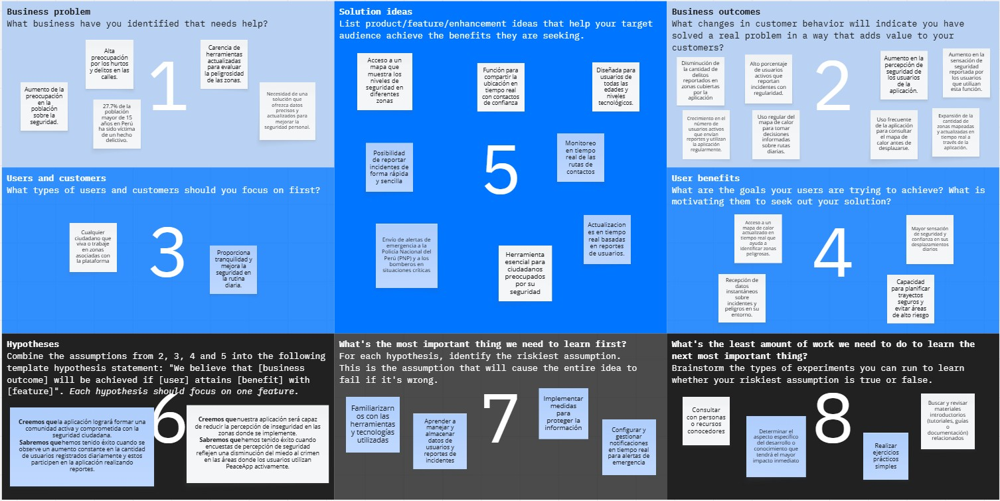

# 
 Universidad Peruana de Ciencias Aplicadas 

  

### 
 Informe Entrega 1 

 

  
 Carrera: Ingeniería de Software 

   
  
 Ciclo: 2026-10 

   
  
 Curso: Aplicaciones para dispositivos móviles 

   
  
 NRC: 3248 

   
  
 Profesor: David Gerardo Quevedo 

   
  
 Nombre del Startup: UrbanVoice 

   
  
 Nombre del Producto: UrbanVoice 

   
  
 Relación de Integrantes: 

  
  - . 

  
  - . 

  
  - . 

  
  - Gordillo Ramos, Santiago Alonso (u202215160) 

  
  - . 

   
  
 Mes y Año: Abril del 2026 

---

# Registro de Versiones del Informe

<table>
  <tr>
    <th style="text-align:center;">Versión</th>
    <th style="text-align:center;">Fecha</th>
    <th style="text-align:center;">Autor</th>
    <th style="text-align:center;">Descripción de la modificación</th>
  </tr>
  <tr>
    <td align="center">TB1</td>
    <td>//2026</td>
    <td> Integrante   Integrante   Integrante   Santiago Gordillo   Integrante </td>
    <td> Realizamos los capítulos 1, 2 y 3 según la rúbrica de manera conjunta y eficiente.  </td>
  </tr>
  <tr>
    <td align="center">TB2</td>
    <td>//2026</td>
    <td> Integrante   Integrante   Integrante   Santiago Gordillo   Integrante </td>
    <td> descripción </td>
  </tr>
  <tr>
    <td align="center">TP1</td>
    <td>//2026</td>
    <td> Integrante   Integrante   Integrante   Santiago Gordillo   Integrante </td>
    <td> descripción </td>
  </tr>
</table>

---

# Tabla de contenidos

- [ Universidad Peruana de Ciencias Aplicadas ](#-universidad-peruana-de-ciencias-aplicadas-)
    - [ Informe de Trabajo Final ](#-informe-de-trabajo-final-)
- [Registro de Versiones del Informe](#registro-de-versiones-del-informe)
- [Tabla de contenidos](#tabla-de-contenidos)
- [Student Outcome](#student-outcome)
- [Capítulo I: Introducción](#capítulo-i-introducción)
    - [1.1 Startup Profile](#11-startup-profile)
        - [1.1.1 Descripción de la Startup](#111-descripción-de-la-startup)
        - [1.1.2. Perfiles de integrantes del equipo](#112-perfiles-de-integrantes-del-equipo)
    - [1.2. Solution Profile](#12-solution-profile)
        - [1.2.1. Nombre del Producto](#121-nombre-del-producto)
        - [1.2.2. Antecedentes y problemática](#122-antecedentes-y-problemática)
        - [1.2.3. Lean UX Process](#123-lean-ux-process)
            - [1.2.3.1. Lean UX Problem Statements](#1231-lean-ux-problem-statements)
            - [1.2.3.2. Lean UX Assumptions](#1232-lean-ux-assumptions)
            - [1.2.3.3. Lean UX Hypothesis Statements](#1233-lean-ux-hypothesis-statements)
            - [1.2.3.4. Lean UX Canvas](#1234-lean-ux-canvas)
    - [1.3. Segmentos Objetivo](#13-segmentos-objetivo)
 

# Student Outcome

**Criterio:** La capacidad de adquirir y aplicar nuevos conocimientos según sea necesario, utilizando estrategias de
aprendizaje apropiadas.

ABET -- EAC - Student Outcome 

<table>
<colgroup>
<col style="width: 30%" />
<col style="width: 40%" />
<col style="width: 30%" />
</colgroup>
<thead>
<tr class="header">
<th><strong>Criterio específico</strong></th>
<th><strong>Acciones Realizadas</strong></th>
<th><strong>Conclusiones</strong></th>
</tr>
</thead>
<tbody>
<tr class="odd">
<td>Actualiza conceptos y
conocimientos necesarios para su
desarrollo profesional y en especial
para su proyecto en soluciones de
software.</td>
<td>
            <strong>Integrante</strong>  
            TB1   Contenido  
            TB2   Contenido  
            TP1   Contenido  
            <strong>Integrante</strong>  
            TB1   Contenido  
            TB2   Contenido  
            TP1   Contenido  
            <strong>Integrante</strong>  
            TB1   Contenido  
            TB2   Contenido  
            TP1   Contenido           
            <strong>Gordillo Ramos, Santiago Alonso</strong>  
            TB1   Contenido  
            TB2   Contenido  
            TP1   Contenido  
            <strong>Integrante</strong>  
            TB1   Contenido  
            TB2   Contenido  
            TP1   Contenido  
</td>
<td>
<em><strong>TB1</strong></em>
 Contenido
 

<em><strong>TB2</strong></em>
 Contenido
 
</td>
</tr>
<tr class="even">
<td>Reconoce la necesidad del
aprendizaje permanente para el
desempeño profesional y el
desarrollo de proyectos en
soluciones de software.</td>
<td>
            <strong>Integrante</strong>  
            TB1   Contenido  
            TB2   Contenido  
            TP1   Contenido  
            <strong>Integrante</strong>  
            TB1   Contenido  
            TB2   Contenido  
            TP1   Contenido  
            <strong>Integrante</strong>  
            TB1   Contenido  
            TB2   Contenido  
            TP1   Contenido  
            <strong>Gordillo Ramos, Santiago Alonso</strong>  
            TB1   Contenido  
            TB2   Contenido  
            TP1   Contenido  
            <strong>Integrante</strong>  
            TB1   Contenido  
            TB2   Contenido  
            TP1   Contenido  
</td>
<td>
<em><strong>TB1</strong></em>
 Contenido 
 
<em><strong>TB2</strong></em>
 Contenido 
 
</td>

</tr>
</tbody>
</table>

# Capítulo I: Introducción

## 1.1 Startup Profile

### 1.1.1 Descripción de la Startup

En respuesta al aumento de la inseguridad ciudadana en el Perú, PeaceApp surge como una propuesta innovadora orientada a fortalecer la seguridad en las calles. En Lima Metropolitana, el 89,9% de los ciudadanos percibe su entorno como inseguro (INEI, 2024), una realidad preocupante que requiere atención inmediata.  

**Misión:**  
Nuestra misión es brindar seguridad a nuestros usuarios, permitiéndoles desplazarse con confianza por las distintas calles del Perú.  

**Visión:**  
Entendemos que el mundo está en constante transformación y queremos contribuir a ese cambio. Creemos que todas las personas tienen derecho a sentirse seguras en su país, y que es responsabilidad de los gobiernos garantizarlo. Por ello, aspiramos a posicionarnos como líderes en el sector de la seguridad, destacando por nuestro compromiso con el bienestar de nuestros usuarios.  

**¿Cómo lo logramos?**  
UrbanVoice se posiciona como una herramienta clave para quienes buscan mayor seguridad en su día a día. A través de nuestra aplicación, los usuarios pueden consultar un mapa interactivo que indica los niveles de seguridad en distintas zonas, facilitando la toma de decisiones informadas. Asimismo, ofrecemos la opción de reportar delitos de manera rápida y sencilla, incorporando fotos, audios o videos, de forma pública o anónima.  

Además, UrbamVoice ofrece una función adicional: compartir la ubicación en tiempo real con contactos de confianza, quienes podrán seguir el recorrido del usuario y brindarle mayor tranquilidad durante sus desplazamientos.  

### 1.1.2. Perfiles de integrantes del equipo

<table>
<colgroup>
<col style="width: 65%" />
<col style="width: 34%" />
</colgroup>
<thead>
<tr class="even">
<td>
<strong>Nombre:</strong> Integrante

<strong> Contenido </strong>
</td>
<td></td>
</tr>
<tr class="even">
<td>
<strong>Nombre:</strong> Integrante

<strong> Contenido </strong>
</td>
<td></td>
</tr>
<tr class="even">
<td>
<strong>Nombre:</strong> Integrante

<strong> Contenido </strong>
</td>
<td></td>
</tr>
<tr class="even">
<td>
<strong>Nombre:</strong> Santiago Alonso Gordillo Ramos (U202215160)

<strong> Mi nombre es Santiago Gordillo, me gusta la programación, en específico el lado frontend y me gustaría especializarme en ciberseguridad. tengo 21 años, domino frameworks como vue, angular,etc y lenguajes como C++ , Python, Javascript.</strong>
</td>
<td></td>
</tr>
<tr class="even">
<td>
<strong>Nombre:</strong> Integrante

<strong> Contenido </strong>
</td>
<td></td>
</tr>

</table>

## 1.2. Solution Profile

### 1.2.1. Nombre del Producto

UrbanVoice, una aplicación móvil orientada a la seguridad ciudadana. Su propósito es brindar a los usuarios información en tiempo real sobre incidentes y zonas de riesgo en Lima Metropolitana, permitiendo tomar decisiones más seguras en sus desplazamientos y fomentando la colaboración entre ciudadanos y autoridades.

### 1.2.2. Antecedentes y problemática

**What (Qué):** UrbanVoice es una aplicación diseñada para empoderar a los usuarios en su vida diaria, ayudándolos a navegar de manera más segura por las calles de Lima Metropolitana. UrbanVoice garantiza el acceso a información detallada y confiable sobre la seguridad en tiempo real, fomentando una red de colaboración que beneficia a todos.

**When (Cuándo):** UrbanVoice estará disponible la mayor parte del tiempo, ofreciendo asistencia continua y actualizada en cualquier momento que los usuarios lo necesiten.

**Where (Dónde):** UrbanVoice puede ser utilizada en cualquier lugar y momento, siempre que el usuario cuente con una conexión a internet. La aplicación se adapta automáticamente a la ubicación del usuario, actualizando la información de seguridad local en tiempo real para brindar datos precisos y relevantes.

**Who (Quién):** UrbanVoice está dirigida a los ciudadanos que transitan por las calles de Lima Metropolitana. Los usuarios no solo podrán beneficiarse de la información proporcionada, sino que también tendrán la capacidad de contribuir al bienestar de la comunidad al reportar incidentes y situaciones de riesgo.

**Why (Por qué):** UrbanVoice surge como respuesta al preocupante aumento de la delincuencia en Lima y en todo el país. Nuestro objetivo es proporcionar a los ciudadanos una herramienta que les permita estar informados sobre los sucesos más recientes en su entorno, incrementando su seguridad personal y ayudando a otros transeúntes a evitar situaciones peligrosas.

**How (Cómo):** UrbanVoice se mantiene actualizada gracias al constante aporte de los usuarios, quienes reportan incidentes y colaboran con la comunidad. Además, la aplicación utiliza tecnología avanzada de geolocalización y análisis de datos para ofrecer información precisa en tiempo real.

**How Much (Cuánto):** UrbanVoice estará disponible de forma gratuita para todos los usuarios. Sin embargo, para sostener el desarrollo y mantenimiento de la plataforma, la aplicación incluirá anuncios integrados.

### 1.2.3. Lean UX Process

#### 1.2.3.1. Lean UX Problem Statements

El objetivo de nuestro servicio es ayudar a las personas a desplazarse con mayor seguridad en su entorno. A través de nuestra aplicación, los usuarios pueden acceder a un mapa de calor que indica qué tan peligrosas son distintas zonas de Lima Metropolitana, basado en reportes en tiempo real hechos por otros usuarios.

Hemos detectado que existe una fuerte preocupación por la inseguridad en las calles, ya que los robos y delitos son situaciones frecuentes. De acuerdo con los resultados más recientes de la ENAPRES (Ene-Jun 2024) del INEI, el 27.7% de las personas mayores de 15 años en Perú ha sido víctima de algún delito.

Frente a esta realidad, surge la pregunta:  
**¿cómo podemos cambiar la percepción de inseguridad en Lima y brindar a las personas una herramienta que realmente les sea útil en su día a día?**

#### 1.2.3.2. Lean UX Assumptions

ahora que hemos analizado la problemática y contamos con una visión clara de cómo abordar la solución, es crucial identificar qué empresas comparten características similares a las nuestras y cómo han evolucionado con el tiempo. Esto nos permitirá aprender de su experiencia y adaptarnos mejor al mercado.

**Assumptions:**

1. **Las personas en Lima necesitan una app que les sugiera rutas más seguras.**  
   Debido al incremento de la delincuencia, los usuarios buscan formas de evitar zonas peligrosas al movilizarse.

2. **A los usuarios les interesa formar parte de una comunidad donde puedan reportar incidentes.**  
   El hecho de contribuir con información genera confianza y sentido de pertenencia.

3. **No hay una competencia fuerte que ofrezca una solución tan completa como la nuestra.**  
   Esto nos da la oportunidad de posicionarnos como una alternativa innovadora en seguridad ciudadana.

4. **Las instituciones que usen la app podrán aprovechar datos útiles para combatir la delincuencia.**  
   La información en tiempo real les permitirá actuar de manera más estratégica.

5. **Los ciudadanos estarán interesados en usar la aplicación.**  
   Al ser una herramienta práctica y fácil de usar, puede atraer a muchas personas.

6. **Las entidades públicas en Perú necesitan soluciones tecnológicas como esta.**  
   La app puede ayudarles a responder mejor ante situaciones de inseguridad.

**Business Outcomes:**

- Generar ingresos constantes mediante acuerdos con entidades públicas y privadas.  
- Aumentar la calidad de vida de las personas al reducir su exposición a riesgos.  
- Aportar a la reducción de la delincuencia mediante información útil y oportuna.

**User Outcomes:**

1. **¿Quién es el usuario?**  
   Cualquier persona que viva o trabaje en zonas donde la app esté disponible.

2. **¿Cómo encaja en su día a día?**  
   Se vuelve una herramienta clave para planificar rutas seguras y reportar incidentes.

3. **¿Qué dificultades enfrenta el producto?**  
   Depende bastante de lograr alianzas con entidades para sostener el modelo de negocio.

4. **¿Cuándo y cómo se usa?**  
   Principalmente al movilizarse por zonas desconocidas o al reportar situaciones de riesgo.

5. **¿Qué características son clave?**  
   Debe ser fácil de usar, rápida y con información actualizada en tiempo real.

6. **¿Cómo debería verse y funcionar?**  
   Con un diseño claro, atractivo y sencillo, que facilite la navegación y el registro.

**User Benefits:**

1. Reducir el riesgo de robos o incidentes al contar con información actualizada.
   
2. Tener acceso a un mapa que muestra zonas peligrosas y rutas más seguras.
   
3. Sentirse parte de una comunidad que aporta a la seguridad colectiva.

#### 1.2.3.3. Lean UX Hypothesis Statements

- **Hypothesis Statement 01:**

**Creemos que** UrbanVoice logrará crear una comunidad activa interesada en la seguridad.  

**Sabremos que funciona** cuando aumente el número de usuarios registrados y participen reportando incidentes.

- **Hypothesis Statement 02:**
  
**Creemos que** los usuarios valorarán poder reportar incidentes y ver información en tiempo real.  

**Sabremos que funciona** cuando muchos usuarios utilicen el mapa y reporten de forma constante.

- **Hypothesis Statement 03:**

**Creemos que** UrbanVoice ayudará a reducir la sensación de inseguridad.  

**Sabremos que funciona** cuando las encuestas reflejen menos miedo al crimen en zonas donde se usa la app.

- **Hypothesis Statement 04:**

**Creemos que** incluir anuncios en la versión gratuita no afectará la experiencia.  

**Sabremos que funciona** si los usuarios siguen usando la app y se mantiene una buena retención.

- **Hypothesis Statement 05:**

**Creemos que** la aplicación será fácil de usar para todo tipo de personas.  

**Sabremos que funciona** cuando los usuarios completen tareas sin dificultad en pruebas de uso.

- **Hypothesis Statement 06:**

**Creemos que** la geolocalización en tiempo real hará que la información sea más precisa.  

**Sabremos que funciona** cuando los usuarios confíen en el mapa y lo usen para decidir sus rutas.

- **Hypothesis Statement 07:**

**Creemos que** compartir la ubicación con contactos aumentará la sensación de seguridad.  

**Sabremos que funciona** cuando muchos usuarios utilicen esta función de forma frecuente.

#### 1.2.3.4. Lean UX Canvas

