# 
 Universidad Peruana de Ciencias Aplicadas 

  

### 
 Informe Entrega 1 

 

  
 Carrera: Ingeniería de Software 

   
  
 Ciclo: 2026-10 

   
  
 Curso: Aplicaciones para dispositivos móviles 

   
  
 NRC: 3248 

   
  
 Profesor: David Gerardo Quevedo 

   
  
 Nombre del Startup: UrbanVoice 

   
  
 Nombre del Producto: UrbanVoice 

   
  
 Relación de Integrantes: 

  
  - Ivan La Madrid - (u). 

  
  - Quijada Magro, Jeremy Alexander (u202219657). 

  
  - Ruiz Madrid, Billy Jake (u202116401) 

  
  - Gordillo Ramos, Santiago Alonso (u202215160) 

  
  - Awad Vargas, Giorgio Marzouk (u202324041) 

   
  
 Mes y Año: Abril del 2026 

---

# Registro de Versiones del Informe

<table>
  <tr>
    <th style="text-align:center;">Versión</th>
    <th style="text-align:center;">Fecha</th>
    <th style="text-align:center;">Autor</th>
    <th style="text-align:center;">Descripción de la modificación</th>
  </tr>
  <tr>
    <td align="center">TB1</td>
    <td>22/04/2026</td>
    <td> Giorgio Marzouk Awad Vargas   Quijada Magro Jeremy   Billy Ruiz   Santiago Gordillo   Ivan La Madrid </td>
    <td> Hemos avanzado bastante en la estructuración del proyecto: ya tengo definidos los capítulos con la introducción de la startup, el perfil de la solución, los segmentos objetivo y un análisis completo de requerimientos. También incluimos entrevistas, user personas, mapas de tareas y journey maps, además de aplicar Lean UX y Domain-Driven Design en niveles estratégico y táctico. En resumen, logramos darle forma clara y ordenada al documento, con bases conceptuales y técnicas que sostienen el desarrollo. </td>
  </tr>
  <tr>
    <td align="center">TB2</td>
    <td>//2026</td>
    <td> Giorgio Marzouk Awad Vargas   Quijada Magro Jeremy   Billy Ruiz   Santiago Gordillo   Ivan La Madrid </td>
    <td> descripción </td>
  </tr>
  <tr>
    <td align="center">TP1</td>
    <td>//2026</td>
    <td> Giorgio Marzouk Awad Vargas   Quijada Magro Jeremy   Billy Ruiz   Santiago Gordillo   Ivan La Madrid </td>
    <td> descripción </td>
  </tr>
</table>

---

# Tabla de contenidos

- [ Universidad Peruana de Ciencias Aplicadas ](#-universidad-peruana-de-ciencias-aplicadas-)
    - [ Informe de Trabajo Final ](#-informe-de-trabajo-final-)
- [Registro de Versiones del Informe](#registro-de-versiones-del-informe)
- [Tabla de contenidos](#tabla-de-contenidos)
- [Student Outcome](#student-outcome)
- [Capítulo I: Introducción](#capítulo-i-introducción)
    - [1.1 Startup Profile](#11-startup-profile)
        - [1.1.1 Descripción de la Startup](#111-descripción-de-la-startup)
        - [1.1.2. Perfiles de integrantes del equipo](#112-perfiles-de-integrantes-del-equipo)
    - [1.2. Solution Profile](#12-solution-profile)
        - [1.2.1. Nombre del Producto](#121-nombre-del-producto)
        - [1.2.2. Antecedentes y problemática](#122-antecedentes-y-problemática)
        - [1.2.3. Lean UX Process](#123-lean-ux-process)
            - [1.2.3.1. Lean UX Problem Statements](#1231-lean-ux-problem-statements)
            - [1.2.3.2. Lean UX Assumptions](#1232-lean-ux-assumptions)
            - [1.2.3.3. Lean UX Hypothesis Statements](#1233-lean-ux-hypothesis-statements)
            - [1.2.3.4. Lean UX Canvas](#1234-lean-ux-canvas)
    - [1.3. Segmentos Objetivo](#13-segmentos-objetivo)

- [Capítulo II: Requirements & Analysis](#capítulo-ii-requirements--analysis)
   - [2.1. Competidores](#21-competidores)
   - [2.1.1 Analisis competitivo](#211-analisis-competitivo)
   - [2.1.2 Estrategias y tacticas frente a competidores](#212-estrategias-y-tacticas-frente-a-competidores)
   - [2.2. Entrevistas](#22-entrevistas)
   - [2.2.1 Diseño de entrevistas](#221-diseño-de-entrevistas)
   - [2.2.2 Registro de entrevistas](#222-registro-de-entrevistas)
   - [2.2.3 Análisis de entrevistas](#223-análisis-de-entrevistas)
   - [2.3. Needfinding](#23-needfinding)
      - [2.3.1. User Personas](#231-user-personas)
      - [2.3.2. User Task Matrix](#232-user-task-matrix)
      - [2.3.3. User Journey Map](#233-user-journey-map)
      - [2.3.4. Empathy Mapping](#234-empathy-mapping)
      - [2.3.5. Big Picture EventStorming ](#235-big-picture-eventstorming)
      - [2.3.6. Ubiquitous Language](#236-ubiquitous-language)
   - [2.4. Requirements specification](#24-requirements-specification)
      - [2.4.1. User Stories](#241-user-stories)
      - [2.4.2. Impact Mapping](#242-impact-mapping)
      - [2.4.3. Product Backlog](#243-product-backlog)
   - [2.5. Strategic-Level Domain-Driven Design](#25-strategic-level-domain-driven-design)
      - [2.5.1. EventStorming](#251-eventstorming)
         - [2.5.1.1. Candidate Context Discovery](#2511-candidate-context-discovery)
         - [2.5.1.2. Domain Message Flows Modeling](#2512-domain-message-flows-modeling)
         - [2.5.1.3. Bounded Context Canvases](#2513-bounded-context-canvases)
      - [2.5.2. Context Mapping](#252-context-mapping)
      - [2.5.3. Software Architecture](#253-software-architecture)
         - [2.5.3.1. Software Architecture Context Level Diagrams](#2531-software-architecture-context-level-diagrams)
         - [2.5.3.2. Software Architecture Container Level Diagrams](#2532-software-architecture-container-level-diagrams)
         - [2.5.3.3. Software Architecture Deployment Diagrams](#2533-software-architecture-deployment-diagrams)
      - [2.6 Tactical-Level Domain-Driven Design](#26-technical-level-domain-driven-design)
         - [2.6.1 Bounded Context:Identity and Access Managment](#261-bounded-context-Identity-and-Access-Managment)
            - [2.6.1.1. Domain Layer](#2611-domain-layer)
            - [2.6.1.2. Interface Layer](#2612-interface-layer)
            - [2.6.1.3. Application Layer](#2613-application-layer)
            - [2.6.1.4 Infrastructure Layer](#2614-infrastructure-layer)
            - [2.6.1.5 Bounded Context Software Architecture Component Level Diagrams](#2615-bounded-context-software-architecture-component-level-diagrams)
            - [2.6.1.6 Bounded Context Software Architecture Code Level Diagrams](#2616-bounded-context-software-architecture-code-level-diagrams)
            - [2.6.1.6.1. Bounded Context Domain Layer Class Diagrams](#26161-bounded-context-domain-layer-class-diagrams)
            - [2.6.1.6.2. Bounded Context Database Design Diagram](#26162-bounded-context-database-design-diagram)
         - [2.6.2 Bounded Context:Profile and Preferences Management](#262-bounded-context-Profile-and-Preferences-Management)
            - [2.6.2.1. Domain Layer](#2621-domain-layer)
            - [2.6.2.2. Interface Layer](#2622-interface-layer)
            - [2.6.2.3. Application Layer](#2623-application-layer)
            - [2.6.2.4 Infrastructure Layer](#2624-infrastructure-layer)
            - [2.6.2.5 Bounded Context Software Architecture Component Level Diagrams](#2625-bounded-context-software-architecture-component-level-diagrams)
            - [2.6.2.6 Bounded Context Software Architecture Code Level Diagrams](#2626-bounded-context-software-architecture-code-level-diagrams)
            - [2.6.2.6.1. Bounded Context Domain Layer Class Diagrams](#26261-bounded-context-domain-layer-class-diagrams)
            - [2.6.2.6.2. Bounded Context Database Design Diagram](#26262-bounded-context-database-design-diagram)
         - [2.6.3 Bounded Context:Location Managment](#263-bounded-context-Location-Managment)
            - [2.6.3.1. Domain Layer](#2631-domain-layer)
            - [2.6.3.2. Interface Layer](#2632-interface-layer)
            - [2.6.3.3. Application Layer](#2633-application-layer)
            - [2.6.3.4 Infrastructure Layer](#2634-infrastructure-layer)
            - [2.6.3.5 Bounded Context Software Architecture Component Level Diagrams](#2635-bounded-context-software-architecture-component-level-diagrams)
            - [2.6.3.6 Bounded Context Software Architecture Code Level Diagrams](#2636-bounded-context-software-architecture-code-level-diagrams)
            - [2.6.3.6.1. Bounded Context Domain Layer Class Diagrams](#26361-bounded-context-domain-layer-class-diagrams)
            - [2.6.3.6.2.  Bounded Context Database Design Diagram](#26362--bounded-context-database-design-diagram)
         - [2.6.4 Bounded Context:Report Managment](#264-bounded-context-Report-Managment)
            - [2.6.4.1. Domain Layer](#2641-domain-layer)
            - [2.6.4.2. Interface Layer](#2642-interface-layer)
            - [2.6.4.3. Application Layer](#2643-application-layer)
            - [2.6.4.4 Infrastructure Layer](#2644-infrastructure-layer)
            - [2.6.4.5 Bounded Context Software Architecture Component Level Diagrams](#2645-bounded-context-software-architecture-component-level-diagrams)
            - [2.6.4.6 Bounded Context Software Architecture Code Level Diagrams](#2646-bounded-context-software-architecture-code-level-diagrams)
            - [2.6.4.6.1. Bounded Context Domain Layer Class Diagrams](#26461-bounded-context-domain-layer-class-diagrams)
            - [2.6.4.6.2. Bounded Context Database Design Diagram](#26462-bounded-context-database-design-diagram)
         - [2.6.5 Bounded Context:Notification Managment](#265-bounded-context-Notification-Managment)
            - [2.6.5.1. Domain Layer](#2651-domain-layer)
            - [2.6.5.2. Interface Layer](#2652-interface-layer)
            - [2.6.5.3. Application Layer](#2653-application-layer)
            - [2.6.5.4 Infrastructure Layer](#2654-infrastructure-layer)
            - [2.6.5.5 Bounded Context Software Architecture Component Level Diagrams](#2655-bounded-context-software-architecture-component-level-diagrams)
            - [2.6.5.6 Bounded Context Software Architecture Code Level Diagrams](#2656-bounded-context-software-architecture-code-level-diagrams)
            - [2.6.5.6.1. Bounded Context Domain Layer Class Diagrams](#26561-bounded-context-domain-layer-class-diagrams)
            - [2.6.5.6.2. Bounded Context Database Design Diagram](#26562-bounded-context-database-design-diagram)

---

# Project Report Collaboration Insights
En esta sección se detalla el proceso de colaboración para la elaboración del informe en el repositorio de GitHub.

**URL del repositorio:** https://github.com/urbanvoice-3248-dispo-moviles/UrbanVoice

   - Se realizaron commits individuales para las secciones de perfiles y descripción de la startup.
   - Se coordinó de forma sincrónica la definición de las hipótesis de Lean UX y el análisis de la problemática.

---

# Student Outcome

**Criterio:** La capacidad de adquirir y aplicar nuevos conocimientos según sea necesario, utilizando estrategias de
aprendizaje apropiadas.

ABET -- EAC - Student Outcome 

<table>
<colgroup>
<col style="width: 30%" />
<col style="width: 40%" />
<col style="width: 30%" />
</colgroup>
<thead>
<tr class="header">
<th><strong>Criterio específico</strong></th>
<th><strong>Acciones Realizadas</strong></th>
<th><strong>Conclusiones</strong></th>
</tr>
</thead>
<tbody>
<tr class="odd">
<td>Actualiza conceptos y
conocimientos necesarios para su
desarrollo profesional y en especial
para su proyecto en soluciones de
software.</td>
<td>
            <strong>Giorgio Marzouk Awad Vargas</strong>  
            TB1   Durante la fase de la entrega TB1, el equipo llevó a cabo la investigación y delimitación de la problemática de inseguridad ciudadana en Lima Metropolitana mediante la aplicación de la técnica 5W2H y el marco de trabajo Lean UX, lo que permitió definir una solución centrada en el ciudadano. Se desarrollaron sesiones de diseño estratégico aplicando la metodología EventStorming para identificar los Bounded Contexts y el lenguaje ubicuo del sistema, complementando esta labor con el modelado de la arquitectura de software utilizando el modelo C4 en sus niveles de contexto y contenedor.  
            TB2   Contenido  
            TP1   Contenido  
            <strong> Giorgio Marzouk Awad Vargas</strong>  
            TB1   Durante la fase de la entrega TB1, el equipo llevó a cabo la investigación y delimitación de la problemática de inseguridad ciudadana en Lima Metropolitana mediante la aplicación de la técnica 5W2H y el marco de trabajo Lean UX, lo que permitió definir una solución centrada en el ciudadano. Se desarrollaron sesiones de diseño estratégico aplicando la metodología EventStorming para identificar los Bounded Contexts y el lenguaje ubicuo del sistema, complementando esta labor con el modelado de la arquitectura de software utilizando el modelo C4 en sus niveles de contexto y contenedor.  
            TB2   Contenido  
            TP1   Contenido  
            <strong>Ruiz Madrid, Billy Jake</strong>  
            TB1   Durante la fase de la entrega TB1, el equipo llevó a cabo la investigación y delimitación de la problemática de inseguridad ciudadana en Lima Metropolitana mediante la aplicación de la técnica 5W2H y el marco de trabajo Lean UX, lo que permitió definir una solución centrada en el ciudadano. Se desarrollaron sesiones de diseño estratégico aplicando la metodología EventStorming para identificar los Bounded Contexts y el lenguaje ubicuo del sistema, complementando esta labor con el modelado de la arquitectura de software utilizando el modelo C4 en sus niveles de contexto y contenedor.  
            TB2   Contenido  
            TP1   Contenido           
            <strong>Gordillo Ramos, Santiago Alonso</strong>  
            TB1   Durante la fase de la entrega TB1, el equipo llevó a cabo la investigación y delimitación de la problemática de inseguridad ciudadana en Lima Metropolitana mediante la aplicación de la técnica 5W2H y el marco de trabajo Lean UX, lo que permitió definir una solución centrada en el ciudadano. Se desarrollaron sesiones de diseño estratégico aplicando la metodología EventStorming para identificar los Bounded Contexts y el lenguaje ubicuo del sistema, complementando esta labor con el modelado de la arquitectura de software utilizando el modelo C4 en sus niveles de contexto y contenedor.  
            TB2   Contenido  
            TP1   Contenido  
            <strong>Quijada Magro, Jeremy</strong>  
            TB1   Durante la fase de la entrega TB1, el equipo llevó a cabo la investigación y delimitación de la problemática de inseguridad ciudadana en Lima Metropolitana mediante la aplicación de la técnica 5W2H y el marco de trabajo Lean UX, lo que permitió definir una solución centrada en el ciudadano. Se desarrollaron sesiones de diseño estratégico aplicando la metodología EventStorming para identificar los Bounded Contexts y el lenguaje ubicuo del sistema, complementando esta labor con el modelado de la arquitectura de software utilizando el modelo C4 en sus niveles de contexto y contenedor.  
            TB2   Contenido  
            TP1   Contenido  
</td>
<td>
<em><strong>TB1</strong></em>
 El desarrollo de esta entrega permitió al equipo adquirir y aplicar conocimientos avanzados en diseño orientado al dominio (DDD) y patrones arquitectónicos modernos, validando la capacidad de aprendizaje autónomo para integrar herramientas de geolocalización y servicios en la nube.
 

<em><strong>TB2</strong></em>
 Contenido
 
</td>
</tr>
<tr class="even">
<td>Reconoce la necesidad del
aprendizaje permanente para el
desempeño profesional y el
desarrollo de proyectos en
soluciones de software.</td>
<td>
            <strong>Giorgio Marzouk Awad Vargas</strong>  
            TB1   Identificó la necesidad de aprender nuevas herramientas de modelado y documentación arquitectónica para representar correctamente los bounded contexts, diagramas de componentes, dominio y base de datos de UrbanVoice.  
            TB2   Contenido  
            TP1   Contenido  
            <strong>Giorgio Marzouk Awad Vargas</strong>  
            TB1   Identificó la necesidad de aprender nuevas herramientas de modelado y documentación arquitectónica para representar correctamente los bounded contexts, diagramas de componentes, dominio y base de datos de UrbanVoice.  
            TB2   Contenido  
            TP1   Contenido  
            <strong>Ruiz Madrid, Billy Jake</strong>  
            TB1   Identificó la necesidad de aprender nuevas herramientas de modelado y documentación arquitectónica para representar correctamente los bounded contexts, diagramas de componentes, dominio y base de datos de UrbanVoice.  
            TB2   Contenido  
            TP1   Contenido  
            <strong>Gordillo Ramos, Santiago Alonso</strong>  
            TB1   Identificó la necesidad de aprender nuevas herramientas de modelado y documentación arquitectónica para representar correctamente los bounded contexts, diagramas de componentes, dominio y base de datos de UrbanVoice.  
            TB2   Contenido  
            TP1   Contenido  
            <strong>Quijada Magro, Jeremy Alexander</strong>  
            TB1   Identificó la necesidad de aprender nuevas herramientas de modelado y documentación arquitectónica para representar correctamente los bounded contexts, diagramas de componentes, dominio y base de datos de UrbanVoice.  
            TB2   Contenido  
            TP1   Contenido  
</td>
<td>
<em><strong>TB1</strong></em>
 Durante TB1 se evidenció que el aprendizaje continuo es clave para adoptar herramientas como Structurizr y PlantUML y traducir requerimientos del dominio en artefactos técnicos claros. 
 
<em><strong>TB2</strong></em>
 Contenido 
 
</td>

</tr>
</tbody>
</table>

# Capítulo I: Introducción

## 1.1 Startup Profile

### 1.1.1 Descripción de la Startup

UrbanVoice es una iniciativa tecnológica enfocada en fortalecer la seguridad ciudadana en Lima Metropolitana. Ante la percepción de inseguridad del 89.9%, nuestra plataforma permite a los ciudadanos consultar niveles de riesgo en tiempo real y reportar incidentes de manera colaborativa.  

**Misión:**  
Nuestra misión es brindar seguridad a nuestros usuarios, permitiéndoles desplazarse con confianza por las distintas calles del Perú.  

**Visión:**  
Entendemos que el mundo está en constante transformación y queremos contribuir a ese cambio. Creemos que todas las personas tienen derecho a sentirse seguras en su país, y que es responsabilidad de los gobiernos garantizarlo. Por ello, aspiramos a posicionarnos como líderes en el sector de la seguridad, destacando por nuestro compromiso con el bienestar de nuestros usuarios.  

**¿Cómo lo logramos?**  
UrbanVoice se posiciona como una herramienta clave para quienes buscan mayor seguridad en su día a día. A través de nuestra aplicación, los usuarios pueden consultar un mapa interactivo que indica los niveles de seguridad en distintas zonas, facilitando la toma de decisiones informadas. Asimismo, ofrecemos la opción de reportar delitos de manera rápida y sencilla, incorporando fotos, audios o videos, de forma pública o anónima.  

Además, UrbamVoice ofrece una función adicional: compartir la ubicación en tiempo real con contactos de confianza, quienes podrán seguir el recorrido del usuario y brindarle mayor tranquilidad durante sus desplazamientos.  

### 1.1.2. Perfiles de integrantes del equipo

<table>
<colgroup>
<col style="width: 65%" />
<col style="width: 34%" />
</colgroup>
<thead>
<tr class="even">
<td>
<strong>Nombre:</strong> Integrante

<strong> Contenido </strong>
</td>
<td></td>
</tr>
<tr class="even">
<td>
<strong>Nombre:</strong> Jeremy Quijada Magro (U202219657)

<strong> Mi nombre es Jeremy, me gusta el analisis de sistemas  y me gustaria especializarme en el area de calidad. </strong>
</td>
<td></td>
</tr>
<tr class="even">
<td>
<strong>Nombre:</strong> Billy Jake Ruiz Madrid (U202116401)

<strong> Tengo 22 años, soy una persona tranquila, colaborativa y adaptable. Me gusta trabajar en equipo, aportando ideas y soluciones. Cuento con conocimientos en C++ y Python y siempre busco formas de hacer las cosas de manera eficiente. </strong>
</td>
<td></td>
</tr>
<tr class="even">
<td>
<strong>Nombre:</strong> Santiago Alonso Gordillo Ramos (U202215160)

<strong> Mi nombre es Santiago Gordillo, me gusta la programación, en específico el lado frontend y me gustaría especializarme en ciberseguridad. tengo 21 años, domino frameworks como vue, angular,etc y lenguajes como C++ , Python, Javascript.</strong>
</td>
<td></td>
</tr>
<tr class="even">
<td>
<strong>Nombre:</strong> Ivan Jeanpierre La Madrid Lozano (u202113432)

<strong> Me llamo Ivan La Madrid, tengo 22 años, me gusta el desarrollo de software. Últimamente me inclino más al desarrollo backend con frameworks como .NET </strong>
</td>
<td></td>
<tr class="even">

<td>
<strong>Nombre:</strong> Giorgio Marzouk Awad Vargas (u202324041)

<strong> Mi nombre es Giorgio Awad, tengo 23 años y estudio la carrera de Ingeniería de Software. Me gustaría especializarme en Análisis de Datos y en buscar soluciones a empresas através de los conocimientos adquiridos en la Ingeniería de Software. </strong>
</td>
<td></td>
</tr>

</table>

## 1.2. Solution Profile

### 1.2.1. Nombre del Producto

UrbanVoice, una aplicación móvil orientada a la seguridad ciudadana. Su propósito es brindar a los usuarios información en tiempo real sobre incidentes y zonas de riesgo en Lima Metropolitana, permitiendo tomar decisiones más seguras en sus desplazamientos y fomentando la colaboración entre ciudadanos y autoridades.

### 1.2.2. Antecedentes y problemática

La inseguridad ciudadana es la principal preocupación en Lima. Aplicamos la técnica 5W's y 2H's para analizar el entorno:

**What (Qué):** UrbanVoice es una aplicación diseñada para empoderar a los usuarios en su vida diaria, ayudándolos a navegar de manera más segura por las calles de Lima Metropolitana. UrbanVoice garantiza el acceso a información detallada y confiable sobre la seguridad en tiempo real, fomentando una red de colaboración que beneficia a todos.

**When (Cuándo):** UrbanVoice estará disponible la mayor parte del tiempo, ofreciendo asistencia continua y actualizada en cualquier momento que los usuarios lo necesiten.

**Where (Dónde):** UrbanVoice puede ser utilizada en cualquier lugar y momento, siempre que el usuario cuente con una conexión a internet. La aplicación se adapta automáticamente a la ubicación del usuario, actualizando la información de seguridad local en tiempo real para brindar datos precisos y relevantes.

**Who (Quién):** UrbanVoice está dirigida a los ciudadanos que transitan por las calles de Lima Metropolitana. Los usuarios no solo podrán beneficiarse de la información proporcionada, sino que también tendrán la capacidad de contribuir al bienestar de la comunidad al reportar incidentes y situaciones de riesgo.

**Why (Por qué):** UrbanVoice surge como respuesta al preocupante aumento de la delincuencia en Lima y en todo el país. Nuestro objetivo es proporcionar a los ciudadanos una herramienta que les permita estar informados sobre los sucesos más recientes en su entorno, incrementando su seguridad personal y ayudando a otros transeúntes a evitar situaciones peligrosas.

**How (Cómo):** UrbanVoice se mantiene actualizada gracias al constante aporte de los usuarios, quienes reportan incidentes y colaboran con la comunidad. Además, la aplicación utiliza tecnología avanzada de geolocalización y análisis de datos para ofrecer información precisa en tiempo real.

**How Much (Cuánto):** UrbanVoice estará disponible de forma gratuita para todos los usuarios. Sin embargo, para sostener el desarrollo y mantenimiento de la plataforma, la aplicación incluirá anuncios integrados.

### 1.2.3. Lean UX Process

#### 1.2.3.1. Lean UX Problem Statements

El objetivo de nuestro servicio es ayudar a las personas a desplazarse con mayor seguridad en su entorno. A través de nuestra aplicación, los usuarios pueden acceder a un mapa de calor que indica qué tan peligrosas son distintas zonas de Lima Metropolitana, basado en reportes en tiempo real hechos por otros usuarios.

Hemos detectado que existe una fuerte preocupación por la inseguridad en las calles, ya que los robos y delitos son situaciones frecuentes. De acuerdo con los resultados más recientes de la ENAPRES (Ene-Jun 2024) del INEI, el 27.7% de las personas mayores de 15 años en Perú ha sido víctima de algún delito.

Frente a esta realidad, surge la pregunta:  
**¿cómo podemos cambiar la percepción de inseguridad en Lima y brindar a las personas una herramienta que realmente les sea útil en su día a día?**

#### 1.2.3.2. Lean UX Assumptions

ahora que hemos analizado la problemática y contamos con una visión clara de cómo abordar la solución, es crucial identificar qué empresas comparten características similares a las nuestras y cómo han evolucionado con el tiempo. Esto nos permitirá aprender de su experiencia y adaptarnos mejor al mercado.

**Assumptions:**

1. **Las personas en Lima necesitan una app que les sugiera rutas más seguras.**  
   Debido al incremento de la delincuencia, los usuarios buscan formas de evitar zonas peligrosas al movilizarse.

2. **A los usuarios les interesa formar parte de una comunidad donde puedan reportar incidentes.**  
   El hecho de contribuir con información genera confianza y sentido de pertenencia.

3. **No hay una competencia fuerte que ofrezca una solución tan completa como la nuestra.**  
   Esto nos da la oportunidad de posicionarnos como una alternativa innovadora en seguridad ciudadana.

4. **Las instituciones que usen la app podrán aprovechar datos útiles para combatir la delincuencia.**  
   La información en tiempo real les permitirá actuar de manera más estratégica.

5. **Los ciudadanos estarán interesados en usar la aplicación.**  
   Al ser una herramienta práctica y fácil de usar, puede atraer a muchas personas.

6. **Las entidades públicas en Perú necesitan soluciones tecnológicas como esta.**  
   La app puede ayudarles a responder mejor ante situaciones de inseguridad.

**Business Outcomes:**

- Generar ingresos constantes mediante acuerdos con entidades públicas y privadas.  
- Aumentar la calidad de vida de las personas al reducir su exposición a riesgos.  
- Aportar a la reducción de la delincuencia mediante información útil y oportuna.

**User Outcomes:**

1. **¿Quién es el usuario?**  
   Cualquier persona que viva o trabaje en zonas donde la app esté disponible.

2. **¿Cómo encaja en su día a día?**  
   Se vuelve una herramienta clave para planificar rutas seguras y reportar incidentes.

3. **¿Qué dificultades enfrenta el producto?**  
   Depende bastante de lograr alianzas con entidades para sostener el modelo de negocio.

4. **¿Cuándo y cómo se usa?**  
   Principalmente al movilizarse por zonas desconocidas o al reportar situaciones de riesgo.

5. **¿Qué características son clave?**  
   Debe ser fácil de usar, rápida y con información actualizada en tiempo real.

6. **¿Cómo debería verse y funcionar?**  
   Con un diseño claro, atractivo y sencillo, que facilite la navegación y el registro.

**User Benefits:**

1. Reducir el riesgo de robos o incidentes al contar con información actualizada.
   
2. Tener acceso a un mapa que muestra zonas peligrosas y rutas más seguras.
   
3. Sentirse parte de una comunidad que aporta a la seguridad colectiva.

#### 1.2.3.3. Lean UX Hypothesis Statements

- **Hypothesis Statement 01:**

**Creemos que** UrbanVoice logrará crear una comunidad activa interesada en la seguridad.  

**Sabremos que funciona** cuando aumente el número de usuarios registrados y participen reportando incidentes.

- **Hypothesis Statement 02:**
  
**Creemos que** los usuarios valorarán poder reportar incidentes y ver información en tiempo real.  

**Sabremos que funciona** cuando muchos usuarios utilicen el mapa y reporten de forma constante.

- **Hypothesis Statement 03:**

**Creemos que** UrbanVoice ayudará a reducir la sensación de inseguridad.  

**Sabremos que funciona** cuando las encuestas reflejen menos miedo al crimen en zonas donde se usa la app.

- **Hypothesis Statement 04:**

**Creemos que** incluir anuncios en la versión gratuita no afectará la experiencia.  

**Sabremos que funciona** si los usuarios siguen usando la app y se mantiene una buena retención.

- **Hypothesis Statement 05:**

**Creemos que** la aplicación será fácil de usar para todo tipo de personas.  

**Sabremos que funciona** cuando los usuarios completen tareas sin dificultad en pruebas de uso.

- **Hypothesis Statement 06:**

**Creemos que** la geolocalización en tiempo real hará que la información sea más precisa.  

**Sabremos que funciona** cuando los usuarios confíen en el mapa y lo usen para decidir sus rutas.

- **Hypothesis Statement 07:**

**Creemos que** compartir la ubicación con contactos aumentará la sensación de seguridad.  

**Sabremos que funciona** cuando muchos usuarios utilicen esta función de forma frecuente.

#### 1.2.3.4. Lean UX Canvas

## 1.3. Segmentos Objetivo

Nuestro público objetivo son personas de 18 a 65 años que residen o trabajan en Lima Metropolitana y se movilizan frecuentemente por la ciudad. Estos usuarios valoran su seguridad y están dispuestos a usar tecnología para mitigar riesgos.

<table>
<colgroup>
<col style="width: 22%" />
<col style="width: 77%" />
</colgroup>
<thead>
<tr>
<th><strong>Variables</strong></th>
<th>Personas que buscan mayor seguridad al movilizarse en espacios públicos</th>
</tr>
</thead>
<tbody>

<tr>
<td><strong>Geográfica</strong></td>
<td>
<ul>
<li>Ubicación: Lima Metropolitana, priorizando zonas con alta incidencia delictiva y gran flujo de personas.</li>
<li>Alcance: Distritos urbanos y zonas concurridas dentro de Lima.</li>
</ul>
</td>
</tr>

<tr>
<td><strong>Demográfica</strong></td>
<td>
<ul>
<li>Edad: Personas entre 18 y 65 años.</li>
<li>Género: Público masculino y femenino.</li>
<li>Nivel socioeconómico: Sectores C1, C2 y C3 que se movilizan constantemente por trabajo, estudios u otras actividades.</li>
<li>Ocupación: Incluye estudiantes, trabajadores dependientes e independientes, y amas de casa.</li>
</ul>
</td>
</tr>

<tr>
<td><strong>Psicológica</strong></td>
<td>
<ul>
<li>Actitudes y valores: Individuos que valoran su seguridad y la de su entorno, atentos a situaciones de riesgo.</li>
<li>Motivaciones: Desean sentirse más tranquilos al desplazarse y contar con información confiable para tomar decisiones.</li>
<li>Estilo de vida: Personas dinámicas que se movilizan con frecuencia dentro de la ciudad.</li>
</ul>
</td>
</tr>

<tr>
<td><strong>Función de comportamiento</strong></td>
<td>
<ul>
<li>Necesidades: Información actualizada sobre niveles de seguridad en las zonas que transitan.</li>
<li>Comportamiento de uso: Usuarios que utilizan aplicaciones móviles para informarse y que están abiertos a usar tecnología para mejorar su seguridad.</li>
<li>Lealtad: Prefieren plataformas confiables donde puedan informarse y también aportar con reportes a la comunidad.</li>
</ul>
</td>
</tr>

</tbody>
</table>

# Capítulo II: Requirements Elicitation & Analysis

## 2.1. Competidores

<table>
<colgroup>
<col style="width: 18%" />
<col style="width: 29%" />
<col style="width: 30%" />
<col style="width: 21%" />
</colgroup>
<thead>
<tr class="header">
<th><strong>Principales Competidores</strong></th>
<th><strong>Características</strong></th>
<th><strong>Diferencias</strong></th>
<th><strong>Limitaciones</strong></th>
</tr>
</thead>
<tbody>
<tr class="odd">
<td>SafeCity</td>
<td>
Reportes Anónimos: Permite a los usuarios reportar incidentes de manera completamente anónima.

Mapeo de Seguridad: Los datos se usan para crear mapas interactivos que muestran las áreas donde se reportan más incidentes.

Colaboración con ONG: SafeCity colabora con organizaciones no gubernamentales para utilizar los datos recopilados en campañas de concientización y políticas públicas.
</td>
<td>
Foco en el Acoso: Mientras que UrbanVoice abarca una amplia gama de incidentes, SafeCity se especializa en el reporte y la prevención del acoso.

Análisis de Datos: SafeCity ofrece un análisis más profundo de los datos para propósitos educativos y de políticas públicas.
</td>
<td>
Especificidad: El enfoque en el acoso puede limitar su utilidad para usuarios que buscan una herramienta más general de seguridad.

Cobertura Limitada: SafeCity no está disponible en todas las ciudades, a diferencia de UrbanVoice que se enfoca en Lima Metropolitana.
</td>
</tr>
<tr class="even">
<td>Nextdoor</td>
<td>
Foros Comunitarios: Espacios donde los vecinos pueden discutir temas de seguridad, reportar incidentes, y organizar eventos.

Alertas de Seguridad: Los usuarios pueden recibir notificaciones sobre incidentes de seguridad en su área.

Redes de Vecindario: Permite la creación de grupos privados basados en la ubicación del usuario.
</td>
<td>
Enfoque en la Comunidad: Nextdoor es más una red social con un enfoque amplio, mientras que UrbanVoice está específicamente diseñada para la seguridad ciudadana.

Cobertura: Disponible en varias ciudades a nivel internacional, no se limita solo a Lima.
</td>
<td>
No Específica de Seguridad: Aunque tiene funcionalidades de seguridad, Nextdoor es una plataforma de propósito general, no una aplicación de seguridad dedicada.

Privacidad: La naturaleza social de la plataforma puede plantear preocupaciones sobre la privacidad, especialmente en temas de seguridad.
</td>
</tr>
<tr class="odd">
<td>Waze</td>
<td>
Alcance: Aunque es principalmente una aplicación de navegación, Waze permite reportar incidentes en la vía pública, incluyendo accidentes y peligros.

Interacción: Los usuarios pueden reportar incidentes que otros conductores verán en tiempo real.

Popularidad: Amplia base de usuarios, lo que incrementa la cantidad de reportes en tiempo real.
</td>
<td>
Waze no está específicamente diseñada para la seguridad personal o la prevención de delitos, sino para la navegación y tráfico.

Su comunidad está más orientada a conductores que a peatones o personas que transitan a pie.
</td>
<td>
No está enfocada en la seguridad ciudadana de forma específica.

La información sobre incidentes podría no ser tan detallada ni orientada a la prevención de delitos.
</td>
</tr>
</tbody>
</table>

### 2.1.1. Análisis Competitivo 

<table>
<colgroup>
<col style="width: 9%" />
<col style="width: 11%" />
<col style="width: 21%" />
<col style="width: 19%" />
<col style="width: 19%" />
<col style="width: 17%" />
</colgroup>
<thead>
<tr class="header">
<th colspan="6"><strong>Competitive Analysis Landscape</strong></th>
</tr>
</thead>
<tbody>
<tr class="odd">
<td colspan="6"><em>¿Por qué llevar al cabo este análisis</em>? Para conocer a nuestros competidores, conocer sus estrategias y poder aprender de estos.</td>
</tr>
<tr class="even">
<td colspan="2">Empresas (Aplicación)</td>
<td>
SafeCity
</td>
<td>
Nextdoor
</td>
<td>
Waze
</td>
<td>UrbanVoice</td>
</tr>
<tr class="odd">
<td rowspan="2"><strong>Perfil</strong></td>
<td>Overview</td>
<td>SafeCity es una aplicación que permite a los usuarios reportar incidentes de acoso y violencia en tiempo real, principalmente enfocada en la seguridad de las mujeres. Utiliza los reportes para crear mapas de calor y prevenir riesgos.</td>
<td>Nextdoor es una red social privada para vecindarios, que conecta a residentes para discutir temas locales, compartir recomendaciones y alertas de seguridad en su entorno inmediato.</td>
<td>Waze es una aplicación de navegación que utiliza crowdsourcing para ofrecer rutas en tiempo real, evitando tráfico, accidentes y obstáculos viales.</td>
<td>UrbanVoice es una aplicación móvil enfocada en mejorar la seguridad ciudadana en Lima Metropolitana, proporcionando información y alertas de riesgo en tiempo real mediante colaboración ciudadana.</td>
</tr>
<tr class="even">
<td>¿Qué valor ofrece los clientes?</td>
<td>
Seguridad y prevención: Identificación de áreas peligrosas.

Empoderamiento: Plataforma para denunciar incidentes de acoso.

Anonimato: Reportes seguros sin temor a represalias.
</td>
<td>
Conexión comunitaria: Facilita la interacción vecinal.

Vigilancia vecinal: Red de apoyo para reportar incidentes locales.

Recursos locales: Recomendaciones de servicios cercanos.
</td>
<td>
Eficiencia: Rutas optimizadas en tiempo real.

Seguridad vial: Información sobre peligros en carretera.

Comunidad activa: Datos precisos gracias a la contribución de usuarios.
</td>
<td>
Seguridad en tiempo real: Alertas inmediatas de situaciones de riesgo.

Colaboración: Nexo entre ciudadanos y autoridades.

Prevención: Información accionable para evitar áreas de alta criminalidad.
</td>
</tr>
<tr class="odd">
<td rowspan="2"><strong>Perfil de Marketing</strong></td>
<td>Mercado objetivo</td>
<td>Mujeres en áreas urbanas preocupadas por el acoso y la seguridad de género.</td>
<td>Adultos y residentes locales interesados en la vida comunitaria y seguridad del vecindario.</td>
<td>Conductores que buscan optimizar sus tiempos de viaje en zonas urbanas congestionadas.</td>
<td>Ciudadanos de Lima Metropolitana que buscan herramientas proactivas para su seguridad personal y comunitaria.</td>
</tr>
<tr class="even">
<td>Estrategias de Marketing</td>
<td>Campañas con ONGs, movimientos sociales y marketing comunitario enfocado en género.</td>
<td>Marketing de boca en boca, publicidad en redes sociales segmentada por vecindarios y alianzas vecinales.</td>
<td>Alianzas con empresas automotrices, publicidad geolocalizada y programas de incentivos para colaboradores.</td>
<td>Campañas de concienciación en Lima, publicidad digital segmentada y relaciones públicas en medios locales.</td>
</tr>
<tr class="odd">
<td rowspan="3"><strong>Perfil del producto</strong></td>
<td>Producto &amp; Servicios</td>
<td>App móvil (iOS/Android) y plataforma de datos agregados para organizaciones de seguridad.</td>
<td>Red social vecinal, alertas de seguridad y servicios de anuncios locales para negocios.</td>
<td>Navegación GPS, alertas de tráfico en tiempo real e integración con servicios de música/mapas.</td>
<td>App móvil con mapas interactivos de seguridad, alertas basadas en ubicación y plataforma de datos para análisis criminalístico local.</td>
</tr>
<tr class="even">
<td>Precios &amp; Costos</td>
<td>Modelo freemium: Gratis para usuarios; suscripciones para acceso a analítica de datos avanzada.</td>
<td>Gratuito para usuarios; ingresos mediante publicidad pagada de empresas y servicios locales.</td>
<td>Gratuito; ingresos generados por publicidad geolocalizada dentro de la interfaz.</td>
<td>Modelo freemium: Gratis para ciudadanos; suscripción para empresas o entidades que requieran análisis de datos detallados.</td>
</tr>
<tr class="odd">
<td>Canales de distribución</td>
<td>Móvil (App Store/Play Store) y plataforma Web complementaria.</td>
<td>Móvil y plataforma Web para acceso desde escritorio.</td>
<td>Principalmente Móvil; herramientas de planificación vía Web.</td>
<td>Móvil (Android/iOS) y plataforma Web interactiva para mapas de riesgo.</td>
</tr>
<tr class="even">
<td rowspan="4"><strong>Análisis SWOT</strong></td>
<td>Fortalezas</td>
<td>Especialización en seguridad personal y fuerte impacto social positivo.</td>
<td>Red hiperlocal consolidada y gran base de usuarios internacionales.</td>
<td>Líder en navegación en tiempo real con integración tecnológica avanzada.</td>
<td>Enfoque específico en la problemática de Lima y colaboración directa con autoridades locales.</td>
</tr>
<tr class="odd">
<td>Debilidades</td>
<td>Alcance limitado fuera de áreas urbanas; dependencia total de los reportes.</td>
<td>Problemas de privacidad de datos y complejidad en la moderación de contenido.</td>
<td>Alto consumo de batería y datos; no orientado a la seguridad criminal personal.</td>
<td>Focalización geográfica inicial limitada; costos operativos de mantenimiento tecnológico.</td>
</tr>
<tr class="even">
<td>Oportunidades</td>
<td>Expansión geográfica a nuevas ciudades con crisis de seguridad.</td>
<td>Integración de nuevas funciones de Marketplace y eventos comunitarios.</td>
<td>Colaboración con gobiernos para Smart Cities y gestión de tráfico masivo.</td>
<td>Escalabilidad a otras capitales de Latinoamérica con desafíos similares de inseguridad.</td>
</tr>
<tr class="odd">
<td>Amenazas</td>
<td>Nuevas regulaciones de datos y competencia de apps de seguridad generalistas.</td>
<td>Competencia de grandes plataformas (Facebook/Nextdoor clones) y saturación.</td>
<td>Mejoras constantes en Google Maps y Apple Maps que absorben sus funciones.</td>
<td>Cambios normativos de privacidad en Perú y competencia de aplicaciones estatales.</td>
</tr>
</tbody>
</table>

### 2.1.2. Estrategias y tácticas frente a competidores 

**1. Diferenciación por Especialización Local:**

 El valor principal de UrbanVoice reside en su enfoque exclusivo en Lima Metropolitana. A diferencia de competidores globales que manejan datos genéricos, nosotros nos enfocamos en entender la dinámica de seguridad de cada distrito limeño. La idea es posicionarnos como la herramienta que mejor conoce la realidad de nuestras calles, logrando una relevancia que aplicaciones más grandes no pueden alcanzar por su falta de contexto local.

**2. Fomento de la Participación Ciudadana:**

Para que la aplicación sea útil, necesitamos que la comunidad sea el motor de la información. No se trata solo de que los usuarios miren el mapa, sino de incentivarlos a ser parte activa del cambio. Implementaremos dinámicas que reconozcan el compromiso de los ciudadanos que reportan, creando un sentido de pertenencia y asegurando que la información siempre esté actualizada y sea confiable para todos.

**3. Alianzas Estratégicas:**

 Buscamos que UrbanVoice no sea una isla, sino un puente entre el ciudadano y las instituciones de seguridad. El objetivo es trabajar de la mano con serenazgos, ONGs y juntas vecinales para que los reportes de la app tengan un respaldo real. Estas alianzas nos darán la credibilidad necesaria para que el usuario sienta que su participación realmente contribuye a una respuesta efectiva en su seguridad.

**4. Expansión Geográfica Controlada:**

 Nuestra visión a largo plazo es llevar este modelo a otras ciudades del Perú que enfrentan desafíos similares. Una vez que hayamos perfeccionado el sistema en Lima, replicaremos la estrategia en regiones clave, adaptando la comunicación y el análisis a las necesidades específicas de cada ciudad para asegurar que el impacto sea igual de positivo que en la capital.

**5. Innovación en Funcionalidades:**

 Para mantenernos un paso adelante de la competencia, UrbanVoice integrará funciones diseñadas específicamente para situaciones críticas de seguridad ciudadana. Esto incluye desde alertas personalizadas según la ubicación del usuario hasta botones de asistencia rápida. Queremos ofrecer una herramienta integral que no solo informe, sino que brinde soluciones prácticas y directas cuando el usuario más lo necesita.

## 2.2. Entrevistas

El propósito de estas entrevistas es profundizar en las preocupaciones, necesidades y expectativas reales de nuestro segmento objetivo: ciudadanos que transitan por espacios públicos y priorizan su seguridad personal. A través de este diálogo, buscamos identificar patrones de comportamiento y oportunidades de solución que validen la propuesta de valor de UrbanVoice.

### 2.2.1. Diseño de entrevistas

Para el registro inicial y perfilamiento del entrevistado, se solicitarán los siguientes datos:
*Nombres y Apellidos, edad, ocupación y pasatiempos.*

**Segmento Objetivo: Ciudadanos preocupados por su seguridad en espacios públicos**

1. ¿Podría describir alguna situación reciente en la que se haya sentido vulnerable o preocupado por su integridad en un espacio público?
*Objetivo: Identificar contextos específicos y factores detonantes de la sensación de inseguridad.*

2. ¿Qué medidas o precauciones toma habitualmente para mitigar riesgos cuando se desplaza por la ciudad?
*Objetivo: Conocer los métodos preventivos y herramientas actuales que utiliza el usuario.*

3. ¿Qué elementos del entorno (falta de iluminación, escasa vigilancia, zonas desoladas, etc.) influyen más en su percepción de peligro?
*Objetivo: Determinar los factores del entorno urbano que UrbanVoice debería priorizar en sus reportes.*

4. Ante un incidente de inseguridad (como testigo o víctima), ¿cuál suele ser su reacción inmediata y qué dificultades encuentra para actuar?
*Objetivo: Entender la respuesta emocional y operativa del ciudadano frente al riesgo.*

5. ¿Qué información o alertas específicas consideraría indispensables recibir en su celular para sentirse más protegido mientras transita?
*Objetivo: Definir las funcionalidades críticas y el tipo de contenido más valioso para la app.*

6. ¿Cuál es su nivel de confianza al usar herramientas digitales para reportar delitos o recibir alertas de seguridad?
*Objetivo: Medir la disposición tecnológica y posibles barreras de adopción.*

7. ¿Ha tenido experiencia previa con aplicaciones de seguridad? Si es así, ¿qué aspectos resultaron útiles y cuáles fueron frustrantes?
*Objetivo: Analizar la competencia desde la experiencia del usuario para evitar errores de diseño.*

8. ¿Considera que compartir su ubicación en tiempo real con sus contactos de confianza es una función esencial o secundaria para su tranquilidad?
*Objetivo: Validar el interés en herramientas de monitoreo preventivo.*

9. Más allá de las alertas, ¿qué otra funcionalidad creativa o herramienta adicional cree que le daría un mayor control sobre su seguridad diaria?
*Objetivo: Explorar ideas innovadoras que puedan diferenciar a UrbanVoice en el mercado.*

### 2.2.2. Registro de entrevistas 

**URL de todas las entrevistas:** 

**Entrevista N°1:**

**Timing:** 

**Nombre:** 

**Edad:** 

**Pasatiempos:** 

**Ocupación:** 

Resumen . 

**Entrevista N°3:**

**Timing:** 19:27

**Nombre**: Marcia Mascco  

**Edad:** 21 años

**Pasatiempos:** Jugar videojuegos con su enamorado o amigos

**Ocupación:** Estudiante de la carrera de Administración y Marketing

La entrevistada no se siente segura en lugares donde no hay mucha iluminación ya que, como menciona, habia una zona por su residencia que estaba totalmente oscura y era zona donde robaban mucho. Afortunadamente, no ha sido victima de algún robo o alguna situación peligrosa, pero ante situaciones peligrosas ella indica que auxiliaria al afectado, dando su celular para llamar o bloquear dependiendo de lo que le hayan robado. Ella se siente cómoda y segura recibiendo alertas en su celuar, argumenta que revisa cada tanto algunas situaciones con alertas como, por ejemplo, google maps que manda alertas de tráfico o accidentes en alguna carretera. No ha usado apps de seguridad antes pero esta abierta a recibir una que le permita sentirse más segura en la vía pública y valora mucho las funcionalidades de alertas y de compartir ubicación en tiempo real.

### 2.2.3. Análisis de entrevistas

Los entrevistados, expresan una profunda preocupación por la inseguridad en sus entornos diarios, especialmente en áreas cercanas a su universidad y en espacios públicos como parques y calles con poca iluminación. Esta sensación de inseguridad está influenciada por la falta de vigilancia, la deficiente iluminación en las zonas que frecuentan, y la frecuencia con la que han sido testigos de actos delictivos, lo que genera una necesidad apremiante de soluciones tecnológicas que puedan mitigar estos riesgos.

##### Intereses y Requerimientos Principales:

1. **Reportes en Tiempo Real**:

Interés en una aplicación que les permita reportar incidencias de forma inmediata. Esta funcionalidad es vista como un mecanismo para alertar a otros usuarios y facilitar la intervención de las autoridades en casos de emergencia.
2. **Alertas en Tiempo Real**:

La capacidad de recibir notificaciones sobre áreas peligrosas es una función altamente valorada. Estas alertas podrían ayudar a los usuarios a evitar situaciones riesgosas al informarles sobre robos recientes u otros incidentes delictivos en su entorno.
3. **Compartir Ubicación**:

Ambos usuarios consideran útil compartir su ubicación en tiempo real, pero hay una fuerte preferencia por hacerlo de manera anónima para evitar posibles represalias o problemas de privacidad. Esto sugiere la necesidad de implementar medidas robustas de protección de datos y opciones para mantener el anonimato.

## 2.3. Needfinding

### 2.3.1. User Personas 

### 2.3.2. User Task Matrix

La siguiente matriz detalla las tareas y acciones que el segmento objetivo realiza actualmente para gestionar su seguridad. Esto nos permite identificar los "gaps" donde la app puede intervenir para mejorar la experiencia del usuario.

| Categoría de Tarea | Tareas Específicas del Usuario | Frecuencia | Importancia |
| :--- | :--- | :--- | :--- |
| **Prevención y Planificación** | Consultar con familiares o amigos sobre la seguridad de una ruta o zona antes de visitarla. | Siempre | Alta |
| | Evitar desplazamientos en horarios nocturnos o por lugares con reputación de peligrosidad. | Siempre | Alta |
| | Buscar noticias sobre incidentes recientes en redes sociales (Facebook, grupos de WhatsApp). | A veces | Media |
| **Acción y Respuesta** | Contactar a la policía o servicios de emergencia (105 / Serenazgo) ante una amenaza directa. | Casi nunca | Alta |
| | Organizarse activamente con vecinos o juntas locales para mejorar la seguridad comunitaria. | Nunca | Media |
| | Portar objetos de autodefensa personal (gas pimienta, alarmas sonoras, etc.). | Nunca | Media |
| **Uso de Tecnología** | Utilizar aplicaciones de mapas (Google Maps/Waze) específicamente para evadir zonas peligrosas. | Nunca | Media |
| | Reportar incidentes en tiempo real a través de plataformas digitales o aplicaciones móviles. | Nunca | Media |

---

#### Análisis de la Matriz
* Los usuarios dependen casi exclusivamente de su red de contactos directa y de evitar el peligro físicamente, lo que indica una falta de herramientas digitales confiables.
* Aunque llamar a la policía es de alta importancia, la frecuencia es "Casi nunca", lo que sugiere desconfianza en los tiempos de respuesta o dificultad para realizar la llamada en una emergencia.
* Existe un uso nulo ("Nunca") de aplicaciones para reportar o evadir zonas peligrosas, lo que representa un océano azul para UrbanVoice si logra simplificar esta tarea.

### 2.3.3. Empathy Journey Mappping

### 2.3.4. Empathy Mappping

Con ayuda del gráfico Empathy Mapping podemos conocer las necesidades, frustraciones de nuestro segmento objetivo: **Ciudadanos preocupados por su seguridad en espacios públicos**. Esto nos ofrece una comprensión más profunda de cómo se siente nuestro usuario y abordar una solución que
realmente los ayuden.

### 2.3.5. Big Picture EventStorming

Para la definición del ecosistema de UrbanVoice, el equipo llevó a cabo una sesión colaborativa de Big Picture Event Storming, un método visual que nos permitió mapear de extremo a extremo el dominio del negocio.

Puedes explorar el flujo completo, los eventos de dominio y las definiciones técnicas en tiempo real a través de nuestro tablero de Miro en el siguiente enlace:
https://miro.com/app/board/uXjVGhQGySg=/?share_link_id=739088953987

### 2.3.6. Ubiquitous Language
En esta sección se definen los términos clave del dominio de negocio. Estas definiciones eliminan ambigüedades y aseguran que todos los involucrados compartan una comprensión común de los conceptos de seguridad ciudadana.

| Término | Definición |
| :--- | :--- |
| **Seguridad Ciudadana** | Acción integrada que desarrolla el Estado, con la colaboración de la ciudadanía, para asegurar su convivencia pacífica, la erradicación de la violencia y la utilización pacífica de las vías y espacios públicos. |
| **Incidente** | Cualquier evento o suceso que represente un riesgo para la integridad física o patrimonial del ciudadano, incluyendo robos, hurtos, acoso o actos vandálicos. |
| **Punto Crítico** | Zona geográfica específica dentro de la ciudad que presenta una alta recurrencia o densidad de incidentes reportados en un periodo determinado. |
| **Alerta en Tiempo Real** | Notificación inmediata enviada a los usuarios sobre un peligro o incidente que está ocurriendo o acaba de ocurrir en su cercanía geográfica. |
| **Ruta Segura** | Trayecto sugerido entre dos puntos que prioriza vías con menor índice de criminalidad, mejor iluminación y mayor presencia de autoridades. |
| **Reporte Ciudadano** | Acto voluntario de un usuario de registrar y compartir información sobre un incidente presenciado o experimentado para alertar a la comunidad. |
| **Mapa de Riesgo** | Representación visual interactiva que utiliza datos históricos y en tiempo real para mostrar los niveles de inseguridad en diferentes sectores de la ciudad. |
| **Acoso Callejero** | Prácticas de naturaleza sexual no consentidas que ocurren en espacios públicos, que afectan la dignidad y el derecho a la libre circulación de las personas. |
| **Botón de Pánico** | Funcionalidad de emergencia que permite al usuario enviar una señal de auxilio inmediata a sus contactos de confianza y a las autoridades competentes. |
| **Círculo de Confianza** | Grupo selecto de contactos (familiares o amigos) con los cuales el usuario decide compartir su ubicación o recibir notificaciones de emergencia. |
| **Espacio Público** | Áreas de la ciudad de libre acceso y circulación, como calles, parques, paraderos y plazas, donde se desarrolla la vida comunitaria. |
| **Tiempo de Respuesta** | Intervalo que transcurre desde que se reporta una emergencia hasta que las autoridades (Serenazgo o Policía) intervienen en el lugar del suceso. |

## 2.4. Requirements specification
### 2.4.1. User Stories
A continuación se detalla la especificación de requisitos del sistema dividida en Épicas, Historias de Usuario y Criterios de Aceptación por escenarios .

<table><tr><th style="text-align:center;">Story ID</th><th style="text-align:center;">Epic</th><th style="text-align:center;">Título</th><th style="text-align:center;">Descripción</th><th style="text-align:center;">Prioridad</th><th style="text-align:center;">Criterios de Aceptación</th></tr><tr><td align="center">US01</td><td align="center">EP03</td><td>Visualización de mapa de riesgo</td><td>Como ciudadano, deseo visualizar un mapa con zonas de riesgo para evitar transitar por lugares peligrosos.</td><td align="center">Alta</td><td><b>Escenario 1: Carga de mapa con incidentes.</b><b>Given</b> que el ciudadano se encuentra en la vista principal,<b>When</b> el sistema identifica reportes en la base de datos,<b>Then</b> el sistema renderiza capas de calor sobre las coordenadas afectadas.<b>
Escenario 2: Actualización de mapa al mover la vista.</b><b>Given</b> que el usuario desplaza el mapa a un nuevo distrito,<b>When</b> el sistema detecta el cambio de coordenadas de visualización,
<b>Then</b> el sistema actualiza dinámicamente los puntos críticos de esa zona.
</td>
</tr>
<tr>
<td align="center">US02</td>
<td align="center">EP02</td>
<td>Registro de incidente</td>
<td>Como ciudadano, deseo reportar un incidente de inseguridad con mi ubicación para alertar a otros.</td>
<td align="center">Alta</td>
<td>
<b>Escenario 1: Envío de reporte con GPS activo.</b><b>Given</b> que el ciudadano completa los campos del reporte,<b>When</b> selecciona la opción de publicar,<b>Then</b> el sistema almacena el incidente con su geolocalización precisa.
<b>Escenario 2: Intento de envío sin permisos de GPS.</b><b>Given</b> que el ciudadano intenta realizar un reporte,<b>When</b> el sistema detecta que el GPS está desactivado,
<b>Then</b> el sistema muestra un mensaje solicitando habilitar la ubicación.
</td>
</tr>
<tr>
<td align="center">US03</td>
<td align="center">EP02</td>
<td>Evidencia multimedia</td>
<td>Como ciudadano, deseo adjuntar evidencia (foto, audio o video) para dar credibilidad al reporte.</td>
<td align="center">Alta</td>
<td>
<b>Escenario 1: Carga de imagen desde cámara.</b><b>Given</b> que el usuario está en el formulario de reporte,<b>When</b> captura una fotografía mediante la cámara del dispositivo,<b>Then</b> el sistema adjunta el archivo al registro del incidente.<b>Escenario 2: Límite de tamaño de archivo superado.</b><b>Given</b> que el ciudadano intenta subir un video pesado,<b>When</b> el archivo excede los 10 MB permitidos,
<b>Then</b> el sistema notifica que el tamaño máximo ha sido superado.
</td>
</tr>
<tr>
<td align="center">US04</td>
<td align="center">EP02</td>
<td>Reporte anónimo</td>
<td>Como ciudadano, deseo realizar reportes de forma anónima para proteger mi identidad.</td>
<td align="center">Alta</td>
<td>
<b>Escenario 1: Publicación con modo anónimo activado.</b><b>Given</b> que el ciudadano activa el switch de anonimato,<b>When</b> envía el reporte al sistema,<b>Then</b> el sistema oculta el nombre del autor en el mapa público.<b>Escenario 2: Publicación sin modo anónimo.</b><b>Given</b> que el usuario deja desactivada la opción de anonimato,<b>When</b> confirma el envío,
<b>Then</b> el sistema muestra su nombre de perfil junto al incidente.
</td>
</tr>
<tr>
<td align="center">US05</td>
<td align="center">EP04</td>
<td>Alertas geolocalizadas</td>
<td>Como ciudadano, deseo recibir alertas de incidentes cercanos para tomar decisiones preventivas.</td>
<td align="center">Alta</td>
<td>
<b>Escenario 1: Alerta en radio de proximidad.</b><b>Given</b> que el sistema registra un nuevo incidente,<b>When</b> el usuario se encuentra en un radio determinado de cercanía,
<b>Then</b> el sistema envía una notificación push de advertencia inmediata.
</td>
</tr>
<tr>
<td align="center">US06</td>
<td align="center">EP03</td>
<td>Consulta de rutas seguras</td>
<td>Como ciudadano, deseo consultar rutas entre dos puntos para reducir exposición a riesgos.</td>
<td align="center">Alta</td>
<td>
<b>Escenario 1: Cálculo de ruta evadiendo hotspots.</b><b>Given</b> que el ciudadano ingresa un punto de destino,<b>When</b> solicita el trazado de la ruta,<b>Then</b> el sistema propone trayectos priorizando calles con menor nivel de incidentes.
</td>
</tr>
<tr>
<td align="center">US07</td>
<td align="center">EP04</td>
<td>Compartir ubicación real</td>
<td>Como ciudadano, deseo compartir mi ubicación con contactos de confianza para sentirme seguro.</td>
<td align="center">Alta</td>
<td>
<b>Escenario 1: Envío de enlace de seguimiento.</b><b>Given</b> que el ciudadano selecciona un contacto de su lista,<b>When</b> activa el seguimiento en tiempo real,<b>Then</b> el sistema permite compartir el seguimiento con los contactos seleccionados.
</td>
</tr>
<tr>
<td align="center">US08</td>
<td align="center">EP04</td>
<td>Vista para contacto</td>
<td>Como contacto de confianza, deseo recibir la ubicación real de un usuario para monitorearlo.</td>
<td align="center">Media</td>
<td>
<b>Escenario 1: Monitoreo sobre el mapa.</b><b>Given</b> que el contacto recibe acceso temporal a la ubicación,<b>When</b> el usuario se desplaza por la ciudad,
<b>Then</b> el sistema muestra el marcador de posición moviéndose en tiempo real.
</td>
</tr>
<tr>
<td align="center">US09</td>
<td align="center">EP02</td>
<td>Detalle de incidentes</td>
<td>Como ciudadano, deseo visualizar el detalle de los incidentes reportados en una zona.</td>
<td align="center">Media</td>
<td>
<b>Escenario 1: Acceso a información ampliada.</b><b>Given</b> que el usuario selecciona un punto crítico en el mapa,<b>When</b> solicita ver más información,<b>Then</b> el sistema permite visualizar tipo, fecha, descripción y evidencia disponible.
</td>
</tr>
<tr>
<td align="center">US10</td>
<td align="center">EP02</td>
<td>Filtros de búsqueda</td>
<td>Como ciudadano, deseo filtrar incidentes por tipo o fecha para mi consulta.</td>
<td align="center">Media</td>
<td>
<b>Escenario 1: Filtrado personalizado.</b><b>Given</b> que el usuario accede a la lista de reportes,<b>When</b> aplica filtros de categoría o rango de fechas,<b>Then</b> el sistema actualiza los resultados en el mapa o lista según la necesidad.
</td>
</tr>
<tr>
<td align="center">US11</td>
<td align="center">EP05</td>
<td>Panel de moderación</td>
<td>Como administrador, deseo moderar los reportes para evitar información falsa u ofensiva.</td>
<td align="center">Alta</td>
<td>
<b>Escenario 1: Rechazo de reporte malicioso.</b><b>Given</b> que un administrador accede al panel de moderación,<b>When</b> detecta un reporte que infringe las normas,
<b>Then</b> el sistema permite rechazar o eliminar dicho reporte de la plataforma.
</td>
</tr>
<tr>
<td align="center">US12</td>
<td align="center">EP05</td>
<td>Gestión de categorías</td>
<td>Como administrador, deseo gestionar categorías de incidentes para organizar el registro.</td>
<td align="center">Media</td>
<td>
<b>Escenario 1: Creación de nueva categoría.</b><b>Given</b> que el administrador requiere una nueva tipología de riesgo,<b>When</b> registra los datos en el sistema,<b>Then</b> el sistema permite crear, editar o desactivar categorías de incidentes.
</td>
</tr>
<tr>
<td align="center">US13</td>
<td align="center">EP06</td>
<td>Sección informativa</td>
<td>Como visitante del Landing Page, deseo ver las funciones de UrbanVoice para conocer su valor.</td>
<td align="center">Baja</td>
<td>
<b>Escenario 1: Navegación por beneficios.</b><b>Given</b> que el visitante carga la URL principal,<b>When</b> se desplaza a la sección de funcionalidades,<b>Then</b> el sistema muestra tarjetas interactivas con información de seguridad.
</td>
</tr>
<tr>
<td align="center">TS01</td>
<td align="center">EP07</td>
<td>Endpoints de REST API</td>
<td>Como desarrollador, deseo crear los servicios web para el manejo de incidentes.</td>
<td align="center">Alta</td>
<td>
<b>Escenario 1: Request de creación exitoso.</b><b>Given</b> que el cliente móvil envía un JSON válido,<b>When</b> el servidor procesa la solicitud,<b>Then</b> el sistema retorna un código 201 (Created) con el ID del reporte.
</td>
</tr>
</table>

### 2.4.3. Spike Stories

### SPK01 - Evaluación de mapa y geolocalización

**Como** equipo de desarrollo,  
**queremos** probar una librería o SDK de mapas,  
**para** validar que la aplicación pueda mostrar la ubicación del usuario y zonas de riesgo en un mapa.

**Objetivo:**  
Verificar si es posible mostrar un mapa, obtener la ubicación actual del usuario y colocar marcadores simulados de incidentes.

**Criterios de aceptación:**

- **Given** que el usuario abre la vista principal,
- **When** la aplicación carga el mapa,
- **Then** se debe visualizar un mapa funcional.

- **Given** que existen incidentes simulados,
- **When** se cargan en la aplicación,
- **Then** deben mostrarse como marcadores o puntos de riesgo en el mapa.

**Entregable esperado:**  
Prototipo simple de mapa con ubicación actual y marcadores simulados.

---

### SPK02 - Prueba de registro de incidentes con ubicación

**Como** equipo de desarrollo,  
**queremos** validar el registro básico de incidentes,  
**para** comprobar que un usuario pueda reportar una situación de inseguridad asociada a una ubicación.

**Objetivo:**  
Probar un formulario simple para registrar tipo de incidente, descripción y coordenadas.

**Criterios de aceptación:**

- **Given** que el usuario completa el formulario de reporte,
- **When** presiona el botón de enviar,
- **Then** el sistema debe guardar o simular el registro del incidente.

- **Given** que la ubicación no está disponible,
- **When** el usuario intenta enviar el reporte,
- **Then** la aplicación debe mostrar un mensaje solicitando activar la ubicación.

**Entregable esperado:**  
Formulario funcional o mockup navegable para registrar incidentes con ubicación.

---

### SPK03 - Validación de alertas o notificaciones simuladas

**Como** equipo de desarrollo,  
**queremos** probar alertas básicas para incidentes cercanos,  
**para** demostrar la idea de prevención en tiempo real de UrbanVoice.

**Objetivo:**  
Validar una notificación simple o alerta visual cuando el usuario se encuentre cerca de una zona de riesgo simulada.

**Criterios de aceptación:**

- **Given** que existe un incidente cercano a la ubicación del usuario,
- **When** el sistema detecta cercanía,
- **Then** debe mostrarse una alerta o notificación indicando posible riesgo.

- **Given** que el usuario está lejos del incidente,
- **When** se evalúa su ubicación,
- **Then** no debe mostrarse ninguna alerta.

**Entregable esperado:**  
Prueba simple de alerta visual o notificación simulada.

---

### SPK04 - Prueba de evidencia multimedia en reportes

**Como** equipo de desarrollo,  
**queremos** probar la carga de una imagen como evidencia,  
**para** validar que un reporte pueda incluir información adicional que le dé mayor credibilidad.

**Objetivo:**  
Comprobar si la aplicación puede adjuntar una foto tomada desde cámara o seleccionada desde galería.

**Criterios de aceptación:**

- **Given** que el usuario está creando un reporte,
- **When** selecciona o toma una fotografía,
- **Then** la imagen debe mostrarse como evidencia adjunta.

- **Given** que el usuario elimina la imagen seleccionada,
- **When** actualiza el formulario,
- **Then** el reporte debe quedar sin evidencia adjunta.

**Entregable esperado:**  
Prueba simple de selección o captura de imagen dentro del formulario de reporte.

---

### SPK05 - Revisión de consistencia del diseño DDD y arquitectura

**Como** equipo de desarrollo,  
**queremos** revisar que los bounded contexts, user stories y arquitectura estén alineados,  
**para** evitar contradicciones en el informe del proyecto.

**Objetivo:**  
Corregir inconsistencias básicas del documento, especialmente nombres de contextos, funcionalidades y términos que no pertenecen al dominio de seguridad ciudadana.

**Criterios de aceptación:**

- **Given** que el documento contiene user stories, DDD y arquitectura,
- **When** se revise la relación entre estos artefactos,
- **Then** se deben identificar posibles inconsistencias.

- **Given** que se encuentren términos ajenos al proyecto,
- **When** se propongan correcciones,
- **Then** el informe debe quedar alineado con UrbanVoice, incidentes, seguridad ciudadana, ubicación y alertas.

**Entregable esperado:**  
Lista breve de correcciones recomendadas para mejorar la coherencia del informe.

### 2.4.3. Impact Mapping
<td>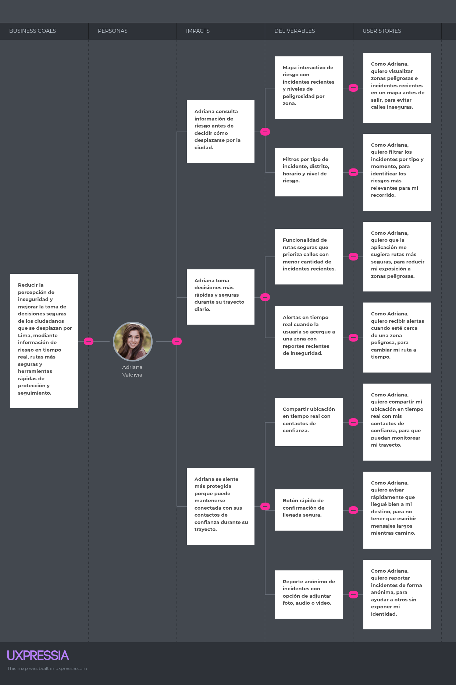</td>

### 2.4.4. Product Backlog

Para el proyecto UrbanVoice, el Product Backlog se ha organizado priorizando el valor de negocio y la necesidad de establecer una presencia digital.

<table>
<tr>
<th style="text-align:center;"># Orden</th>
<th style="text-align:center;">User Story ID</th>
<th style="text-align:center;">Título</th>
<th style="text-align:center;">Story Points</th>
<th style="text-align:center;">Prioridad</th>
</tr>
<tr>
<td align="center">1</td>
<td align="center">US13</td>
<td>Landing Page Informativo</td>
<td align="center">2</td>
<td align="center">Alta</td>
</tr>
<tr>
<td align="center">2</td>
<td align="center">US01</td>
<td>Visualización de mapa de riesgo</td>
<td align="center">5</td>
<td align="center">Alta</td>
</tr>
<tr>
<td align="center">3</td>
<td align="center">US02</td>
<td>Registro de incidentes ciudadanos</td>
<td align="center">5</td>
<td align="center">Alta</td>
</tr>
<tr>
<td align="center">4</td>
<td align="center">US05</td>
<td>Sistema de alertas geolocalizadas</td>
<td align="center">8</td>
<td align="center">Alta</td>
</tr>
<tr>
<td align="center">5</td>
<td align="center">US03</td>
<td>Gestión de evidencia multimedia</td>
<td align="center">5</td>
<td align="center">Alta</td>
</tr>
<tr>
<td align="center">6</td>
<td align="center">TS01</td>
<td>Endpoints de RESTful API (Arquitectura)</td>
<td align="center">3</td>
<td align="center">Alta</td>
</tr>
<tr>
<td align="center">7</td>
<td align="center">US04</td>
<td>Funcionalidad de reporte anónimo</td>
<td align="center">3</td>
<td align="center">Alta</td>
</tr>
<tr>
<td align="center">8</td>
<td align="center">US07</td>
<td>Compartir ubicación en tiempo real</td>
<td align="center">8</td>
<td align="center">Media</td>
</tr>
<tr>
<td align="center">9</td>
<td align="center">US14</td>
<td>Enlaces de descarga (Landing Page)</td>
<td align="center">1</td>
<td align="center">Media</td>
</tr>
<tr>
<td align="center">10</td>
<td align="center">US09</td>
<td>Visualización de detalle de incidentes</td>
<td align="center">3</td>
<td align="center">Media</td>
</tr>
<tr>
<td align="center">11</td>
<td align="center">US11</td>
<td>Panel de moderación para administradores</td>
<td align="center">5</td>
<td align="center">Media</td>
</tr>
<tr>
<td align="center">12</td>
<td align="center">US06</td>
<td>Trazado y consulta de rutas seguras</td>
<td align="center">8</td>
<td align="center">Baja</td>
</tr>
<tr>
<td align="center">13</td>
<td align="center">US10</td>
<td>Filtros avanzados de búsqueda</td>
<td align="center">3</td>
<td align="center">Baja</td>
</tr>
<tr>
<td align="center">14</td>
<td align="center">US08</td>
<td>Interfaz para contactos de confianza</td>
<td align="center">5</td>
<td align="center">Baja</td>
</tr>
<tr>
<td align="center">15</td>
<td align="center">US12</td>
<td>Gestión de categorías de riesgo</td>
<td align="center">2</td>
<td align="center">Baja</td>
</tr>
</table>

## 2.5. Strategic-Level Domain-Driven Design

Esta sección detalla la descomposición del sistema UrbanVoice en subdominios lógicos, permitiendo una arquitectura modular que responda a la complejidad de la seguridad urbana . Se emplean técnicas de diseño estratégico para asegurar que cada módulo tenga una responsabilidad clara y aislada.

### 2.5.1 EventStorming

El equipo realizó una sesión colaborativa para modelar los procesos de negocio de UrbanVoice, identificando eventos de dominio, comandos y reglas .

#### Paso 1: Collect Domain Events

En este primer paso, se identificaron todos los eventos relevantes para el dominio de nuestro sistema. Estos eventos representan hechos importantes que suceden en el proceso de negocio, como la creación de una cuenta, la publicación de un local o la confirmación de un pago, y los recopilamos utilizando post-its de color naranja.

<td></td>

#### Paso 2: Timeline

En este paso organizamos los eventos identificados en una línea temporal, colocándolos en orden cronológico para visualizar mejor el flujo del proceso (por ejemplo, desde que el Propietario publica un local hasta que el Freelancer lo reserva y lo paga) y entender la secuencia natural de acciones en el sistema.

<td></td>

#### Paso 3: Pain and Pivotal Points

En este paso se identificaron los pain points y los pivotal points del proceso. Esto significa que se encontraron las partes que necesitan mayor atención o que son cruciales para que el sistema funcione correctamente.

<td></td>

#### Paso 4: Commands

En este paso se agregaron comandos (los post-its azules) para representar las acciones de los usuarios o sistemas que inician un cambio en el sistema.

<td></td>

#### Paso 5: Policies

En este paso se definieron reglas de negocio (los post-its lila/morados) que responden a ciertos eventos y generan nuevos comandos o eventos. Básicamente, estas reglas automatizan decisiones basadas en lo que sucedió antes.

<td></td>

#### Paso 6: Read Models

En este paso se identificaron las vistas o modelos de lectura que los usuarios necesitan (post-its verdes). Esto se refiere a la información específica que debe estar accesible en ciertos momentos.

<td></td>

#### Paso 7: External System

En este paso se identificaron los sistemas externos (post-its rosados) que se conectan con nuestra solución. Estos son elementos que no controlamos directamente, pero que influyen en el proceso.

<td></td>

#### Paso 8: Aggregates

En este paso se organizaron los comandos y eventos relacionados en grupos lógicos llamados agregados (los post-its amarillos claros). Cada grupo reúne un conjunto de funciones y entidades que trabajan juntas de manera coherente.

<td></td>

#### Paso 9: Bounded Context

Al final, definimos las áreas de responsabilidad del sistema, agrupando los agregados y procesos afines, también conocidas como bounded contexts.

Bounded context: Identity and Access Management
<td></td>

Bounded context: Profile and Preferences Management
<td></td>

Bounded context: Location Managment
<td></td>

Bounded context: Report Managment
<td></td>

Bounded context: Notification Managment
<td></td>

### 2.5.1.1 Candidate Context Discovery

Tras analizar los eventos clave y los límites naturales del lenguaje, se identificaron los siguientes Bounded Contexts candidatos para UrbanVoice :

- **Identity and Access Management**: Encargado de la seguridad, roles de usuario y sesiones.
- **Profile Management**: Provee la funcionalidad de perfiles personales y preferencias.
- **Report Management**: Maneja el ciclo de vida de los incidentes y la evidencia multimedia (Core Domain) .
- **Location & Geospatial Intelligence**: Provee la lógica de mapas de calor, coordenadas y cálculo de rutas seguras.
- **Notification Management:** Coordina el envío de alertas críticas y mensajes a contactos.

<td></td>

### 2.5.1.2 Domain Message Flows Modeling

Se modelaron los flujos de comunicación entre contextos para los escenarios críticos de la aplicación .

**Escenario 1: Reporte de Incidente Ciudadano**

El Ciudadano registra un incidente mediante la app móvil. El contexto de Report almacena la data, el contexto de Location valida el punto crítico y el contexto de Notification dispara una alerta a los vecinos cercanos.

<td></td>

**Escenario 2: Compartir Ubicación en Tiempo Real**

El Ciudadano inicia un trayecto. El contexto de Profile identifica a los contactos de confianza y el contexto de Location emite las coordenadas constantes al contexto de Notification para que los contactos reciban el seguimiento.

<td></td>

### 2.5.1.3. Bounded Context Canvases

En esta sección, el equipo diseña sus candidate bounded contexts detallando los criterios de diseño estratégicos y tácticos. Para cada Bounded Context, se ha elaborado un Bounded Context Canvas utilizando la plantilla estándar, siguiendo un proceso iterativo que incluye la definición del propósito, la destilación del Lenguaje Ubicuo, las reglas de negocio, los mensajes consumidos/producidos y el análisis de dependencias.

1. Bounded Context Canvas: Identity and Access Management (IAM)
<td>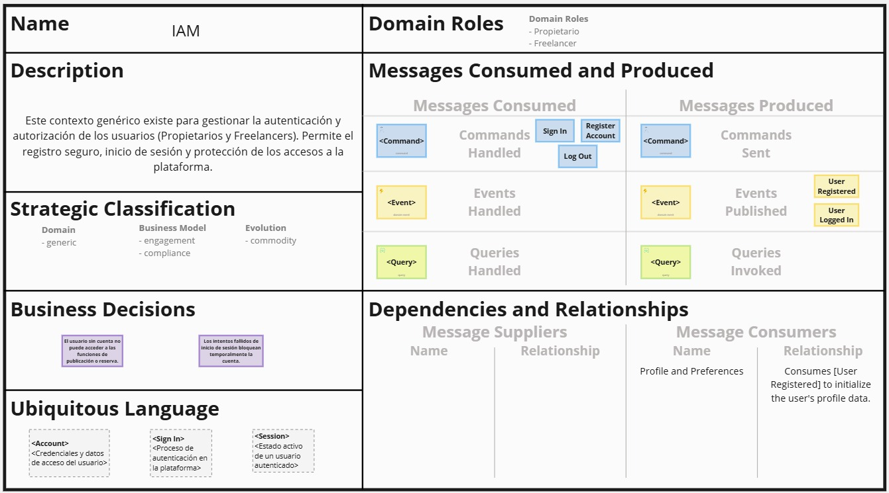</td>

2. Bounded Context Canvas: Profile and Preferences Management
<td></td>

3. Bounded Context Canvas: Location Managment
<td></td>

4. Bounded Context Canvas: Report Managment
<td></td>

5. Bounded Context Canvas: Notification Managment
<td></td>

### 2.5.2. Context Mapping
Este diagrama define las relaciones y fronteras entre los diferentes dominios (Agregados) identificados en el Event Storming. Establece cómo interactúan los contextos de Access, User, Incident, Spacial y Alert, detallando la naturaleza de sus integraciones y el flujo de información entre ellos para garantizar la integridad del sistema.
<td>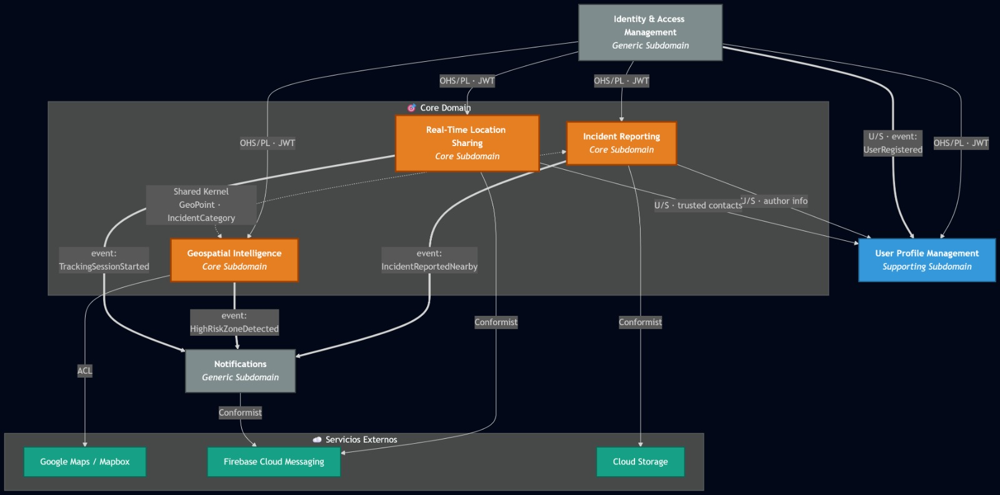</td>

### 2.5.3. Software Architecture
En esta sección se describe la estructura técnica de la solución. Se detalla la organización de los componentes, sus responsabilidades y cómo se articulan para satisfacer los requerimientos funcionales de participación ciudadana y seguridad urbana de UrbanVoice.

### 2.5.3.1. Software Architecture Context Level Diagrams
<td>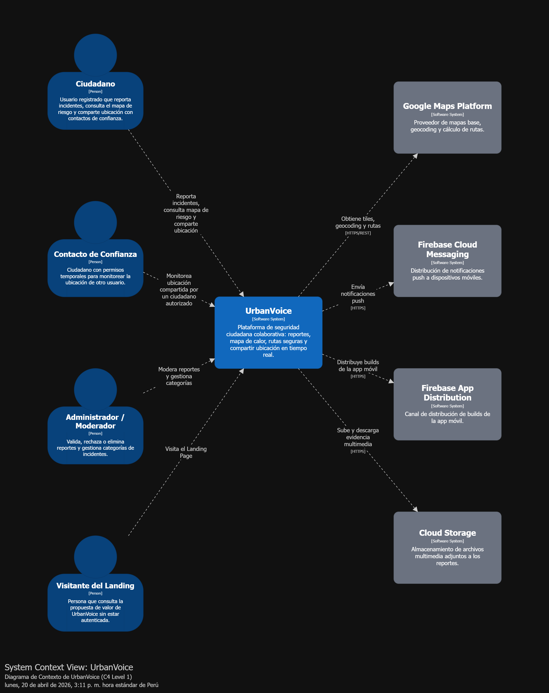</td>

### 2.5.3.2. Software Architecture Container Level Diagrams
<td>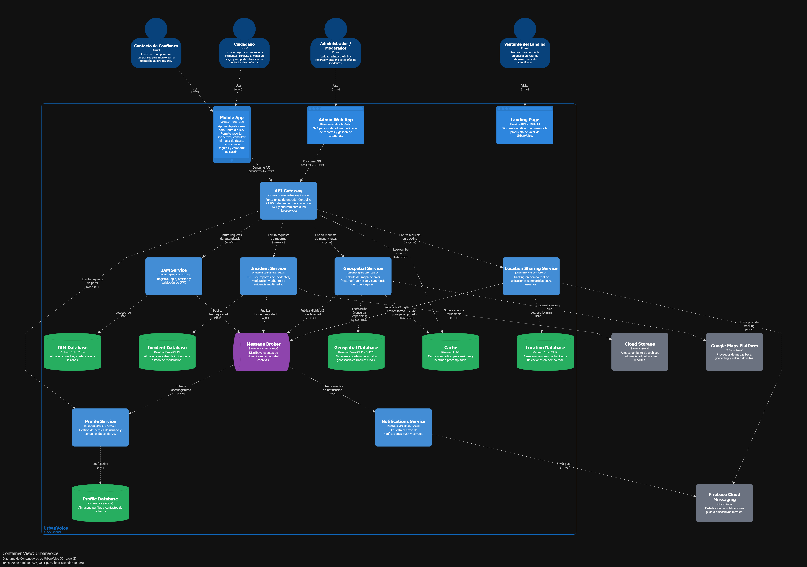</td>

### 2.5.3.3. Software Architecture Deployment Diagrams
<td>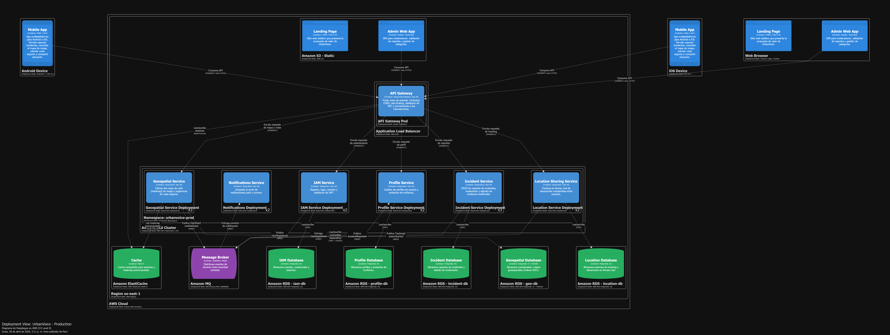</td>

## 2.6 Tactical-Level Domain-Driven Design

### 2.6.1 Bounded Context:Identity and Access Managment

El Bounded Context Identity and Access Management (IAM) es el pilar de seguridad de UrbanVoice. Su responsabilidad principal es gestionar el ciclo de vida de las identidades digitales, garantizando que solo los usuarios legítimos (ciudadanos y administradores) accedan a los recursos de la plataforma. Este contexto implementa la lógica de autenticación, autorización basada en roles (RBAC) y la gestión de sesiones mediante tokens de seguridad.

#### 2.6.1.1. Domain Layer

La Domain Layer concentra el modelo del dominio del contexto IAM. Aquí se ubican las clases que representan los conceptos del negocio, sus reglas y sus invariantes, sin dependencia alguna hacia frameworks, bases de datos ni servicios externos.

**Aggregate Root: `UserAccount`**

La entidad `UserAccount` es el aggregate root del contexto IAM. Esta entidad es la unidad de consistencia transaccional y concentra toda la lógica relacionada con el estado de un usuario registrado en el sistema: cuando un propietario o freelancer crea su cuenta, cuando se valida que su correo electrónico es único o cuando se restablece su contraseña, todas esas operaciones pasan necesariamente por este aggregate root.

| Atributo | Tipo | Descripción |
|---|---|---|
| `id` | `AccountId` (VO) | Identificador único de la cuenta de usuario |
| `name` | `UserProfileInfo` (VO) | Información del perfil del usuario (nombre y edad) |
| `credentials` | `AccountCredentials` (VO) | Credenciales de acceso (correo electrónico y hash de contraseña) |
| `status` | `AccountStatus` (Enum) | Estado actual de la cuenta (e.g., CREATED, VERIFIED, LOCKED) |
| `session` | `Session` (Entity) | Entidad interna que representa la sesión activa (opcional) |
| `createdAt` | `DateTime` | Fecha y hora de creación de la cuenta |
| `updatedAt` | `DateTime` | Fecha y hora de la última actualización |

**Métodos principales**

| Método | Visibilidad | Descripción |
|---|---|---|
| `changeCredentials(credentials: AccountCredentials)` | public | Cambia las credenciales de acceso. Emite `PasswordChanged` |
| `isLoginAllowed()` | public | Invariante: Retorna `true` si el estado de la cuenta y los intentos fallidos permiten el inicio de sesión |
| `lock()` | public | Bloquea la cuenta por seguridad (e.g., tras múltiples fallos de login) |
| `validateProfileInfo()` | public | Valida que la información de nombre y edad cumpla con las reglas de negocio |
| `validatePasswordResetPolicy(policy: PasswordResetPolicy)` | public | Valida que un nuevo password cumpla con la política de seguridad |
| `updateProfileInfo(profileInfo: UserProfileInfo)` | public | Actualiza el nombre y la edad del usuario |

**Entidad interna: `Session`**

`Session` es una entidad interna del aggregate root `UserAccount`. Su ciclo de vida está ligado a la cuenta; representa una instancia de autenticación exitosa.

| Atributo | Tipo | Descripción |
|---|---|---|
| `token` | `SessionToken` (VO) | Token criptográfico que identifica la sesión |
| `startedAt` | `DateTime` | Fecha y hora de inicio de la sesión |
| `expiresAt` | `DateTime` | Fecha y hora de expiración del token |

**Value Objects**

| Value Object | Propósito |
|---|---|
| `AccountId` | Identificador único de la cuenta de usuario (e.g., UUID) |
| `Name` | Encapsula el nombre del usuario (e.g., longitud mínima 2) |
| `Age` | Encapsula la edad validada |
| `EmailAddress` | Encapsula el correo electrónico del usuario, validando su formato y asegurando que sea único en el sistema |
| `Password` | Encapsula la contraseña compleja, pero solo como una abstracción antes de ser hasheada |
| `AccountCredentials` | Encapsula el correo electrónico y el hash de la contraseña. Es inmutable y se modela por valor |
| `SessionToken` | Token único y seguro de sesión |

**Enumerations**

| Enum | Valores | Propósito |
|---|---|---|
| `AccountStatus` | CREATED, VERIFIED, LOCKED, DELETED | Representa el estado actual de la cuenta de usuario |

**Domain Services**

| Domain Service | Responsabilidad |
|---|---|
| `PasswordHashingService` | Provee una abstracción para el hasheo seguro de contraseñas. Su implementación vive en infraestructura |
| `PasswordResetService` | Coordina el proceso de validación y generación de tokens para la recuperación de contraseña |
| `EmailUniquenessChecker` | Servicio para verificar que un correo electrónico no esté ya registrado en el sistema |

**Repository Interfaces (abstracciones)**

| Interface | Operaciones principales |
|---|---|
| `UserAccountRepository` | `save(account: UserAccount)`, `findById(id: AccountId)`, `findByEmail(email: EmailAddress)` |

**Domain Events**

| Domain Event | Cuándo se emite | Consumidores |
|---|---|---|
| `UserAccountCreated` | Cuando se crea exitosamente un nuevo `UserAccount` | Interno y externo |
| `LoginSuccessful` | Cuando un usuario inicia sesión con credenciales válidas | Interno y externo |
| `LoginFailed` | Cuando un intento de inicio de sesión falla | Interno (e.g., para audit-log y bloqueo) |
| `PasswordResetInitiated` | Cuando se solicita un cambio de contraseña | Interno y externo |
| `PasswordChanged` | Cuando se completa exitosamente el cambio de contraseña | Interno y externo |
| `SessionEnded` | Cuando un usuario cierra sesión explícitamente | Interno y externo |

**Factories**

| Factory | Propósito |
|---|---|
| `UserAccountFactory` | Centraliza la creación de nuevos `UserAccount` válidos a partir de un command, asegurando que se cumplan todas las precondiciones |

#### 2.6.1.2. Interface Layer

La Interface Layer es la capa más externa del Bounded Context del lado entrante. Su responsabilidad es exponer las capabilities del contexto y traducir los requests entrantes al modelo de la Application Layer.

**Controllers REST**

| Controller | Endpoints | Capabilities soportadas |
|---|---|---|
| `AccountRegistrationController` | `POST /api/v1/accounts` | Creación de cuenta y completado de registro |
| `AccountLoginController` | `POST /api/v1/login`, `POST /api/v1/logout` | Inicio y cierre de sesión |
| `PasswordResetController` | `POST /api/v1/password-reset/initiate`, `POST /api/v1/password-reset/complete` | Solicitud y cambio de contraseña |

**Resources / DTOs**

| DTO | Tipo | Uso |
|---|---|---|
| `RegisterAccountRequest` | Input | Payload del request `POST` para crear una cuenta |
| `LoginRequest` | Input | Payload del request `POST` para iniciar sesión |
| `InitiatePasswordResetRequest` | Input | Payload para solicitar la recuperación de contraseña |
| `CompletePasswordResetRequest` | Input | Payload para establecer la nueva contraseña |
| `AccountSummaryResponse` | Output | Versión reducida de la cuenta para listados rápidos |
| `LoginResponse` | Output | Respuesta exitosa del login (e.g., con token de sesión) |
| `AccountStatusResponse` | Output | Respuesta detallada del estado de la cuenta |

**Assemblers**

| Assembler | Transformación |
|---|---|
| `FromRegisterAccountRequestAssembler` | `RegisterAccountRequest` a `RegisterAccountCommand` |
| `FromLoginRequestAssembler` | `LoginRequest` a `LoginUserCommand` |

#### 2.6.1.3. Application Layer

La Application Layer orquesta los flujos de proceso del negocio que involucran al Bounded Context. Aquí viven las clases responsables de recibir commands y queries, coordinar con el Domain Layer, gestionar la transaccionalidad y publicar los domain events. Se adopta el patrón CQRS ligero.

**Command Handlers**

| Command Handler | Command procesado | Flujo |
|---|---|---|
| `RegisterAccountCommandHandler` | `RegisterAccountCommand` | Valida el command, invoca al `UserAccountFactory` para crear el aggregate, persiste vía `UserAccountRepository` y publica `UserAccountCreated` |
| `LoginUserCommandHandler` | `LoginUserCommand` | Recupera el aggregate por correo, valida credenciales, invoca `account.startSession()`, persiste y publica `LoginSuccessful` |
| `InitiatePasswordResetCommandHandler` | `InitiatePasswordResetCommand` | Recupera el aggregate, invoca el `PasswordResetService` para generar token, persiste y publica `PasswordResetInitiated` |
| `CompletePasswordResetCommandHandler` | `CompletePasswordResetCommand` | Valida el token, recupera el aggregate, invoca `account.changeCredentials()`, persiste y publica `PasswordChanged` |
| `LogoutUserCommandHandler` | `LogoutUserCommand` | Recupera el aggregate, invoca `account.endSession()`, persiste y publica `SessionEnded` |

**Query Services**

| Query Service | Query soportada | Retorno |
|---|---|---|
| `GetRegistrationFormQueryService` | `GetRegistrationFormQuery` | `RegisterAccountRequest` (vacío) |
| `GetLoginFormQueryService` | `GetLoginFormQuery` | `LoginRequest` (vacío) |
| `GetAccountStatusQueryService` | `GetAccountStatusQuery(accountId)` | `AccountStatusResponse` |
| `GetAccountSummaryQueryService` | `GetAccountSummaryQuery(accountId)` | `AccountSummaryResponse` |

**Event Handlers**

| Event Handler | Evento | Acción |
|---|---|---|
| `UserAccountCreatedEventHandler` | `UserAccountCreated` | Publica el evento en el message broker para que otros contexts reaccionen |
| `LoginFailedEventHandler` | `LoginFailed` | Actualiza un read-model específico o genera una entrada de audit-log |

**Application Services**

| Application Service | Responsabilidad |
|---|---|
| `AccountApplicationService` | Fachada del contexto que coordina Command Handlers y Query Services |

#### 2.6.1.4 Infrastructure Layer

La Infrastructure Layer provee implementaciones concretas de las abstracciones definidas en el Domain Layer y gestiona la integración con tecnologías externas.

**Repository Implementations**

| Implementación | Interface que implementa | Tecnología |
|---|---|---|
| `JpaUserAccountRepository` | `UserAccountRepository` | Spring Data JPA sobre PostgreSQL |

**JPA Entities**

| JPA Entity | Mapeo |
|---|---|
| `UserAccountJpaEntity` | Tabla `accounts` |
| `UserProfileInfoJpaEntity` | Tabla `user_profiles` o descomposición en la tabla `accounts` |
| `SessionJpaEntity` | Tabla `sessions` |

**Mappers Domain a JPA**

| Mapper | Transformación |
|---|---|
| `UserAccountJpaMapper` | `UserAccount` a `UserAccountJpaEntity` y viceversa |
| `SessionJpaMapper` | `Session` a `SessionJpaEntity` y viceversa |

**External Service Adapters**

| Adapter | Servicio externo | Responsabilidad |
|---|---|---|
| `BCryptPasswordAdapter` | `PasswordHashingService` | Provee la implementación de hasheo seguro utilizando BCrypt |
| `JwtSessionServiceAdapter` | `SessionTokenGenerator` | Genera y valida tokens de sesión seguros utilizando JSON Web Tokens (JWT) |
| `MailgunServiceAdapter` | `EmailService` | Implementación externa para enviar correos electrónicos para la recuperación de contraseña |
| `EventPublisherAdapter` | RabbitMQ (vía Spring AMQP) | Publica los domain events en el exchange correspondiente |

**Configuration**

| Clase de configuración | Propósito |
|---|---|
| `IamContextConfig` | Registra los beans de Spring del contexto, configura transacciones y wiring de handlers |
| `SpringSecurityConfig` | Configura el framework de seguridad (e.g., filtros JWT, autenticación de endpoints) |
| `RabbitMqConfig` | Declara exchanges, queues y bindings del contexto |
| `DatabaseConfig` | Configura la conexión a la base de datos PostgreSQL específica para este contexto |

#### 2.6.1.5 Bounded Context Software Architecture Component Level Diagrams

En esta subsección se documenta de forma textual y visual la arquitectura a nivel de componentes del Bounded Context Identity and Access Management (IAM). La descomposición parte del contenedor `Identity Service`, que implementa este contexto, y lo organiza en componentes principales agrupados por capas. Cada componente representa una agrupación coherente de clases que colaboran para proveer el ciclo de vida de la cuenta de usuario.

La arquitectura evidencia una separación estricta entre las cuatro capas. La Interface Layer, compuesta por `AccountRegistrationController`, `AccountLoginController` y `PasswordResetController`, recibe las peticiones HTTP y delega en la Application Layer. Esta capa coordina el flujo mediante `AccountApplicationService`, Command Handlers específicos (como `RegisterAccountCommandHandler` y `LoginUserCommandHandler`) y Query Services.

Estos componentes interactúan con el Domain Layer, el núcleo del contexto, donde residen el aggregate root `UserAccount`, la factory `UserAccountFactory` y servicios de dominio puros como `PasswordResetService`. Siguiendo el Dependency Inversion Principle, la Infrastructure Layer provee las implementaciones técnicas a través de `JpaUserAccountRepository`, y delega la complejidad técnica externa a adapters como `JwtSessionServiceAdapter` (para tokens) y `BCryptPasswordAdapter` (para encriptación).

<td>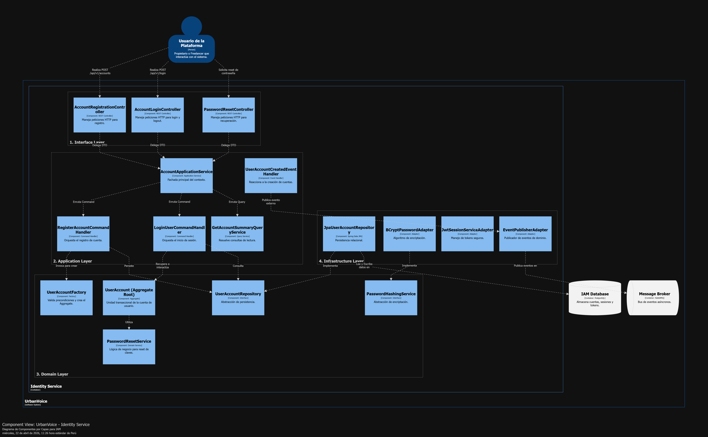</td>

#### 2.6.1.6 Bounded Context Software Architecture Code Level Diagrams

En esta subsección se describe la arquitectura a nivel de código del Bounded Context Identity and Access Management (IAM). Se documentan los dos artefactos principales del diseño detallado: el modelo de clases del Domain Layer, garantizando las reglas de negocio de autenticación y registro, y el diseño de persistencia relacional que soporta al contexto.

##### 2.6.1.6.1. Bounded Context Domain Layer Class Diagrams

El modelo de clases del Domain Layer gira alrededor del aggregate root UserAccount, que concentra la consistencia transaccional del contexto de identidad. Dentro de este aggregate se encuentra la entidad interna Session, cuya existencia depende de un inicio de sesión exitoso asociado a una cuenta activa.

Los value objects, como AccountId, AccountCredentials (que encapsula email y hash), UserProfileInfo y SessionToken, forman parte integral del modelo. Estos objetos inmutables refuerzan validaciones intrínsecas, por ejemplo, asegurando que un correo tenga el formato correcto antes de ser evaluado por el sistema. Las enumeraciones como AccountStatus dictan las invariantes del estado de la cuenta (CREATED, VERIFIED, LOCKED).

Sobre este núcleo actúan las interfaces abstractas UserAccountRepository y PasswordHashingService, manteniendo al dominio completamente ignorante de las librerías de persistencia o los algoritmos criptográficos específicos utilizados en producción.

<td>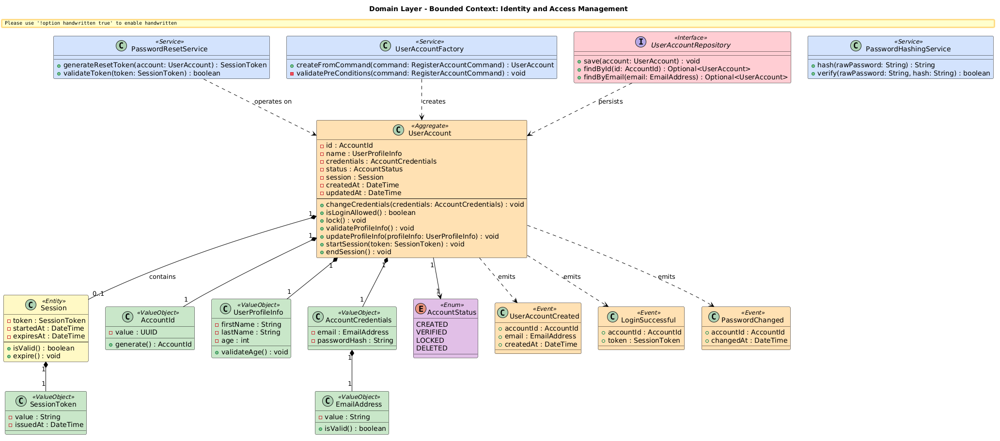</td>

##### 2.6.1.6.2.  Bounded Context Database Design Diagram   

El diseño de base de datos relacional que soporta el Bounded Context IAM sigue el principio de database-per-service. La tabla central es accounts, donde se materializa el aggregate root UserAccount. Esta tabla contiene los identificadores únicos, los datos del perfil del usuario (descompuestos en columnas) y las credenciales cifradas.

Para garantizar la integridad y la seguridad a nivel de base de datos, se utiliza un índice UNIQUE sobre la columna email, previniendo de forma estricta que dos usuarios se registren con el mismo correo. Asimismo, se implementan restricciones CHECK para asegurar que la columna status solo contenga valores válidos.

La tabla sessions representa la entidad interna del dominio y se relaciona con accounts mediante una foreign key. Esta tabla maneja la persistencia de los tokens de sesión activos y sus fechas de expiración, con un borrado en cascada (ON DELETE CASCADE) si la cuenta madre es eliminada. Finalmente, una columna version en la tabla accounts habilita el optimistic locking, evitando condiciones de carrera si el usuario intenta modificar su perfil desde dos dispositivos simultáneamente.

<td>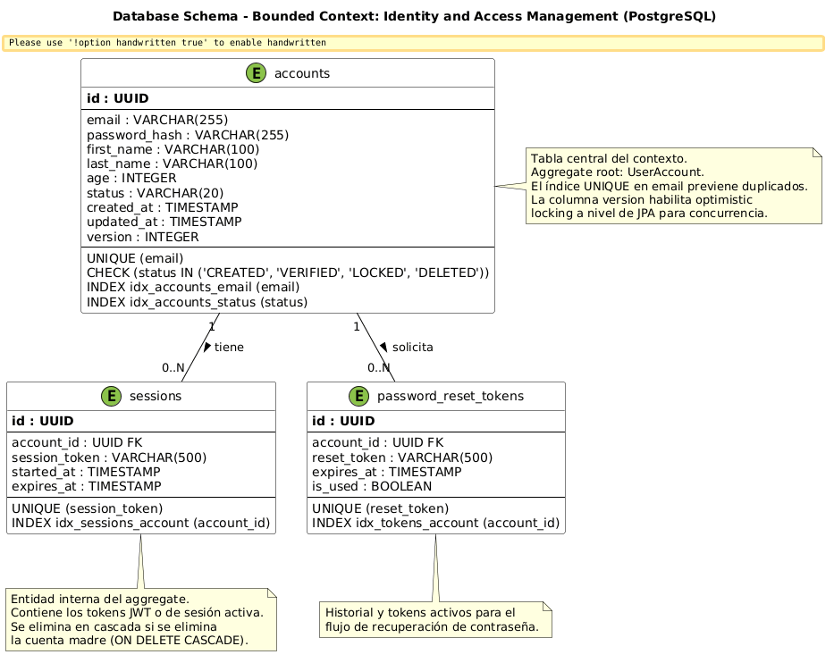</td>

### 2.6.2 Bounded Context:Profile and Preferences Management
El Bounded Context Profile and Preferences Management es el encargado de gestionar la identidad social y la configuración de seguridad personalizada de cada ciudadano en UrbanVoice. Mientras que el contexto IAM se ocupa de la "cuenta" y el "acceso", este contexto se centra en el "sujeto": quién es el usuario, cómo desea ser notificado y, fundamentalmente, quiénes integran su red de apoyo inmediata.

Este contexto introduce el concepto crítico del Círculo de Confianza, una red de contactos que permite la reacción rápida ante situaciones de emergencia. La lógica de este contexto asegura que la información de contacto sea válida y que las preferencias de notificación respeten las invariantes de privacidad definidas por el usuario. El diseño táctico sigue los principios de segregación de responsabilidades para permitir que la gestión de perfiles escale independientemente del sistema de autenticación central.
#### 2.6.2.1. Domain Layer

La capa de dominio define la estructura y el comportamiento de la identidad del ciudadano y sus vínculos de seguridad. Es una capa pura que encapsula las reglas sobre cómo se construye una red de contactos confiable.

**Aggregate Root: `Profile`**

El aggregate root `Profile` es la entidad principal que orquesta la información del ciudadano y su círculo de confianza. Un perfil es el punto de consistencia para todas las configuraciones de seguridad personal; por ejemplo, no se puede activar una alerta de pánico si el perfil no tiene al menos un contacto de confianza validado.

| Atributo | Tipo | Descripción |
|---|---|---|
| `id` | `ProfileId` (VO) | Identificador único vinculado al `AccountId` del contexto IAM |
| `fullName` | `PersonName` (VO) | Nombre y apellido con validaciones de longitud y caracteres |
| `phoneNumber` | `Phone` (VO) | Número móvil validado para comunicaciones de emergencia |
| `circleOfTrust` | `List<TrustedContact>` | Colección de entidades internas (contactos de apoyo) |
| `preferences` | `UserPreferences` (VO) | Configuraciones de radio de alerta y categorías de interés |
| `avatarUrl` | `StorageUrl` (VO) | Enlace a la imagen de perfil almacenada en la nube |
| `createdAt` | `DateTime` | Fecha de creación del perfil |

**Métodos principales**

| Método | Visibilidad | Descripción |
|---|---|---|
| `addTrustedContact(name, phone, relationship)` | public | Agrega un nuevo contacto al círculo. Invariante: Máximo 5 contactos por perfil. Emite `ContactAddedToCircle`. |
| `removeTrustedContact(contactId)` | public | Elimina un contacto de la red de apoyo. |
| `updateEmergencySettings(radius, autoAlert)` | public | Modifica los umbrales de geofencing para alertas automáticas. |
| `updateProfileInfo(name, phone)` | public | Actualiza datos básicos. Emite `ProfileUpdated`. |

**Entidad interna: `TrustedContact`**

`TrustedContact` es una entidad que solo existe dentro del ciclo de vida de un `Profile`. Representa a las personas externas (familiares, amigos) que recibirán notificaciones si el ciudadano se encuentra en peligro.

| Atributo | Tipo | Descripción |
|---|---|---|
| `id` | `ContactId` (VO) | Identificador único del contacto dentro del perfil |
| `name` | `string` | Nombre del contacto |
| `phoneNumber` | `Phone` (VO) | Número para recepción de SMS/Llamadas de alerta |
| `relationship` | `string` | Vínculo (Padre, Amigo, etc.) para contextualizar la alerta |

**Value Objects**

| Value Object | Propósito |
|---|---|
| `ProfileId` | UUID inmutable que actúa como llave foránea lógica hacia IAM. |
| `PersonName` | Valida que el nombre no contenga caracteres especiales y tenga una longitud mínima. |
| `Phone` | Valida el formato internacional de número telefónico (E.164). |
| `UserPreferences` | Encapsula el radio de acción (en metros) y los filtros de tipos de incidentes preferidos. |

**Domain Services**

| Domain Service | Responsabilidad |
|---|---|
| `CircleIntegrityService` | Valida que los números telefónicos en el Círculo de Confianza no estén duplicados y sean operables para servicios de SMS. |

**Domain Events**

| Domain Event | Cuándo se emite | Consumidores |
|---|---|---|
| `ProfileCreated` | Al instanciar un perfil nuevo tras el registro en IAM. | Notifications (para bienvenida). |
| `ContactAddedToCircle` | Al registrar un nuevo contacto de emergencia. | Notifications (para solicitar confirmación al contacto). |
| `EmergencyPreferencesChanged` | Al modificar radios de geofencing. | Location Management (para actualizar observadores). |

#### 2.6.2.2. Interface Layer
Expone las capacidades de gestión de identidad social y configuración a los clientes móviles y aplicaciones de administración.

**Controllers REST**

| Controller | Endpoints | Capabilities soportadas |
|---|---|---|
| `ProfileController` | `GET /api/v1/profiles/me`   `PATCH /api/v1/profiles/me` | Consulta y actualización del perfil del ciudadano autenticado. |
| `TrustCircleController` | `POST /api/v1/profiles/me/contacts`   `DELETE /api/v1/profiles/me/contacts/{id}` | Gestión dinámica del Círculo de Confianza. |

**Resources / DTOs**

| DTO | Uso |
|---|---|
| `UpdateProfileResource` | Payload para modificar datos personales y preferencias. |
| `TrustedContactResource` | Representación del contacto para ser mostrado en la App móvil. |
| `ProfileDetailResource` | Vista completa del perfil incluyendo estadísticas de reportes realizados. |

#### 2.6.2.3. Application Layer

Gestiona los flujos de orquestación, asegurando que las acciones del usuario se traduzcan en cambios válidos en el dominio y se notifiquen a otros contextos.

**Command Handlers**

| Command Handler | Flujo |
|---|---|
| `CreateProfileCommandHandler` | Reacciona al evento `UserRegistered` de IAM para inicializar un perfil vacío con valores por defecto. |
| `AddTrustedContactCommandHandler` | Recupera el perfil, invoca la lógica de negocio de `addTrustedContact` y persiste los cambios. |
| `UpdatePreferencesCommandHandler` | Traduce los nuevos parámetros de alerta y los aplica al aggregate root. |

**Query Services**

| Query Service | Responsabilidad |
|---|---|
| `GetProfileDetailsQueryService` | Retorna la información extendida del ciudadano, integrando datos del modelo de lectura optimizado. |

#### 2.6.2.4 Infrastructure Layer

Provee la persistencia y la integración con servicios multimedia externos.

**Persistence**

| Componente | Tecnología | Mapeo |
|---|---|---|
| `JpaProfileRepository` | Spring Data JPA | Tabla `profiles` y `trusted_contacts` (relación One-to-Many). |

**Adapters**

| Adapter | Servicio Externo | Responsabilidad |
|---|---|---|
| `CloudinaryImageAdapter` | Cloudinary API | Gestiona el upload de fotos de perfil y retorna las URLs optimizadas con transformación de tamaño. |
| `IamServiceClientAdapter` | IAM Context (REST/Internal) | Verifica la existencia de la cuenta antes de operaciones críticas de perfil. |

**Mappers**

| Mapper | Transformación |
|---|---|
| `ProfileMapper` | Convierte la entidad de persistencia `ProfileJpaEntity` al objeto de dominio `Profile` manteniendo la inmutabilidad de los Value Objects. |

#### 2.6.2.5 Bounded Context Software Architecture Component Level Diagrams

En esta subsección se documenta la arquitectura a nivel de componentes del Bounded Context **Profile and Preferences Management**. La descomposición parte del contenedor **Profile Service**, el cual implementa este contexto y se organiza en componentes agrupados por capas. Cada componente representa una agrupación coherente de clases que colaboran para gestionar la información personal del ciudadano, sus preferencias de seguridad y su círculo de confianza.

La **Interface Layer** expone las capacidades del contexto a través de `ProfileController` y `TrustCircleController`, los cuales reciben las solicitudes HTTP provenientes de la aplicación móvil y delegan su procesamiento a la **Application Layer**. Estos componentes permiten consultar y actualizar el perfil del usuario autenticado, así como registrar y eliminar contactos del círculo de confianza.

La **Application Layer** coordina los casos de uso mediante `ProfileApplicationService`, los command handlers `CreateProfileCommandHandler`, `UpdateProfileCommandHandler`, `AddTrustedContactCommandHandler`, `RemoveTrustedContactCommandHandler` y `UpdatePreferencesCommandHandler`, además del `GetProfileDetailsQueryService` para las operaciones de consulta. Esta capa se encarga de orquestar el flujo entre la capa de entrada y el modelo de dominio, manteniendo separada la lógica de negocio de los detalles de transporte y persistencia.

La **Domain Layer** concentra el núcleo del contexto. En ella residen el aggregate root `Profile`, la entidad interna `TrustedContact`, el value object `UserPreferences`, el servicio de dominio `CircleIntegrityService` y la abstracción `ProfileRepository`. Estas piezas encapsulan las reglas de negocio relacionadas con la actualización del perfil, la validación de contactos de confianza y la configuración de preferencias de seguridad. De esta manera, el dominio permanece independiente de frameworks y tecnologías externas.

Siguiendo el principio de inversión de dependencias, la **Infrastructure Layer** provee las implementaciones técnicas necesarias para ejecutar el contexto en producción. En esta capa se ubican `JpaProfileRepository`, encargado de la persistencia relacional; `ProfileMapper`, responsable de transformar entidades de persistencia en objetos de dominio y viceversa; `CloudinaryImageAdapter`, para la gestión de imágenes de perfil; e `IamServiceClientAdapter`, que permite validar la existencia de la cuenta del usuario en el contexto IAM cuando sea necesario. Opcionalmente, el contexto también puede incorporar un `EventPublisherAdapter` para publicar eventos de dominio hacia otros bounded contexts.

Esta organización por componentes evidencia una separación clara de responsabilidades, mejora la mantenibilidad del contexto y permite que la lógica del perfil evolucione de manera desacoplada de la infraestructura y del sistema de autenticación.

<td></td>

#### 2.6.2.6 Bounded Context Software Architecture Code Level Diagrams

En esta subsección se describe la arquitectura a nivel de código del Bounded Context **Profile and Preferences Management**. Se documentan los dos artefactos principales del diseño detallado del contexto: el modelo de clases del **Domain Layer**, que concentra las reglas de negocio del perfil del ciudadano y su círculo de confianza, y el diseño de persistencia relacional que soporta dichas capacidades.

El objetivo de esta vista es mostrar cómo los conceptos del dominio previamente identificados se traducen en estructuras de código concretas, preservando la separación entre la lógica de negocio, la persistencia y la integración con servicios externos. Para ello, se presenta primero el diagrama de clases del dominio y, posteriormente, el diagrama de diseño de base de datos asociado al contexto.

##### 2.6.2.6.1. Bounded Context Domain Layer Class Diagrams

El modelo de clases del **Domain Layer** gira alrededor del aggregate root `Profile`, que concentra la consistencia transaccional del contexto. Este aggregate representa la identidad funcional del ciudadano dentro de UrbanVoice y centraliza la gestión de su información personal, sus preferencias de seguridad y su círculo de confianza.

Dentro de este aggregate se encuentra la entidad interna `TrustedContact`, cuya existencia depende completamente del perfil al que pertenece. La relación entre ambas clases es de composición, ya que un contacto de confianza no tiene sentido fuera del ciclo de vida de un `Profile`. A través de esta estructura se modela la red de apoyo inmediata del ciudadano para escenarios de emergencia.

El aggregate utiliza distintos **Value Objects** para encapsular validaciones y reforzar la semántica del dominio. Entre ellos destacan `ProfileId`, `ContactId`, `PersonName`, `Phone`, `UserPreferences` y `StorageUrl`. Estos objetos son inmutables y contienen reglas intrínsecas, como el formato válido del número telefónico, la estructura correcta del nombre y las configuraciones permitidas de seguridad personalizada.

Sobre este núcleo actúa el servicio de dominio `CircleIntegrityService`, responsable de validar reglas que no pertenecen naturalmente a una sola entidad, como evitar la duplicidad de contactos dentro del círculo de confianza y verificar que los números registrados puedan ser utilizados para comunicaciones de emergencia. Asimismo, la abstracción `ProfileRepository` representa el puerto de persistencia del aggregate root, permitiendo almacenar y recuperar perfiles sin acoplar el dominio a una tecnología específica de base de datos.

Este diseño mantiene al dominio limpio y cohesionado, reforzando las invariantes del contexto y preservando su independencia respecto de la infraestructura.

<td></td>

##### 2.6.2.6.2. Bounded Context Database Design Diagram

El diseño de base de datos relacional que soporta el Bounded Context **Profile and Preferences Management** sigue el principio de **database-per-service**, de modo que este contexto administra de forma independiente la persistencia de los perfiles y sus contactos de confianza.

La tabla central es `profiles`, donde se materializa el aggregate root `Profile`. En esta tabla se almacenan los atributos principales del perfil del ciudadano, tales como el identificador del perfil, la referencia lógica hacia la cuenta del contexto IAM (`account_id`), el nombre completo, el número telefónico, la URL del avatar y las preferencias de seguridad configuradas por el usuario, como el radio de alerta, la activación de alertas automáticas y las categorías preferidas de incidentes.

Para garantizar integridad a nivel de base de datos, la tabla `profiles` incorpora una restricción `UNIQUE` sobre `account_id`, evitando que una misma cuenta tenga más de un perfil asociado. Asimismo, la columna `version` permite implementar **optimistic locking**, previniendo conflictos cuando múltiples operaciones intentan modificar el mismo perfil de forma concurrente.

La tabla `trusted_contacts` representa la entidad interna `TrustedContact` y mantiene una relación de uno a muchos con `profiles`, ya que un perfil puede contener varios contactos de confianza. En esta tabla se almacenan el identificador del contacto, el identificador del perfil al que pertenece, el nombre del contacto, su número telefónico, el tipo de relación que mantiene con el usuario y la fecha de registro.

La relación entre `profiles` y `trusted_contacts` se implementa mediante una **foreign key** sobre `profile_id`, acompañada de borrado en cascada (`ON DELETE CASCADE`), ya que un contacto de confianza no debe existir sin el perfil al que pertenece. Adicionalmente, se recomienda definir índices sobre `account_id` y `profile_id` para optimizar las consultas más frecuentes del contexto.

Este diseño relacional permite representar adecuadamente las necesidades funcionales del bounded context y mantiene consistencia entre el modelo del dominio y la estructura de persistencia.

<td></td>

### 2.6.3 Bounded Context:Location Managment

El Bounded Context Location Management representa el núcleo de inteligencia geoespacial de UrbanVoice. Su propósito es procesar, analizar y transformar los datos de ubicación crudos en información accionable sobre seguridad urbana. Mientras que otros contextos gestionan el "qué" (el incidente), este contexto se especializa en el "dónde": define las zonas de riesgo, calcula mapas de calor dinámicos y provee algoritmos para determinar la seguridad de los trayectos ciudadanos.

#### 2.6.3.1. Domain Layer

La capa de dominio de Location Management es responsable de la lógica espacial pura. No depende de proveedores de mapas específicos, sino que define cómo se modela el riesgo en el territorio.

**Aggregate Root: `GeospatialZone`**

La entidad `GeospatialZone` es el aggregate root. Representa un área geográfica delimitada (polígono o radio) que consolida múltiples reportes para determinar un nivel de riesgo específico. Es la unidad de consistencia para los mapas de calor.

| Atributo | Tipo | Descripción |
|---|---|---|
| `id` | `ZoneId` (VO) | Identificador único de la zona espacial |
| `boundary` | `GeoBoundary` (VO) | Polígono o radio que define la extensión de la zona |
| `riskLevel` | `RiskIndex` (VO) | Valor numérico (0.0 a 1.0) que cuantifica el peligro |
| `incidentCount` | `int` | Cantidad de reportes activos en la zona |
| `lastActivity` | `DateTime` | Última actualización basada en nuevos incidentes |

**Métodos principales**

| Método | Visibilidad | Descripción |
|---|---|---|
| `recalculateRisk(incidents: List<IncidentData>)` | public | Actualiza el `RiskIndex` basándose en la densidad y gravedad de los sucesos. |
| `isPointInside(point: Coordinates)` | public | Determina si una coordenada específica pertenece a esta zona de riesgo. |
| `expireOldData(threshold: DateTime)` | public | Reduce el índice de riesgo si no se han reportado incidentes recientes (enfriamiento). |

**Value Objects**

| Value Object | Propósito |
|---|---|
| `Coordinates` | Encapsula Latitud y Longitud con validaciones de rango geográfico. |
| `RiskIndex` | Objeto inmutable que valida que el nivel de riesgo esté en el rango permitido y define su semántica (BAJO, MEDIO, ALTO). |
| `GeoBoundary` | Define la geometría de la zona (Círculo o Polígono). |

**Domain Services**

| Domain Service | Responsabilidad |
|---|---|
| `HeatmapCalculationService` | Ejecuta algoritmos de agrupación (clustering) para convertir puntos individuales en áreas de calor continuas. |
| `RouteSafetyEvaluator` | Recibe una serie de puntos (polilínea) y retorna un reporte de seguridad comparándolo con las `GeospatialZones` activas. |

**Repository Interfaces**

| Interface | Operaciones principales |
|---|---|
| `GeospatialRepository` | `save(zone: GeospatialZone)`, `findZonesNear(point: Coordinates, radius: double)`, `findAllActiveZones()` |

**Domain Events**

| Domain Event | Cuándo se emite | Consumidores |
|---|---|---|
| `RiskLevelEscalated` | Cuando una zona supera un umbral crítico de peligro. | **Notifications** (para alertas críticas de área). |
| `SafeRouteCalculated` | Al completar el análisis de un trayecto solicitado. | **Application Layer** (Auditoría). |

#### 2.6.3.2. Interface Layer

Se encarga de recibir las coordenadas de los usuarios y entregar los datos necesarios para el renderizado del mapa en la aplicación móvil.

**Controllers REST**

| Controller | Endpoints | Capabilities soportadas |
|---|---|---|
| `MapController` | `GET /api/v1/location/heatmap` | Provee la colección de puntos y pesos para el mapa de calor (US01). |
| `GeofencingController` | `POST /api/v1/location/check-point` | Valida si la ubicación actual del usuario representa un riesgo (US05). |
| `RouteController` | `POST /api/v1/location/safe-route` | Calcula el trayecto con menor exposición al riesgo (US06). |

**DTOs / Resources**

| DTO | Uso |
|---|---|
| `HeatmapPointResource` | Coordenada + Intensidad para el frontend de mapas. |
| `RouteRequestResource` | Punto de origen y destino para el cálculo de ruta. |
| `RiskAlertResource` | Información sobre la zona de riesgo detectada cerca del usuario. |

#### 2.6.3.3. Application Layer

Esta capa orquesta la interacción entre los reportes entrantes y la actualización de la inteligencia espacial.

**Command Handlers**

| Command Handler | Flujo |
|---|---|
| `UpdateHeatmapCommandHandler` | Reacciona a nuevos reportes de incidentes para disparar el recálculo de las zonas de riesgo afectadas. |
| `EvaluateRouteSafetyCommandHandler` | Coordina con el servicio de dominio para analizar una ruta y retornar la mejor opción al ciudadano. |

**Query Services**

| Query Service | Responsabilidad |
|---|---|
| `GetNearbyRiskZonesQueryService` | Retorna las zonas peligrosas en el radio de visión actual del usuario para optimizar el rendimiento del mapa móvil. |

#### 2.6.3.4 Infrastructure Layer

Provee el motor de base de datos espacial y la integración con proveedores de mapas externos.

**Persistence (Spatial DB)**

| Componente | Tecnología | Responsabilidad |
|---|---|---|
| `PostGisGeospatialRepository` | PostgreSQL + PostGIS | Utiliza tipos de datos `GEOMETRY` y `GEOGRAPHY` para realizar cálculos espaciales (`ST_DWithin`, `ST_Contains`) a nivel de base de datos. |

**Adapters**

| Adapter | Servicio Externo | Responsabilidad |
|---|---|---|
| `GoogleMapsApiAdapter` | Google Maps Platform | Provee servicios de Geocodificación (direcciones a coordenadas) y trazado inicial de rutas de tráfico. |
| `MatrixDistanceAdapter` | MapBox / Google | Calcula distancias y tiempos estimados para las rutas sugeridas. |

**Mappers Espaciales**

| Mapper | Transformación |
|---|---|
| `GeoJsonMapper` | Convierte los objetos de dominio `Coordinates` y `GeospatialZone` al estándar GeoJSON para facilitar la interoperabilidad con clientes móviles y web. |

#### 2.6.3.5 Bounded Context Software Architecture Component Level Diagrams

En esta subsección se documenta de forma textual la arquitectura a nivel de componentes del Bounded Context *Location Management*. La descomposición parte del container `Location Service`, responsable de la inteligencia geoespacial del sistema, y se organiza en componentes principales agrupados por capas siguiendo un enfoque de arquitectura limpia. Cada componente representa una unidad cohesionada de comportamiento encargada de procesar, transformar o exponer información espacial.

La arquitectura evidencia una separación estricta entre las cuatro capas del contexto. La **Interface Layer**, compuesta por `MapController`, `GeofencingController` y `RouteController`, actúa como punto de entrada para las solicitudes de los clientes. Estos controladores no contienen lógica de negocio; únicamente validan, transforman y delegan las peticiones hacia la Application Layer mediante DTOs como `HeatmapPointResource`, `RouteRequestResource` y `RiskAlertResource`.

La **Application Layer** orquesta los casos de uso del contexto a través de componentes como `UpdateHeatmapCommandHandler` y `EvaluateRouteSafetyCommandHandler`. Estos coordinan la ejecución de operaciones complejas, como la actualización de zonas de riesgo en respuesta a nuevos incidentes o el análisis de rutas seguras. Asimismo, servicios de consulta como `GetNearbyRiskZonesQueryService` optimizan la recuperación de datos geoespaciales según el contexto de visualización del usuario, evitando cargas innecesarias en dispositivos móviles.

En el núcleo del sistema se encuentra la **Domain Layer**, donde reside el aggregate `GeospatialZone`, encargado de encapsular la consistencia del modelo de riesgo espacial. Este aggregate trabaja en conjunto con value objects como `Coordinates`, `GeoBoundary` y `RiskIndex`, que representan conceptos fundamentales del dominio. La lógica compleja se delega a domain services como `HeatmapCalculationService`, responsable de ejecutar algoritmos de clustering sobre datos de incidentes, y `RouteSafetyEvaluator`, que analiza trayectorias para determinar niveles de exposición al riesgo.

Siguiendo el *Dependency Inversion Principle*, la capa de dominio define el puerto `GeospatialRepository` como una abstracción, mientras que la **Infrastructure Layer** provee su implementación concreta mediante `PostGisGeospatialRepository`. Esta implementación utiliza capacidades avanzadas de PostgreSQL con PostGIS para ejecutar operaciones espaciales eficientes como `ST_DWithin` y `ST_Contains`. Adicionalmente, la integración con servicios externos se encapsula a través de adapters como `GoogleMapsApiAdapter` y `MatrixDistanceAdapter`, los cuales permiten delegar tareas como geocodificación y cálculo de rutas sin acoplar el dominio a proveedores específicos.

Los eventos de dominio, como `RiskLevelEscalated` y `SafeRouteCalculated`, son generados por el aggregate o los servicios de dominio cuando se detectan cambios significativos en el estado del sistema. Estos eventos son capturados por la Application Layer y publicados hacia un broker de mensajería, permitiendo que otros bounded contexts, como Notifications, reaccionen de manera desacoplada. Esta arquitectura garantiza un modelo de dominio limpio, altamente cohesivo y preparado para escalar en escenarios de procesamiento geoespacial en tiempo real.

<td>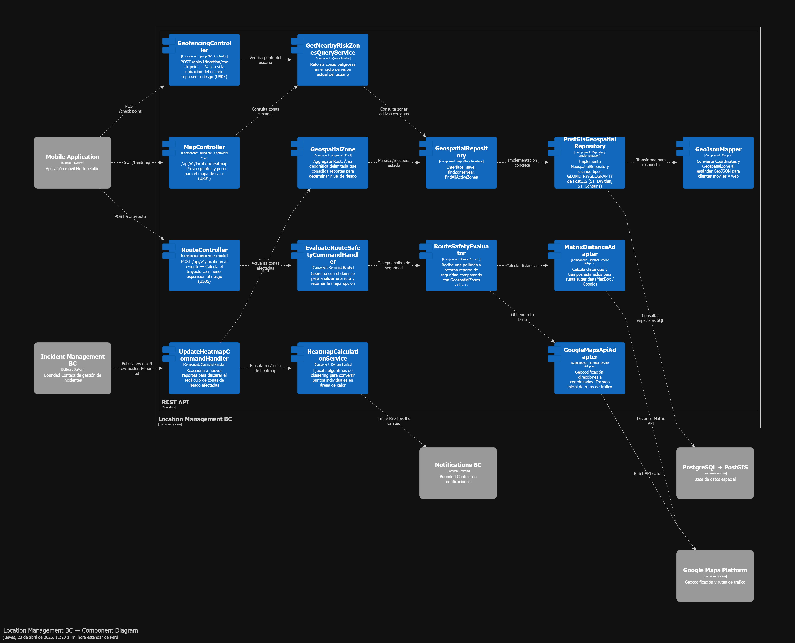</td>

#### 2.6.3.6 Bounded Context Software Architecture Code Level Diagrams

En esta sección se detallan los diagramas a nivel de código del Bounded Context Location Management, proporcionando una representación más granular de las estructuras internas del sistema. Se incluyen tanto los diagramas de clases del dominio como el diseño de base de datos, permitiendo entender cómo se implementan los conceptos definidos en el modelo de dominio y cómo se persisten los datos geoespaciales.

##### 2.6.3.6.1. Bounded Context Domain Layer Class Diagrams

El modelo de clases del Domain Layer se centra en el aggregate root `GeospatialZone`, que representa la unidad de consistencia del modelo de riesgo espacial. Cada instancia de este aggregate define una región geográfica delimitada —ya sea mediante un polígono o un radio— y mantiene información agregada sobre la actividad delictiva en dicha zona, como el número de incidentes, el nivel de riesgo y la última actualización registrada.

Dentro de este aggregate, los value objects juegan un rol fundamental en la definición del dominio. `Coordinates` encapsula la latitud y longitud asegurando que los valores se mantengan dentro de rangos geográficos válidos. `GeoBoundary` define la geometría de la zona y provee operaciones como la verificación de pertenencia de un punto dentro de sus límites. Por su parte, `RiskIndex` modela el nivel de peligro como un valor numérico acotado, incorporando además su interpretación semántica en términos de riesgo bajo, medio o alto.

A diferencia de entidades tradicionales, estos value objects son inmutables y carecen de identidad propia, lo que refuerza la consistencia del modelo y evita efectos secundarios indeseados. La lógica de negocio compleja no se concentra exclusivamente en el aggregate, sino que se distribuye en domain services especializados. `HeatmapCalculationService` procesa colecciones de incidentes para generar agrupaciones espaciales coherentes, mientras que `RouteSafetyEvaluator` analiza trayectorias completas para producir reportes de seguridad basados en la intersección con zonas de riesgo.

El acceso a los datos se abstrae mediante la interface `GeospatialRepository`, que define operaciones como la persistencia de zonas, la búsqueda por proximidad y la recuperación de zonas activas. Esta abstracción permite desacoplar completamente el dominio de cualquier tecnología de almacenamiento específica. Finalmente, los domain events `RiskLevelEscalated` y `SafeRouteCalculated` permiten comunicar cambios relevantes del dominio hacia otras partes del sistema, facilitando la integración basada en eventos y promoviendo una arquitectura reactiva.

<td></td>

##### 2.6.3.6.2.  Bounded Context Database Design Diagram

El diseño de persistencia del Bounded Context *Location Management* se fundamenta en el uso de una base de datos espacial basada en PostgreSQL con la extensión PostGIS, siguiendo el principio de *database-per-service*. Esto garantiza que el servicio de ubicación mantenga control total sobre sus datos geoespaciales, evitando acoplamientos indebidos con otros contextos.

La tabla principal, `geospatial_zones`, materializa el aggregate root `GeospatialZone`. En ella se almacenan tanto atributos descriptivos como el nivel de riesgo (`risk_level`), la cantidad de incidentes (`incident_count`) y la última actividad (`last_activity`), así como la geometría de la zona mediante el tipo `GEOMETRY`. Este enfoque permite delegar cálculos espaciales directamente a la base de datos, optimizando significativamente el rendimiento en operaciones de proximidad y contención.

Para reforzar la integridad del sistema, el diseño incorpora restricciones a nivel de base de datos. Por ejemplo, el campo `risk_level` se valida para asegurar que su valor se mantenga dentro del rango permitido, mientras que las estructuras geométricas deben cumplir con formatos válidos definidos por PostGIS. Adicionalmente, se emplean índices espaciales del tipo GIST sobre el campo `boundary`, lo que permite ejecutar consultas como `ST_DWithin` y `ST_Contains` de manera eficiente incluso con grandes volúmenes de datos.

La tabla `incidents_reference` actúa como una estructura de soporte para almacenar datos crudos de incidentes que alimentan los algoritmos de cálculo de mapas de calor. Esta separación entre datos agregados y datos base permite recalcular dinámicamente las zonas de riesgo sin comprometer la trazabilidad de la información original.

En términos de rendimiento, el diseño prioriza consultas geoespaciales en tiempo real, especialmente aquellas relacionadas con la detección de zonas cercanas al usuario y el análisis de rutas. Finalmente, el modelo está preparado para escenarios de alta concurrencia mediante estrategias como el uso de timestamps y potencial integración futura de mecanismos de versionado, permitiendo mantener consistencia en un entorno altamente dinámico y orientado a eventos.

<td>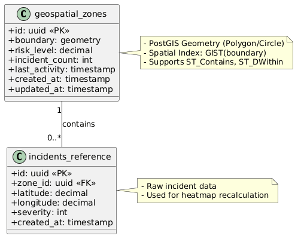</td>

### 2.6.4 Bounded Context:Report Managment

El Bounded Context **Report Management** es uno de los contextos core de UrbanVoice y concentra la mayor parte del valor diferencial de la plataforma. Este contexto es responsable de todo el ciclo de vida de un reporte de incidente de seguridad: su creación por parte de un ciudadano, la incorporación de evidencia multimedia, la consulta y filtrado de reportes existentes, la edición por parte del autor original y la exposición de los datos necesarios para que otros contextos, como Geospatial Intelligence y Notifications, puedan reaccionar ante la aparición de nuevos reportes.

#### 2.6.4.1. Domain Layer

La Domain Layer concentra el modelo del dominio del contexto Report Management. Aquí se ubican las clases que representan los conceptos del negocio, sus reglas y sus invariantes, sin dependencia alguna hacia frameworks, bases de datos, servicios externos ni tecnologías específicas. Esta capa es el corazón del Bounded Context y cualquier otra capa del contexto depende de ella, nunca al revés.

**Aggregate Root: `Report`**

La entidad `Report` es el aggregate root del contexto. Un reporte es la unidad de consistencia transaccional: cuando un ciudadano crea un reporte, adjunta evidencia o lo edita, todas esas operaciones atraviesan necesariamente al aggregate root para garantizar que las invariantes del reporte se mantengan en todo momento. Por ejemplo, un reporte no puede existir sin una ubicación válida, un reporte publicado anónimamente no puede exponer el id del autor, y solo el autor original puede editar un reporte.

| Atributo | Tipo | Descripción |
|---|---|---|
| `id` | `ReportId` (VO) | Identificador único del reporte |
| `authorId` | `UserId` (VO) | Identificador del ciudadano autor (referencia cruzada a User Profile) |
| `category` | `IncidentCategory` (VO) | Tipo de incidente reportado |
| `location` | `IncidentLocation` (VO) | Coordenadas geográficas del incidente |
| `content` | `ReportContent` (VO) | Título y descripción del reporte |
| `anonymity` | `AnonymityLevel` (Enum) | Nivel de anonimato: PUBLIC o ANONYMOUS |
| `status` | `ReportStatus` (Enum) | Estado del reporte: DRAFT, PUBLISHED, UNDER_REVIEW, APPROVED, REJECTED |
| `evidence` | `List<MediaEvidence>` | Colección de evidencias multimedia adjuntadas |
| `reportedAt` | `DateTime` | Fecha y hora en que ocurrió el incidente |
| `createdAt` | `DateTime` | Fecha y hora de creación del reporte en el sistema |
| `updatedAt` | `DateTime` | Fecha y hora de la última modificación |

**Métodos principales**

| Método | Visibilidad | Descripción |
|---|---|---|
| `publish()` | public | Publica el reporte (pasa de DRAFT a PUBLISHED). Emite el evento `ReportPublished` |
| `attachEvidence(media: MediaEvidence)` | public | Adjunta una evidencia al reporte. Emite el evento `EvidenceAttached` |
| `removeEvidence(evidenceId: EvidenceId)` | public | Remueve una evidencia del reporte (solo permitido en DRAFT o si el autor es quien edita) |
| `editContent(content: ReportContent, editor: UserId)` | public | Edita el contenido. Invariante: solo el autor puede editarlo. Emite `ReportEdited` |
| `changeAnonymity(level: AnonymityLevel, editor: UserId)` | public | Cambia el nivel de anonimato. Invariante: solo el autor puede cambiarlo |
| `submitForReview()` | public | Cambia el estado a UNDER_REVIEW para moderación |
| `approve(moderator: UserId)` | public | Aprueba el reporte. Emite `ReportApproved` |
| `reject(moderator: UserId, reason: string)` | public | Rechaza el reporte. Emite `ReportRejected` |
| `isEditableBy(userId: UserId)` | public | Retorna `true` si el usuario puede editar el reporte |

**Entidad interna: `MediaEvidence`**

`MediaEvidence` es una entidad interna del aggregate `Report`. No es un aggregate root porque su ciclo de vida depende completamente del reporte al que pertenece; no tiene sentido que exista una evidencia sin un reporte asociado.

| Atributo | Tipo | Descripción |
|---|---|---|
| `id` | `EvidenceId` (VO) | Identificador único de la evidencia |
| `mediaType` | `MediaType` (Enum) | Tipo: IMAGE, AUDIO, VIDEO |
| `storageUrl` | `StorageUrl` (VO) | URL del archivo almacenado en Cloud Storage |
| `fileSize` | `FileSize` (VO) | Tamaño del archivo en bytes |
| `uploadedAt` | `DateTime` | Fecha y hora en que se subió la evidencia |

**Value Objects**

Los value objects encapsulan conceptos del dominio que se identifican por su valor y no por identidad. Son inmutables y contienen las validaciones intrínsecas del concepto que representan.

| Value Object | Propósito |
|---|---|
| `ReportId` | Identificador único del reporte (UUID v4). Inmutable |
| `EvidenceId` | Identificador único de una evidencia multimedia |
| `UserId` | Referencia al autor del reporte (compartido con otros contextos) |
| `IncidentLocation` | Encapsula latitud y longitud validadas. Miembro del Shared Kernel con Geospatial Intelligence |
| `IncidentCategory` | Categoría del incidente (robo, asalto, vandalismo, etc.). Miembro del Shared Kernel con Geospatial Intelligence |
| `ReportContent` | Encapsula título (3-100 caracteres) y descripción (10-1000 caracteres). Valida que no esté vacío |
| `StorageUrl` | URL válida hacia el archivo en Cloud Storage. Valida formato URL |
| `FileSize` | Tamaño del archivo en bytes. Invariante: máximo 10 MB por archivo |

**Enumerations**

| Enum | Valores | Propósito |
|---|---|---|
| `ReportStatus` | DRAFT, PUBLISHED, UNDER_REVIEW, APPROVED, REJECTED | Estado del reporte en su ciclo de vida |
| `AnonymityLevel` | PUBLIC, ANONYMOUS | Nivel de exposición de la identidad del autor |
| `MediaType` | IMAGE, AUDIO, VIDEO | Tipo de evidencia multimedia |

**Domain Services**

Los domain services encapsulan lógica de dominio que no pertenece naturalmente a una entidad o value object.

| Domain Service | Responsabilidad |
|---|---|
| `ReportFilterService` | Aplica criterios de filtrado complejos sobre una colección de reportes (por categoría, por radio geográfico, por rango de fechas, por nivel de riesgo asociado) |
| `ReportVisibilityPolicy` | Determina qué campos de un reporte son visibles para un usuario dado, considerando el nivel de anonimato y el rol del solicitante |

**Repository Interfaces (abstracciones)**

Las interfaces de repositorio se declaran en el Domain Layer. Su implementación vive en el Infrastructure Layer siguiendo el Dependency Inversion Principle.

| Interface | Operaciones principales |
|---|---|
| `ReportRepository` | `save(report: Report)`, `findById(id: ReportId)`, `findByAuthor(authorId: UserId)`, `findByFilters(criteria: ReportFilterCriteria)`, `delete(id: ReportId)` |

**Domain Events**

Los domain events representan hechos relevantes que ocurrieron en el dominio. Son inmutables y se publican cuando las invariantes del aggregate lo permiten.

| Domain Event | Cuándo se emite | Consumidores |
|---|---|---|
| `ReportPublished` | Cuando un reporte pasa de DRAFT a PUBLISHED | Geospatial Intelligence, Notifications |
| `EvidenceAttached` | Cuando se adjunta una evidencia a un reporte | Interno del contexto |
| `ReportEdited` | Cuando el autor edita el contenido del reporte | Notifications |
| `ReportApproved` | Cuando un moderador aprueba el reporte | Geospatial Intelligence, Notifications |
| `ReportRejected` | Cuando un moderador rechaza el reporte | Notifications |
| `IncidentReportedNearby` | Policy derivada de `ReportPublished` para ciudadanos cercanos | Notifications |

**Factories**

| Factory | Propósito |
|---|---|
| `ReportFactory` | Centraliza la creación de reportes válidos a partir de un `SubmitReportCommand`. Valida todas las precondiciones antes de instanciar el aggregate |

#### 2.6.4.2. Interface Layer

La Interface Layer es la capa más externa del Bounded Context del lado entrante. Su responsabilidad es exponer las capabilities del contexto al mundo exterior, como aplicaciones móviles, web admin y otros servicios, y traducir los requests entrantes al modelo de la Application Layer. En esta capa residen los controllers REST y los consumers de eventos asíncronos.

**Controllers REST**

Los controllers son la puerta de entrada HTTP al contexto. Siguen el patrón thin controller: reciben el request, lo traducen a un command o query, delegan en el Application Layer y retornan el DTO de respuesta. No contienen lógica de negocio.

| Controller | Endpoints | Capabilities soportadas |
|---|---|---|
| `ReportController` | `POST /api/v1/reports` (crear), `GET /api/v1/reports/{id}` (detalle), `PUT /api/v1/reports/{id}` (editar), `DELETE /api/v1/reports/{id}` (eliminar), `GET /api/v1/reports` (listar con filtros) | CRUD completo de reportes, alineado con US01, US02, US04, US09, US10 y US13 |
| `EvidenceController` | `POST /api/v1/reports/{id}/evidence` (adjuntar), `DELETE /api/v1/reports/{id}/evidence/{evidenceId}` (remover) | Gestión de evidencia multimedia, alineado con US03 |
| `ModerationController` | `POST /api/v1/reports/{id}/moderation/approve`, `POST /api/v1/reports/{id}/moderation/reject`, `GET /api/v1/reports/moderation/queue` | Panel de moderación, alineado con US11 |

**Resources / DTOs**

Cada endpoint trabaja con DTOs en lugar de exponer directamente las clases del Domain Layer. Esto evita acoplar la API pública a la estructura interna del dominio.

| DTO | Tipo | Uso |
|---|---|---|
| `SubmitReportResource` | Input | Payload del request `POST` para crear un reporte |
| `EditReportResource` | Input | Payload del request `PUT` para editar un reporte |
| `AttachEvidenceResource` | Input | Payload para adjuntar evidencia (contiene metadata y URL prefirmada) |
| `ReportSummaryResource` | Output | Versión reducida del reporte para listados |
| `ReportDetailResource` | Output | Versión completa del reporte para vista de detalle |
| `ReportFilterResource` | Input (query params) | Criterios de filtrado para listados |

**Assemblers**

Los assemblers convierten entre DTOs de la Interface Layer y objetos del Application Layer o Domain Layer.

| Assembler | Transformación |
|---|---|
| `FromSubmitReportResourceAssembler` | `SubmitReportResource` a `SubmitReportCommand` |
| `FromEditReportResourceAssembler` | `EditReportResource` a `EditReportCommand` |
| `ReportResourceFromEntityAssembler` | `Report` a `ReportDetailResource` |

**Event Consumers**

| Consumer | Evento escuchado | Acción |
|---|---|---|
| `UserRegisteredConsumer` | `UserRegistered` (publicado por IAM) | Preparar cache local de `UserId` válidos para validación rápida al recibir nuevos reportes |

#### 2.6.4.3. Application Layer

La Application Layer orquesta los flujos de proceso del negocio que involucran al Bounded Context. Aquí viven las clases responsables de recibir commands y queries, coordinar con el Domain Layer, gestionar la transaccionalidad y publicar los domain events hacia el resto del sistema. Esta capa no contiene reglas de negocio; solo coordinación.

Se adopta el patrón **CQRS** (Command Query Responsibility Segregation) ligero: los flujos de escritura pasan por Command Handlers y los flujos de lectura por Query Services. Esta separación permite optimizar cada ruta independientemente.

**Command Handlers**

Cada command representa una intención del usuario o del sistema de cambiar el estado del dominio.

| Command Handler | Command procesado | Flujo |
|---|---|---|
| `SubmitReportCommandHandler` | `SubmitReportCommand` | Valida el command, invoca al `ReportFactory` para crear el aggregate, persiste vía `ReportRepository` y publica `ReportPublished` |
| `AttachEvidenceCommandHandler` | `AttachEvidenceCommand` | Recupera el aggregate, invoca `report.attachEvidence()`, persiste y publica `EvidenceAttached` |
| `EditReportCommandHandler` | `EditReportCommand` | Recupera el aggregate, valida que el editor sea el autor, invoca `report.editContent()`, persiste y publica `ReportEdited` |
| `ApproveReportCommandHandler` | `ApproveReportCommand` | Recupera el aggregate, invoca `report.approve()`, persiste y publica `ReportApproved` |
| `RejectReportCommandHandler` | `RejectReportCommand` | Recupera el aggregate, invoca `report.reject()`, persiste y publica `ReportRejected` |

**Query Services**

Los query services manejan las operaciones de lectura. Retornan DTOs directamente sin pasar por aggregates completos cuando es posible, optimizando para el caso de uso de consulta.

| Query Service | Query soportada | Retorno |
|---|---|---|
| `GetReportByIdQueryService` | `GetReportByIdQuery(id)` | `ReportDetailResource` |
| `ListReportsByAuthorQueryService` | `ListReportsByAuthorQuery(authorId)` | `List<ReportSummaryResource>` |
| `SearchReportsQueryService` | `SearchReportsQuery(criteria)` | `Page<ReportSummaryResource>` filtrada y paginada |
| `GetModerationQueueQueryService` | `GetModerationQueueQuery()` | Cola de reportes en estado `UNDER_REVIEW` |

**Event Handlers**

Los event handlers reaccionan a domain events propios o externos al contexto.

| Event Handler | Evento | Acción |
|---|---|---|
| `ReportPublishedEventHandler` | `ReportPublished` | Publica el evento en el message broker para que Geospatial Intelligence y Notifications reaccionen |
| `EvidenceAttachedEventHandler` | `EvidenceAttached` | Actualiza el modelo de lectura del reporte |

**Application Services**

| Application Service | Responsabilidad |
|---|---|
| `ReportApplicationService` | Fachada del contexto que coordina Command Handlers y Query Services. Es el punto de entrada unificado desde la Interface Layer |
| `EvidenceUploadService` | Coordina el proceso de generación de URL prefirmada para que el cliente suba directamente a Cloud Storage y luego registre la evidencia en el reporte |

#### 2.6.4.4 Infrastructure Layer

La Infrastructure Layer provee implementaciones concretas de las abstracciones definidas en el Domain Layer y gestiona la integración con tecnologías externas al contexto: base de datos, message broker, servicios de almacenamiento en la nube, entre otros. Esta capa es la única que depende directamente de frameworks específicos como Spring Data JPA, Spring AMQP o los SDKs de cloud providers.

**Repository Implementations**

Implementan las interfaces declaradas en el Domain Layer.

| Implementación | Interface que implementa | Tecnología |
|---|---|---|
| `JpaReportRepository` | `ReportRepository` | Spring Data JPA sobre PostgreSQL |

**JPA Entities**

Las JPA entities son el equivalente técnico de las domain entities, decoradas con anotaciones de persistencia. Se mantienen separadas de las domain entities para no contaminar el modelo de dominio con preocupaciones de infraestructura.

| JPA Entity | Mapeo |
|---|---|
| `ReportJpaEntity` | Tabla `reports` |
| `MediaEvidenceJpaEntity` | Tabla `media_evidence` |
| `ReportCategoryJpaEntity` | Tabla de lookup `incident_categories` |

**Mappers Domain a JPA**

| Mapper | Transformación |
|---|---|
| `ReportJpaMapper` | `Report` (domain) a `ReportJpaEntity` (JPA) y viceversa |
| `MediaEvidenceJpaMapper` | `MediaEvidence` (domain) a `MediaEvidenceJpaEntity` (JPA) y viceversa |

**External Service Adapters**

Implementan puertos de salida hacia servicios externos.

| Adapter | Servicio externo | Responsabilidad |
|---|---|---|
| `CloudStorageAdapter` | AWS S3 o Firebase Storage | Genera URLs prefirmadas para upload directo y URLs de lectura con expiración |
| `EventPublisherAdapter` | RabbitMQ (vía Spring AMQP) | Publica los domain events en el exchange correspondiente |
| `UserProfileClientAdapter` | Profile Service (vía REST) | Consulta información pública del autor cuando se requiere mostrar un reporte no anónimo |

**Configuration**

| Clase de configuración | Propósito |
|---|---|
| `ReportingContextConfig` | Registra los beans de Spring del contexto, configura transacciones y wiring de handlers |
| `RabbitMqConfig` | Declara exchanges, queues y bindings del contexto |

#### 2.6.4.5 Bounded Context Software Architecture Component Level Diagrams

En esta subsección se documenta de forma textual la arquitectura a nivel de componentes del Bounded Context Report Management. La descomposición parte del container `Incident Service` o `Report Service`, que implementa este contexto, y lo organiza en componentes principales agrupados por capas. Cada componente representa una agrupación coherente de clases que colaboran para proveer una capability específica del negocio.

La arquitectura evidencia una separación estricta entre las cuatro capas del contexto. La Interface Layer, compuesta por `ReportController`, `EvidenceController`, `ModerationController` y `UserRegisteredConsumer`, solo conoce a la Application Layer. La Application Layer coordina el flujo mediante `ReportApplicationService`, `EvidenceUploadService`, los distintos Command Handlers y los Query Services. A su vez, estos componentes interactúan con el Domain Layer, donde residen el aggregate `Report`, la factory `ReportFactory`, los domain services `ReportFilterService` y `ReportVisibilityPolicy`, además de la abstracción `ReportRepository`.

Siguiendo el Dependency Inversion Principle, el Domain Layer declara el puerto `ReportRepository` como interface, mientras que en tiempo de ejecución la Infrastructure Layer provee la implementación concreta `JpaReportRepository`. Del mismo modo, la integración con servicios externos se encapsula mediante adapters como `CloudStorageAdapter`, `EventPublisherAdapter` y `UserProfileClientAdapter`, evitando que el dominio dependa directamente de detalles de infraestructura.

Los domain events emitidos por el aggregate son interceptados por event handlers de la Application Layer, que luego los publican al broker correspondiente para que otros bounded contexts, como Geospatial Intelligence y Notifications, reaccionen sin acoplamiento directo. Esta organización permite mantener un modelo de dominio limpio, cohesionando la lógica del reporte y dejando las preocupaciones técnicas en la capa de infraestructura.

<td>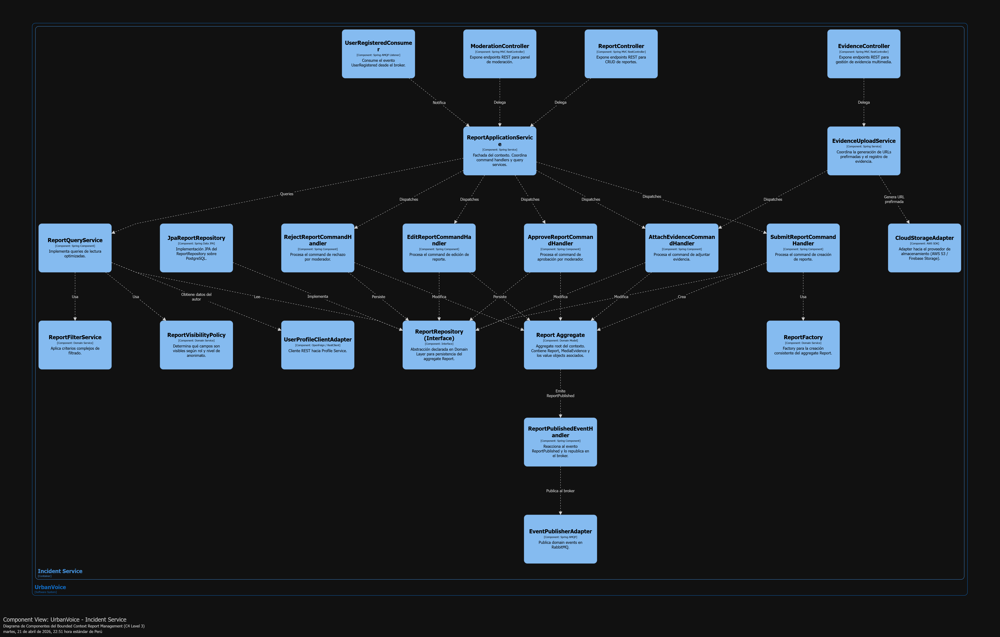</td>

#### 2.6.4.6 Bounded Context Software Architecture Code Level Diagrams

En esta subsección se describe, de manera textual, la arquitectura a nivel de código del Bounded Context Report Management. El objetivo es dejar documentados los dos artefactos principales del diseño detallado: el modelo de clases del Domain Layer y el diseño de persistencia relacional que soporta al contexto, sin insertar diagramas visuales en esta versión.

##### 2.6.4.6.1. Bounded Context Domain Layer Class Diagrams

El modelo de clases del Domain Layer gira alrededor del aggregate root `Report`, que concentra la consistencia transaccional del contexto. Dentro de este aggregate se encuentra la entidad interna `MediaEvidence`, cuya existencia depende completamente del reporte al que pertenece. La relación entre ambas clases es de composición, ya que una evidencia no puede existir fuera del ciclo de vida del reporte.

Los value objects, como `ReportId`, `EvidenceId`, `UserId`, `IncidentLocation`, `IncidentCategory`, `ReportContent`, `StorageUrl` y `FileSize`, forman parte integral del aggregate y encapsulan las validaciones propias del dominio. Estos objetos son inmutables y se modelan por valor, no por identidad, reforzando la semántica del dominio y reduciendo inconsistencias en las reglas de negocio.

Las enumeraciones `ReportStatus`, `AnonymityLevel` y `MediaType` permiten representar estados y categorías cerradas del dominio de forma explícita. Sobre este núcleo trabajan los domain services `ReportFilterService`, `ReportVisibilityPolicy` y `ReportFactory`, que operan sobre el aggregate sin formar parte estructural de él. Finalmente, la interface `ReportRepository` abstrae la persistencia del aggregate, cumpliendo con el principio de inversión de dependencias y manteniendo al dominio desacoplado de la infraestructura.

<td></td>

##### 2.6.4.6.2. Bounded Context Database Design Diagram

El diseño de base de datos relacional que soporta el Bounded Context Report Management sigue el principio de database-per-service: el servicio responsable del contexto mantiene su propia instancia de PostgreSQL y ningún otro servicio accede directamente a estas tablas. La tabla central es `reports`, donde se materializa el aggregate root `Report`. Allí se descomponen en columnas planas los value objects del dominio, como el contenido del reporte, la ubicación del incidente, el nivel de anonimato y el estado del flujo de vida.

En `reports` se emplean restricciones `CHECK` para reforzar a nivel de base de datos las mismas invariantes ya protegidas en el Domain Layer. Por ejemplo, se valida que `status` solo acepte los cinco estados permitidos, que `anonymity_level` solo reciba valores válidos y que las coordenadas geográficas se mantengan dentro de los rangos correctos. Esta estrategia implementa defense-in-depth y reduce la posibilidad de que datos inválidos ingresen al sistema.

La tabla `media_evidence` representa la entidad interna `MediaEvidence` y se relaciona con `reports` en una cardinalidad uno a muchos. Esta tabla almacena únicamente metadatos de los archivos, como tipo, URL y tamaño, mientras que el contenido real vive en Cloud Storage. Debido a que las evidencias no tienen sentido fuera del reporte, esta relación se modela con borrado en cascada.

La tabla `incident_categories` funciona como lookup table para las categorías predefinidas del sistema, tales como robo, asalto o vandalismo. En lugar de eliminar físicamente una categoría, se usa el flag `is_active`, lo que permite mantener consistencia histórica sobre reportes ya emitidos que referencian categorías descontinuadas.

Por su parte, `moderation_log` mantiene la trazabilidad del proceso de moderación. Cada aprobación o rechazo genera una entrada asociada al reporte y al moderador que tomó la decisión, permitiendo auditoría completa y análisis posterior del desempeño del flujo de moderación.

La tabla `report_filter_presets` permite almacenar filtros frecuentes definidos por los usuarios. El uso de un campo `JSONB` para `criteria_json` facilita la evolución del modelo de búsqueda sin requerir migraciones constantes del esquema. Este enfoque da flexibilidad a la personalización de consultas y soporta mejor la ampliación futura de criterios.

En cuanto al desempeño, los índices priorizan tres patrones de acceso críticos: búsqueda por autor para la vista de "mis reportes", búsqueda por estado para la cola de moderación y búsqueda geográfica para escenarios de heatmap y alertas por proximidad. Finalmente, la columna `version` en `reports` habilita optimistic locking a nivel de JPA, evitando conflictos cuando dos actores intentan modificar simultáneamente el mismo reporte.

<td></td>

### 2.6.5 Bounded Context: Notification Management

El Bounded Context **Notification Management** es un componente vital para la propuesta de valor proactiva de UrbanVoice. Este contexto es responsable de mantener al ciudadano informado y seguro en tiempo real. Se encarga de gestionar el ciclo de vida de las alertas emitidas por el sistema, notificar al usuario cuando ingresa a una zona de riesgo (geofencing), avisarle cuando se crea un nuevo reporte de incidente cerca de su ubicación, y gestionar las sesiones de "compartir ubicación" (Live Tracking) entre usuarios mediante códigos de acceso.

El modelo de dominio presentado en esta sección es consistente con lo identificado en el Design-Level EventStorming. Se establecieron commands principales como generar alerta de proximidad, marcar notificación como leída y unirse a una sesión de ubicación compartida; los domain events asociados como Alerta Emitida, Zona Peligrosa Detectada y Ubicación Compartida; y los read models necesarios como la bandeja de notificaciones, el detalle de la alerta y la vista en vivo del mapa compartido.

A continuación, se presenta el diseño del contexto organizado en las cuatro capas estándar de una arquitectura hexagonal o aplicada a DDD. Posteriormente se documenta, de forma textual, la arquitectura a nivel de componente y a nivel de código.

#### 2.6.5.1. Domain Layer

La Domain Layer concentra el modelo del dominio del contexto Notification Management. Aquí se ubican las clases que representan las alertas, las sesiones de ubicación compartida y sus reglas de negocio, manteniendo total independencia de frameworks, bases de datos o servicios de mensajería externos (como Firebase Cloud Messaging).

**Aggregate Root: `SecurityAlert` (Notificación)**

La entidad `SecurityAlert` es el aggregate root principal para el flujo de notificaciones. Representa una alerta individual despachada a un ciudadano específico. Toda transición de estado (por ejemplo, de "no leída" a "leída" o "descartada") debe pasar por este aggregate.

| Atributo | Tipo | Descripción |
|---|---|---|
| `id` | `AlertId` (VO) | Identificador único de la alerta |
| `recipientId` | `UserId` (VO) | Identificador del ciudadano receptor de la notificación |
| `type` | `AlertType` (Enum) | Tipo de alerta: PROXIMITY_WARNING, NEW_INCIDENT, SYSTEM_UPDATE |
| `content` | `AlertContent` (VO) | Título, mensaje detallado y severidad de la alerta |
| `referenceLocation` | `LocationCoordinates` (VO) | Coordenadas asociadas a la alerta (opcional) |
| `status` | `AlertStatus` (Enum) | Estado actual: UNREAD, READ, DISMISSED |
| `issuedAt` | `DateTime` | Fecha y hora en que el sistema generó la alerta |
| `readAt` | `DateTime` | Fecha y hora en que el usuario leyó la alerta (nullable) |

**Métodos principales**

| Método | Visibilidad | Descripción |
|---|---|---|
| `markAsRead()` | public | Cambia el estado de UNREAD a READ y registra la fecha. Emite `AlertRead` |
| `dismiss()` | public | Cambia el estado a DISMISSED ocultándola de la bandeja activa |
| `isUrgent()` | public | Retorna `true` si el nivel de severidad en el contenido es HIGH o CRITICAL |

**Aggregate Root: `LocationShareSession`**

Este segundo aggregate root maneja el flujo de "compartir ubicación" evidenciado en el EventStorming. Gestiona el código de acceso temporal y los usuarios que tienen permiso para visualizar la ubicación del emisor.

| Atributo | Tipo | Descripción |
|---|---|---|
| `id` | `SessionId` (VO) | Identificador único de la sesión de rastreo |
| `ownerId` | `UserId` (VO) | Identificador del ciudadano que comparte su ubicación |
| `accessCode` | `ShareCode` (VO) | Código alfanumérico único para unirse a la sesión |
| `status` | `TrackingStatus` (Enum) | Estado: ACTIVE, PAUSED, EXPIRED |
| `viewers` | `List<UserId>` | Lista de usuarios que han ingresado el código exitosamente |
| `expiresAt` | `DateTime` | Fecha y hora de caducidad automática de la sesión |

**Métodos principales**

| Método | Visibilidad | Descripción |
|---|---|---|
| `addViewer(viewerId: UserId, code: ShareCode)` | public | Invariante: Verifica que el código coincida y la sesión esté activa. Emite `ViewerJoined` |
| `terminate()` | public | Cambia el estado a EXPIRED, cerrando el acceso. Emite `SessionTerminated` |

**Value Objects**

| Value Object | Propósito |
|---|---|
| `AlertId` | Identificador único de la notificación (UUID v4) |
| `UserId` | Identificador del usuario (Shared Kernel) |
| `AlertContent` | Encapsula el título (ej. "¡Peligro! Zona Insegura"), mensaje y el nivel de Severity |
| `ShareCode` | Código seguro de 6 dígitos autogenerado para compartir ubicación |
| `LocationCoordinates` | Encapsula latitud y longitud. Usado para mostrar la alerta en el mapa |

**Enumerations**

| Enum | Valores | Propósito |
|---|---|---|
| `AlertStatus` | UNREAD, READ, DISMISSED | Ciclo de vida de visualización de la alerta |
| `AlertType` | PROXIMITY_WARNING, NEW_INCIDENT, SYSTEM_UPDATE | Clasifica el motivo de la notificación |
| `TrackingStatus` | ACTIVE, PAUSED, EXPIRED | Controla si la ubicación sigue siendo visible |

**Domain Services**

| Domain Service | Responsabilidad |
|---|---|
| `ProximityAlertService` | Evalúa si las coordenadas actuales del usuario intersectan con un área de riesgo (Geofence) para emitir un PROXIMITY_WARNING |

**Repository Interfaces (abstracciones)**

| Interface | Operaciones principales |
|---|---|
| `SecurityAlertRepository` | `save(alert: SecurityAlert)`, `findUnreadByUserId(userId: UserId)`, `markAllAsRead(userId: UserId)` |
| `LocationShareRepository` | `save(session: LocationShareSession)`, `findByAccessCode(code: ShareCode)`, `findActiveByOwnerId(ownerId: UserId)` |

**Domain Events**

| Domain Event | Cuándo se emite | Consumidores |
|---|---|---|
| `AlertIssued` | Cuando se crea y despacha una nueva alerta | Interno (para enviar Push Notification) |
| `AlertRead` | Cuando el usuario visualiza la alerta | Interno |
| `LocationShareCreated` | Cuando se genera un nuevo código de ubicación | Externo (notificar a contactos sugeridos) |
| `ViewerJoined` | Cuando alguien ingresa el código correctamente | Interno (notifica al owner que alguien lo está viendo) |

#### 2.6.5.2. Interface Layer

La Interface Layer expone los endpoints para que la aplicación móvil consulte sus notificaciones y gestione las sesiones de mapa. También contiene los consumidores de eventos asíncronos provenientes de otros contextos (como Report Management).

**Controllers REST**

| Controller | Endpoints | Capabilities soportadas |
|---|---|---|
| `AlertsController` | `GET /api/v1/notifications`, `PATCH /api/v1/notifications/{id}/read` | Bandeja de entrada de alertas y actualización de estado |
| `LocationSharingController` | `POST /api/v1/location-share` (crear), `POST /api/v1/location-share/join` (ingresar código) | Flujo para compartir ubicación y visualizar a otros |

**Resources / DTOs**

| DTO | Tipo | Uso |
|---|---|---|
| `JoinSessionRequest` | Input | Contiene el `accessCode` ingresado por el usuario para ver un mapa |
| `AlertSummaryResponse` | Output | Lista de notificaciones para la bandeja de la app |
| `LocationSessionResponse` | Output | Devuelve el estado de la sesión y el código generado |

**Event Consumers**

| Consumer | Evento escuchado | Acción |
|---|---|---|
| `IncidentReportedConsumer` | `ReportPublished` (desde Report Management) | Desencadena el cálculo de usuarios cercanos para emitirles un `SecurityAlert` de tipo NEW_INCIDENT |

#### 2.6.5.3. Application Layer

Esta capa orquesta los casos de uso, suscribiéndose a eventos externos y despachando commands hacia el Domain Layer. Gestiona el patrón CQRS para separar la consulta de alertas de la generación de las mismas.

**Command Handlers**

| Command Handler | Command procesado | Flujo |
|---|---|---|
| `DispatchAlertCommandHandler` | `DispatchAlertCommand` | Instancia un `SecurityAlert`, persiste en base de datos y publica `AlertIssued` para que la infraestructura envíe la Push Notification |
| `MarkAlertReadCommandHandler` | `MarkAlertReadCommand` | Recupera el aggregate, invoca `markAsRead()`, y persiste |
| `CreateShareSessionCommandHandler` | `CreateShareSessionCommand` | Invoca factory para generar `LocationShareSession` con código único, persiste y publica evento |
| `JoinShareSessionCommandHandler` | `JoinShareSessionCommand` | Busca sesión por código, invoca `session.addViewer()`, autoriza acceso al socket de ubicación y persiste |

**Query Services**

| Query Service | Query soportada | Retorno |
|---|---|---|
| `GetUserAlertsQueryService` | `GetUserAlertsQuery(userId)` | `List<AlertSummaryResponse>` ordenado por fecha |
| `GetActiveSessionQueryService` | `GetActiveSessionQuery(code)` | `LocationSessionResponse` |

**Event Handlers**

| Event Handler | Evento | Acción |
|---|---|---|
| `AlertIssuedEventHandler` | `AlertIssued` | Delega al `PushNotificationAdapter` el envío a dispositivos iOS/Android |
| `NewIncidentEventHandler` | `ReportPublished` | Llama al `ProximityAlertService` para buscar usuarios en un radio de X km e invocar el `DispatchAlertCommand` |

#### 2.6.5.4. Infrastructure Layer

La Infrastructure Layer conecta el modelo del dominio con las tecnologías reales: bases de datos, WebSockets para el mapa en vivo y Firebase para notificaciones push.

**Repository Implementations**

| Implementación | Interface que implementa | Tecnología |
|---|---|---|
| `JpaSecurityAlertRepository` | `SecurityAlertRepository` | Spring Data JPA sobre PostgreSQL |
| `JpaLocationShareRepository` | `LocationShareRepository` | Spring Data JPA sobre PostgreSQL |

**JPA Entities y Mappers**

| JPA Entity / Mapper | Mapeo |
|---|---|
| `SecurityAlertJpaEntity` | Tabla `security_alerts`. Índices en `recipient_id` y `status` para consultas rápidas |
| `LocationShareJpaEntity` | Tabla `location_share_sessions`. Índice UNIQUE en `access_code` |
| `NotificationJpaMapper` | Transforma `SecurityAlert` (domain) a `SecurityAlertJpaEntity` y viceversa |

**External Service Adapters**

| Adapter | Servicio externo | Responsabilidad |
|---|---|---|
| `FcmPushNotificationAdapter` | Firebase Cloud Messaging (FCM) | Toma el evento `AlertIssued` y envía un Push Notification real al token del smartphone del usuario |
| `WebSocketLocationAdapter` | Spring WebSocket / STOMP | Mantiene el canal abierto y emite las coordenadas en tiempo real a los viewers autorizados en el `LocationShareSession` |

#### 2.6.5.5 Bounded Context Software Architecture Component Level Diagrams

En esta subsección se documenta la arquitectura a nivel de componentes del Bounded Context Notification Management. La descomposición parte del contenedor Notification Service, organizándolo por capas.

La Interface Layer expone los endpoints a través de `AlertsController` y `LocationSharingController`, mientras el `IncidentReportedConsumer` escucha activamente el Message Broker (RabbitMQ/Kafka). Estos componentes derivan el tráfico hacia la Application Layer, donde los Command Handlers (como `DispatchAlertCommandHandler` y `JoinShareSessionCommandHandler`) coordinan la lógica.

El Domain Layer encapsula el core con los aggregates `SecurityAlert` y `LocationShareSession`, protegiendo invariantes como la validación del código de acceso temporal. Finalmente, la Infrastructure Layer provee la persistencia mediante `JpaSecurityAlertRepository` y ejecuta las acciones externas mediante adaptadores especializados: `FcmPushNotificationAdapter` para emitir las alertas visuales en el dispositivo y `WebSocketLocationAdapter` para el streaming de coordenadas en vivo durante la compartición de ubicación.

<td>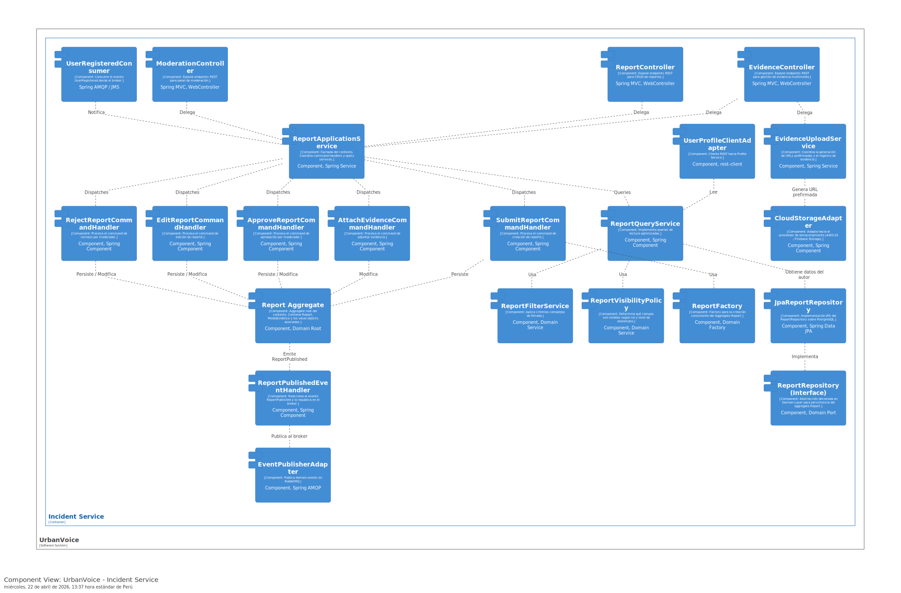</td>

#### 2.6.5.6 Bounded Context Software Architecture Code Level Diagrams

En esta subsección se describe la arquitectura a nivel de código del Bounded Context Notification Management, detallando su modelo de clases y diseño de persistencia relacional.

##### 2.6.5.6.1. Bounded Context Domain Layer Class Diagrams

El modelo de clases del Domain Layer presenta dos aggregates independientes. El primero es `SecurityAlert`, que centraliza el estado de las notificaciones (UNREAD, READ) y su contenido (encapsulado en el VO `AlertContent`). Incluye un VO `LocationCoordinates` para alertas vinculadas a eventos geográficos.

El segundo aggregate es `LocationShareSession`, diseñado para gestionar la característica de "compartir ubicación". Sus atributos incluyen el `ShareCode` autogenerado, el `ownerId` y la lista de viewers (espectadores). Este aggregate expone métodos como `addViewer(code)` que validan internamente si la sesión sigue activa y si el código ingresado coincide antes de permitir que un ciudadano monitoree a otro, asegurando la privacidad en todo momento.

<td>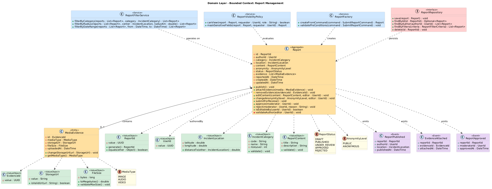</td>

##### 2.6.5.6.2. Bounded Context Database Design Diagram

El diseño relacional para el Bounded Context Notification Management consta de dos tablas principales bajo el esquema database-per-service. La tabla `security_alerts` persiste las notificaciones. Se optimiza el acceso de lectura masiva creando un índice compuesto en las columnas `recipient_id` y `status`, lo que garantiza que la consulta para contar "notificaciones no leídas" en la aplicación móvil responda en milisegundos.

Por otro lado, la tabla `location_share_sessions` persiste los datos de tracking. Posee una restricción UNIQUE en la columna `access_code` para garantizar que no existan colisiones cuando dos usuarios generen un código de vinculación. Una tabla intermedia `session_viewers` almacena la relación de qué usuarios (`viewer_id`) se han unido exitosamente a qué sesión (`session_id`), utilizando borrado en cascada para evitar registros huérfanos una vez que la sesión de emergencia expira.

 

  <td>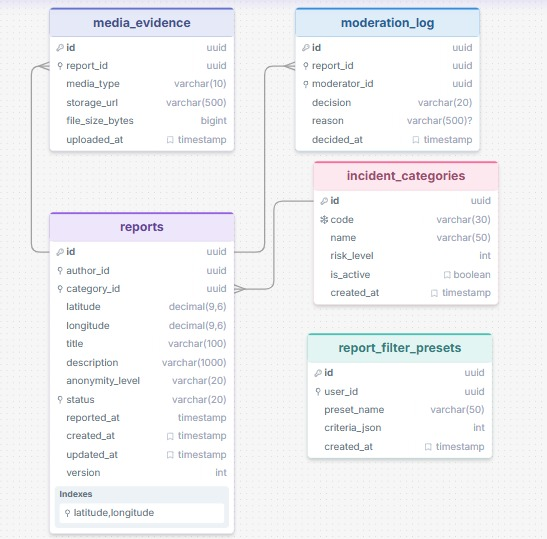</td>

 
