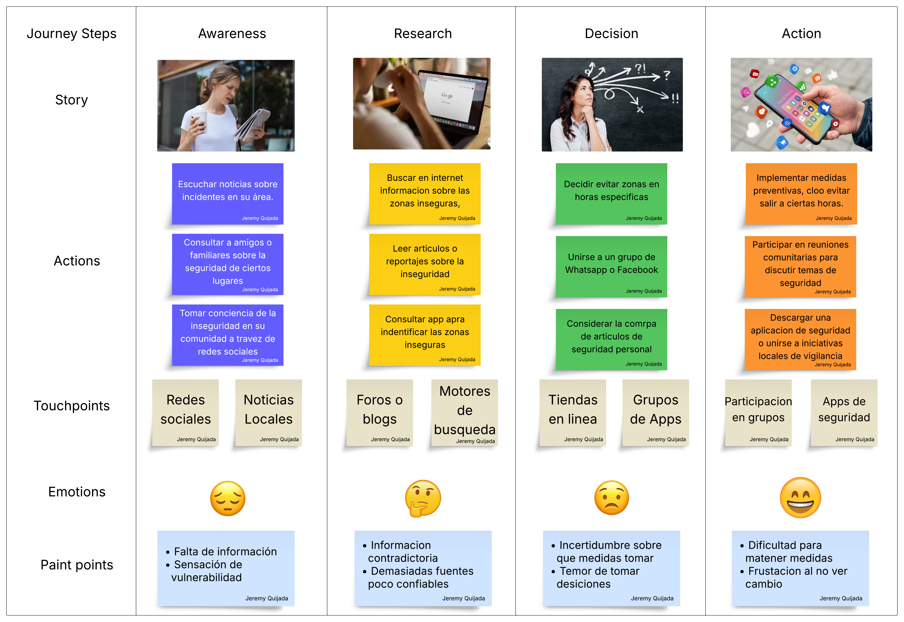

# 
 Universidad Peruana de Ciencias Aplicadas 

  

### 
 Informe Entrega 1 

 

  
 Carrera: Ingeniería de Software 

   
  
 Ciclo: 2026-10 

   
  
 Curso: Aplicaciones para dispositivos móviles 

   
  
 NRC: 3248 

   
  
 Profesor: David Gerardo Quevedo 

   
  
 Nombre del Startup: UrbanVoice 

   
  
 Nombre del Producto: UrbanVoice 

   
  
 Relación de Integrantes: 

  
  - . 

  
  - . 

  
  - . 

  
  - Gordillo Ramos, Santiago Alonso (u202215160) 

  
  - . 

   
  
 Mes y Año: Abril del 2026 

---

# Registro de Versiones del Informe

<table>
  <tr>
    <th style="text-align:center;">Versión</th>
    <th style="text-align:center;">Fecha</th>
    <th style="text-align:center;">Autor</th>
    <th style="text-align:center;">Descripción de la modificación</th>
  </tr>
  <tr>
    <td align="center">TB1</td>
    <td>//2026</td>
    <td> Integrante   Integrante   Integrante   Santiago Gordillo   Integrante </td>
    <td> Realizamos los capítulos 1, 2 y 3 según la rúbrica de manera conjunta y eficiente.  </td>
  </tr>
  <tr>
    <td align="center">TB2</td>
    <td>//2026</td>
    <td> Integrante   Integrante   Integrante   Santiago Gordillo   Integrante </td>
    <td> descripción </td>
  </tr>
  <tr>
    <td align="center">TP1</td>
    <td>//2026</td>
    <td> Integrante   Integrante   Integrante   Santiago Gordillo   Integrante </td>
    <td> descripción </td>
  </tr>
</table>

---

# Tabla de contenidos

- [ Universidad Peruana de Ciencias Aplicadas ](#-universidad-peruana-de-ciencias-aplicadas-)
    - [ Informe de Trabajo Final ](#-informe-de-trabajo-final-)
- [Registro de Versiones del Informe](#registro-de-versiones-del-informe)
- [Tabla de contenidos](#tabla-de-contenidos)
- [Student Outcome](#student-outcome)
- [Capítulo I: Introducción](#capítulo-i-introducción)
    - [1.1 Startup Profile](#11-startup-profile)
        - [1.1.1 Descripción de la Startup](#111-descripción-de-la-startup)
        - [1.1.2. Perfiles de integrantes del equipo](#112-perfiles-de-integrantes-del-equipo)
    - [1.2. Solution Profile](#12-solution-profile)
        - [1.2.1. Nombre del Producto](#121-nombre-del-producto)
        - [1.2.2. Antecedentes y problemática](#122-antecedentes-y-problemática)
        - [1.2.3. Lean UX Process](#123-lean-ux-process)
            - [1.2.3.1. Lean UX Problem Statements](#1231-lean-ux-problem-statements)
            - [1.2.3.2. Lean UX Assumptions](#1232-lean-ux-assumptions)
            - [1.2.3.3. Lean UX Hypothesis Statements](#1233-lean-ux-hypothesis-statements)
            - [1.2.3.4. Lean UX Canvas](#1234-lean-ux-canvas)
    - [1.3. Segmentos Objetivo](#13-segmentos-objetivo)

- [Capítulo II: Requirements & Analysis](#capítulo-ii-requirements--analysis)
   - [2.1. Competidores](#21-competidores)
   - [2.1.1 Analisis competitivo](#211-analisis-competitivo)
   - [2.1.2 Estrategias y tacticas frente a competidores](#212-estrategias-y-tacticas-frente-a-competidores)
   - [2.2. Entrevistas](#22-entrevistas)
   - [2.2.1 Diseño de entrevistas](#221-diseño-de-entrevistas)
   - [2.2.2 Registro de entrevistas](#222-registro-de-entrevistas)
   - [2.2.3 Análisis de entrevistas](#223-análisis-de-entrevistas)
   - [2.3. Needfinding](#23-needfinding)
      - [2.3.1. User Personas](#231-user-personas)
      - [2.3.2. User Task Matrix](#232-user-task-matrix)
      - [2.3.3. User Journey Map](#233-user-journey-map)
      - [2.3.4. Empathy Mapping](#234-empathy-mapping)
      - [2.3.5. Big Picture EventStorming ](#235-big-picture-eventstorming)
      - [2.3.6. Ubiquitous Language](#236-ubiquitous-language)
   - [2.4. Requirements specification](#24-requirements-specification)
      - [2.4.1. User Stories](#241-user-stories)
      - [2.4.2. Impact Mapping](#242-impact-mapping)
      - [2.4.3. Product Backlog](#243-product-backlog)
   - [2.5. Strategic-Level Domain-Driven Design](#25-strategic-level-domain-driven-design)
      - [2.5.1. EventStorming](#251-eventstorming)
         - [2.5.1.1. Candidate Context Discovery](#2511-candidate-context-discovery)
         - [2.5.1.2. Domain Message Flows Modeling](#2512-domain-message-flows-modeling)
         - [2.5.1.3. Bounded Context Canvases](#2513-bounded-context-canvases)
      - [2.5.2. Context Mapping](#252-context-mapping)
      - [2.5.3. Software Architecture](#253-software-architecture)
         - [2.5.3.1. Software Architecture Context Level Diagrams](#2531-software-architecture-context-level-diagrams)
         - [2.5.3.2. Software Architecture Container Level Diagrams](#2532-software-architecture-container-level-diagrams)
         - [2.5.3.3. Software Architecture Deployment Diagrams](#2533-software-architecture-deployment-diagrams)
      - [2.6 Tactical-Level Domain-Driven Design](#26-technical-level-domain-driven-design)
  
      
# Student Outcome

**Criterio:** La capacidad de adquirir y aplicar nuevos conocimientos según sea necesario, utilizando estrategias de
aprendizaje apropiadas.

ABET -- EAC - Student Outcome 

<table>
<colgroup>
<col style="width: 30%" />
<col style="width: 40%" />
<col style="width: 30%" />
</colgroup>
<thead>
<tr class="header">
<th><strong>Criterio específico</strong></th>
<th><strong>Acciones Realizadas</strong></th>
<th><strong>Conclusiones</strong></th>
</tr>
</thead>
<tbody>
<tr class="odd">
<td>Actualiza conceptos y
conocimientos necesarios para su
desarrollo profesional y en especial
para su proyecto en soluciones de
software.</td>
<td>
            <strong>Integrante</strong>  
            TB1   Contenido  
            TB2   Contenido  
            TP1   Contenido  
            <strong>Integrante</strong>  
            TB1   Contenido  
            TB2   Contenido  
            TP1   Contenido  
            <strong>Integrante</strong>  
            TB1   Contenido  
            TB2   Contenido  
            TP1   Contenido           
            <strong>Gordillo Ramos, Santiago Alonso</strong>  
            TB1   Contenido  
            TB2   Contenido  
            TP1   Contenido  
            <strong>Integrante</strong>  
            TB1   Contenido  
            TB2   Contenido  
            TP1   Contenido  
</td>
<td>
<em><strong>TB1</strong></em>
 Contenido
 

<em><strong>TB2</strong></em>
 Contenido
 
</td>
</tr>
<tr class="even">
<td>Reconoce la necesidad del
aprendizaje permanente para el
desempeño profesional y el
desarrollo de proyectos en
soluciones de software.</td>
<td>
            <strong>Integrante</strong>  
            TB1   Contenido  
            TB2   Contenido  
            TP1   Contenido  
            <strong>Integrante</strong>  
            TB1   Contenido  
            TB2   Contenido  
            TP1   Contenido  
            <strong>Integrante</strong>  
            TB1   Contenido  
            TB2   Contenido  
            TP1   Contenido  
            <strong>Gordillo Ramos, Santiago Alonso</strong>  
            TB1   Contenido  
            TB2   Contenido  
            TP1   Contenido  
            <strong>Integrante</strong>  
            TB1   Contenido  
            TB2   Contenido  
            TP1   Contenido  
</td>
<td>
<em><strong>TB1</strong></em>
 Contenido 
 
<em><strong>TB2</strong></em>
 Contenido 
 
</td>

</tr>
</tbody>
</table>

# Capítulo I: Introducción

## 1.1 Startup Profile

### 1.1.1 Descripción de la Startup

En respuesta al aumento de la inseguridad ciudadana en el Perú, UrbanVoice surge como una propuesta innovadora orientada a fortalecer la seguridad en las calles. En Lima Metropolitana, el 89,9% de los ciudadanos percibe su entorno como inseguro (INEI, 2024), una realidad preocupante que requiere atención inmediata.  

**Misión:**  
Nuestra misión es brindar seguridad a nuestros usuarios, permitiéndoles desplazarse con confianza por las distintas calles del Perú.  

**Visión:**  
Entendemos que el mundo está en constante transformación y queremos contribuir a ese cambio. Creemos que todas las personas tienen derecho a sentirse seguras en su país, y que es responsabilidad de los gobiernos garantizarlo. Por ello, aspiramos a posicionarnos como líderes en el sector de la seguridad, destacando por nuestro compromiso con el bienestar de nuestros usuarios.  

**¿Cómo lo logramos?**  
UrbanVoice se posiciona como una herramienta clave para quienes buscan mayor seguridad en su día a día. A través de nuestra aplicación, los usuarios pueden consultar un mapa interactivo que indica los niveles de seguridad en distintas zonas, facilitando la toma de decisiones informadas. Asimismo, ofrecemos la opción de reportar delitos de manera rápida y sencilla, incorporando fotos, audios o videos, de forma pública o anónima.  

Además, UrbamVoice ofrece una función adicional: compartir la ubicación en tiempo real con contactos de confianza, quienes podrán seguir el recorrido del usuario y brindarle mayor tranquilidad durante sus desplazamientos.  

### 1.1.2. Perfiles de integrantes del equipo

<table>
<colgroup>
<col style="width: 65%" />
<col style="width: 34%" />
</colgroup>
<thead>
<tr class="even">
<td>
<strong>Nombre:</strong> Integrante

<strong> Contenido </strong>
</td>
<td></td>
</tr>
<tr class="even">
<td>
<strong>Nombre:</strong> Jeremy Quijada Magro (U202219657)

<strong> Contenido </strong>
</td>
<td></td>
</tr>
<tr class="even">
<td>
<strong>Nombre:</strong> Integrante

<strong> Contenido </strong>
</td>
<td></td>
</tr>
<tr class="even">
<td>
<strong>Nombre:</strong> Santiago Alonso Gordillo Ramos (U202215160)

<strong> Mi nombre es Santiago Gordillo, me gusta la programación, en específico el lado frontend y me gustaría especializarme en ciberseguridad. tengo 21 años, domino frameworks como vue, angular,etc y lenguajes como C++ , Python, Javascript.</strong>
</td>
<td></td>
</tr>
<tr class="even">
<td>
<strong>Nombre:</strong> Integrante

<strong> Contenido </strong>
</td>
<td></td>
</tr>

</table>

## 1.2. Solution Profile

### 1.2.1. Nombre del Producto

UrbanVoice, una aplicación móvil orientada a la seguridad ciudadana. Su propósito es brindar a los usuarios información en tiempo real sobre incidentes y zonas de riesgo en Lima Metropolitana, permitiendo tomar decisiones más seguras en sus desplazamientos y fomentando la colaboración entre ciudadanos y autoridades.

### 1.2.2. Antecedentes y problemática

**What (Qué):** UrbanVoice es una aplicación diseñada para empoderar a los usuarios en su vida diaria, ayudándolos a navegar de manera más segura por las calles de Lima Metropolitana. UrbanVoice garantiza el acceso a información detallada y confiable sobre la seguridad en tiempo real, fomentando una red de colaboración que beneficia a todos.

**When (Cuándo):** UrbanVoice estará disponible la mayor parte del tiempo, ofreciendo asistencia continua y actualizada en cualquier momento que los usuarios lo necesiten.

**Where (Dónde):** UrbanVoice puede ser utilizada en cualquier lugar y momento, siempre que el usuario cuente con una conexión a internet. La aplicación se adapta automáticamente a la ubicación del usuario, actualizando la información de seguridad local en tiempo real para brindar datos precisos y relevantes.

**Who (Quién):** UrbanVoice está dirigida a los ciudadanos que transitan por las calles de Lima Metropolitana. Los usuarios no solo podrán beneficiarse de la información proporcionada, sino que también tendrán la capacidad de contribuir al bienestar de la comunidad al reportar incidentes y situaciones de riesgo.

**Why (Por qué):** UrbanVoice surge como respuesta al preocupante aumento de la delincuencia en Lima y en todo el país. Nuestro objetivo es proporcionar a los ciudadanos una herramienta que les permita estar informados sobre los sucesos más recientes en su entorno, incrementando su seguridad personal y ayudando a otros transeúntes a evitar situaciones peligrosas.

**How (Cómo):** UrbanVoice se mantiene actualizada gracias al constante aporte de los usuarios, quienes reportan incidentes y colaboran con la comunidad. Además, la aplicación utiliza tecnología avanzada de geolocalización y análisis de datos para ofrecer información precisa en tiempo real.

**How Much (Cuánto):** UrbanVoice estará disponible de forma gratuita para todos los usuarios. Sin embargo, para sostener el desarrollo y mantenimiento de la plataforma, la aplicación incluirá anuncios integrados.

### 1.2.3. Lean UX Process

#### 1.2.3.1. Lean UX Problem Statements

El objetivo de nuestro servicio es ayudar a las personas a desplazarse con mayor seguridad en su entorno. A través de nuestra aplicación, los usuarios pueden acceder a un mapa de calor que indica qué tan peligrosas son distintas zonas de Lima Metropolitana, basado en reportes en tiempo real hechos por otros usuarios.

Hemos detectado que existe una fuerte preocupación por la inseguridad en las calles, ya que los robos y delitos son situaciones frecuentes. De acuerdo con los resultados más recientes de la ENAPRES (Ene-Jun 2024) del INEI, el 27.7% de las personas mayores de 15 años en Perú ha sido víctima de algún delito.

Frente a esta realidad, surge la pregunta:  
**¿cómo podemos cambiar la percepción de inseguridad en Lima y brindar a las personas una herramienta que realmente les sea útil en su día a día?**

#### 1.2.3.2. Lean UX Assumptions

ahora que hemos analizado la problemática y contamos con una visión clara de cómo abordar la solución, es crucial identificar qué empresas comparten características similares a las nuestras y cómo han evolucionado con el tiempo. Esto nos permitirá aprender de su experiencia y adaptarnos mejor al mercado.

**Assumptions:**

1. **Las personas en Lima necesitan una app que les sugiera rutas más seguras.**  
   Debido al incremento de la delincuencia, los usuarios buscan formas de evitar zonas peligrosas al movilizarse.

2. **A los usuarios les interesa formar parte de una comunidad donde puedan reportar incidentes.**  
   El hecho de contribuir con información genera confianza y sentido de pertenencia.

3. **No hay una competencia fuerte que ofrezca una solución tan completa como la nuestra.**  
   Esto nos da la oportunidad de posicionarnos como una alternativa innovadora en seguridad ciudadana.

4. **Las instituciones que usen la app podrán aprovechar datos útiles para combatir la delincuencia.**  
   La información en tiempo real les permitirá actuar de manera más estratégica.

5. **Los ciudadanos estarán interesados en usar la aplicación.**  
   Al ser una herramienta práctica y fácil de usar, puede atraer a muchas personas.

6. **Las entidades públicas en Perú necesitan soluciones tecnológicas como esta.**  
   La app puede ayudarles a responder mejor ante situaciones de inseguridad.

**Business Outcomes:**

- Generar ingresos constantes mediante acuerdos con entidades públicas y privadas.  
- Aumentar la calidad de vida de las personas al reducir su exposición a riesgos.  
- Aportar a la reducción de la delincuencia mediante información útil y oportuna.

**User Outcomes:**

1. **¿Quién es el usuario?**  
   Cualquier persona que viva o trabaje en zonas donde la app esté disponible.

2. **¿Cómo encaja en su día a día?**  
   Se vuelve una herramienta clave para planificar rutas seguras y reportar incidentes.

3. **¿Qué dificultades enfrenta el producto?**  
   Depende bastante de lograr alianzas con entidades para sostener el modelo de negocio.

4. **¿Cuándo y cómo se usa?**  
   Principalmente al movilizarse por zonas desconocidas o al reportar situaciones de riesgo.

5. **¿Qué características son clave?**  
   Debe ser fácil de usar, rápida y con información actualizada en tiempo real.

6. **¿Cómo debería verse y funcionar?**  
   Con un diseño claro, atractivo y sencillo, que facilite la navegación y el registro.

**User Benefits:**

1. Reducir el riesgo de robos o incidentes al contar con información actualizada.
   
2. Tener acceso a un mapa que muestra zonas peligrosas y rutas más seguras.
   
3. Sentirse parte de una comunidad que aporta a la seguridad colectiva.

#### 1.2.3.3. Lean UX Hypothesis Statements

- **Hypothesis Statement 01:**

**Creemos que** UrbanVoice logrará crear una comunidad activa interesada en la seguridad.  

**Sabremos que funciona** cuando aumente el número de usuarios registrados y participen reportando incidentes.

- **Hypothesis Statement 02:**
  
**Creemos que** los usuarios valorarán poder reportar incidentes y ver información en tiempo real.  

**Sabremos que funciona** cuando muchos usuarios utilicen el mapa y reporten de forma constante.

- **Hypothesis Statement 03:**

**Creemos que** UrbanVoice ayudará a reducir la sensación de inseguridad.  

**Sabremos que funciona** cuando las encuestas reflejen menos miedo al crimen en zonas donde se usa la app.

- **Hypothesis Statement 04:**

**Creemos que** incluir anuncios en la versión gratuita no afectará la experiencia.  

**Sabremos que funciona** si los usuarios siguen usando la app y se mantiene una buena retención.

- **Hypothesis Statement 05:**

**Creemos que** la aplicación será fácil de usar para todo tipo de personas.  

**Sabremos que funciona** cuando los usuarios completen tareas sin dificultad en pruebas de uso.

- **Hypothesis Statement 06:**

**Creemos que** la geolocalización en tiempo real hará que la información sea más precisa.  

**Sabremos que funciona** cuando los usuarios confíen en el mapa y lo usen para decidir sus rutas.

- **Hypothesis Statement 07:**

**Creemos que** compartir la ubicación con contactos aumentará la sensación de seguridad.  

**Sabremos que funciona** cuando muchos usuarios utilicen esta función de forma frecuente.

#### 1.2.3.4. Lean UX Canvas

## 1.3. Segmentos Objetivo

<table>
<colgroup>
<col style="width: 22%" />
<col style="width: 77%" />
</colgroup>
<thead>
<tr>
<th rowspan="2"><strong>Variables</strong></th>
<th><strong>Segmento</strong></th>
</tr>
<tr>
<th>Personas que buscan mayor seguridad al movilizarse en espacios públicos</th>
</tr>
</thead>
<tbody>

<tr>
<td><strong>Geográfica</strong></td>
<td>
<ul>
<li>Ubicación: Lima Metropolitana, priorizando zonas con alta incidencia delictiva y gran flujo de personas.</li>
<li>Alcance: Distritos urbanos y zonas concurridas dentro de Lima.</li>
</ul>
</td>
</tr>

<tr>
<td><strong>Demográfica</strong></td>
<td>
<ul>
<li>Edad: Personas entre 18 y 65 años.</li>
<li>Género: Público masculino y femenino.</li>
<li>Nivel socioeconómico: Sectores C1, C2 y C3 que se movilizan constantemente por trabajo, estudios u otras actividades.</li>
<li>Ocupación: Incluye estudiantes, trabajadores dependientes e independientes, y amas de casa.</li>
</ul>
</td>
</tr>

<tr>
<td><strong>Psicológica</strong></td>
<td>
<ul>
<li>Actitudes y valores: Individuos que valoran su seguridad y la de su entorno, atentos a situaciones de riesgo.</li>
<li>Motivaciones: Desean sentirse más tranquilos al desplazarse y contar con información confiable para tomar decisiones.</li>
<li>Estilo de vida: Personas dinámicas que se movilizan con frecuencia dentro de la ciudad.</li>
</ul>
</td>
</tr>

<tr>
<td><strong>Función de comportamiento</strong></td>
<td>
<ul>
<li>Necesidades: Información actualizada sobre niveles de seguridad en las zonas que transitan.</li>
<li>Comportamiento de uso: Usuarios que utilizan aplicaciones móviles para informarse y que están abiertos a usar tecnología para mejorar su seguridad.</li>
<li>Lealtad: Prefieren plataformas confiables donde puedan informarse y también aportar con reportes a la comunidad.</li>
</ul>
</td>
</tr>

</tbody>
</table>

# Capítulo II: Requirements Elicitation & Analysis

## 2.1. Competidores

<table>
<colgroup>
<col style="width: 18%" />
<col style="width: 29%" />
<col style="width: 30%" />
<col style="width: 21%" />
</colgroup>
<thead>
<tr class="header">
<th><strong>Principales Competidores</strong></th>
<th><strong>Características</strong></th>
<th><strong>Diferencias</strong></th>
<th><strong>Limitaciones</strong></th>
</tr>
</thead>
<tbody>
<tr class="odd">
<td>SafeCity</td>
<td>
Reportes Anónimos: Permite a los usuarios reportar incidentes de manera completamente anónima.

Mapeo de Seguridad: Los datos se usan para crear mapas interactivos que muestran las áreas donde se reportan más incidentes.

Colaboración con ONG: SafeCity colabora con organizaciones no gubernamentales para utilizar los datos recopilados en campañas de concientización y políticas públicas.
</td>
<td>
Foco en el Acoso: Mientras que UrbanVoice abarca una amplia gama de incidentes, SafeCity se especializa en el reporte y la prevención del acoso.

Análisis de Datos: SafeCity ofrece un análisis más profundo de los datos para propósitos educativos y de políticas públicas.
</td>
<td>
Especificidad: El enfoque en el acoso puede limitar su utilidad para usuarios que buscan una herramienta más general de seguridad.

Cobertura Limitada: SafeCity no está disponible en todas las ciudades, a diferencia de UrbanVoice que se enfoca en Lima Metropolitana.
</td>
</tr>
<tr class="even">
<td>Nextdoor</td>
<td>
Foros Comunitarios: Espacios donde los vecinos pueden discutir temas de seguridad, reportar incidentes, y organizar eventos.

Alertas de Seguridad: Los usuarios pueden recibir notificaciones sobre incidentes de seguridad en su área.

Redes de Vecindario: Permite la creación de grupos privados basados en la ubicación del usuario.
</td>
<td>
Enfoque en la Comunidad: Nextdoor es más una red social con un enfoque amplio, mientras que UrbanVoice está específicamente diseñada para la seguridad ciudadana.

Cobertura: Disponible en varias ciudades a nivel internacional, no se limita solo a Lima.
</td>
<td>
No Específica de Seguridad: Aunque tiene funcionalidades de seguridad, Nextdoor es una plataforma de propósito general, no una aplicación de seguridad dedicada.

Privacidad: La naturaleza social de la plataforma puede plantear preocupaciones sobre la privacidad, especialmente en temas de seguridad.
</td>
</tr>
<tr class="odd">
<td>Waze</td>
<td>
Alcance: Aunque es principalmente una aplicación de navegación, Waze permite reportar incidentes en la vía pública, incluyendo accidentes y peligros.

Interacción: Los usuarios pueden reportar incidentes que otros conductores verán en tiempo real.

Popularidad: Amplia base de usuarios, lo que incrementa la cantidad de reportes en tiempo real.
</td>
<td>
Waze no está específicamente diseñada para la seguridad personal o la prevención de delitos, sino para la navegación y tráfico.

Su comunidad está más orientada a conductores que a peatones o personas que transitan a pie.
</td>
<td>
No está enfocada en la seguridad ciudadana de forma específica.

La información sobre incidentes podría no ser tan detallada ni orientada a la prevención de delitos.
</td>
</tr>
</tbody>
</table>

### 2.1.1. Análisis Competitivo 

<table>
<colgroup>
<col style="width: 9%" />
<col style="width: 11%" />
<col style="width: 21%" />
<col style="width: 19%" />
<col style="width: 19%" />
<col style="width: 17%" />
</colgroup>
<thead>
<tr class="header">
<th colspan="6"><strong>Competitive Analysis Landscape</strong></th>
</tr>
</thead>
<tbody>
<tr class="odd">
<td colspan="6"><em>¿Por qué llevar al cabo este análisis</em>? Para conocer a nuestros competidores, conocer sus estrategias y poder aprender de estos.</td>
</tr>
<tr class="even">
<td colspan="2">Empresas (Aplicación)</td>
<td>
SafeCity
</td>
<td>
Nextdoor
</td>
<td>
Waze
</td>
<td>UrbanVoice</td>
</tr>
<tr class="odd">
<td rowspan="2"><strong>Perfil</strong></td>
<td>Overview</td>
<td>SafeCity es una aplicación que permite a los usuarios reportar incidentes de acoso y violencia en tiempo real, principalmente enfocada en la seguridad de las mujeres. Utiliza los reportes para crear mapas de calor y prevenir riesgos.</td>
<td>Nextdoor es una red social privada para vecindarios, que conecta a residentes para discutir temas locales, compartir recomendaciones y alertas de seguridad en su entorno inmediato.</td>
<td>Waze es una aplicación de navegación que utiliza crowdsourcing para ofrecer rutas en tiempo real, evitando tráfico, accidentes y obstáculos viales.</td>
<td>UrbanVoice es una aplicación móvil enfocada en mejorar la seguridad ciudadana en Lima Metropolitana, proporcionando información y alertas de riesgo en tiempo real mediante colaboración ciudadana.</td>
</tr>
<tr class="even">
<td>¿Qué valor ofrece los clientes?</td>
<td>
Seguridad y prevención: Identificación de áreas peligrosas.

Empoderamiento: Plataforma para denunciar incidentes de acoso.

Anonimato: Reportes seguros sin temor a represalias.
</td>
<td>
Conexión comunitaria: Facilita la interacción vecinal.

Vigilancia vecinal: Red de apoyo para reportar incidentes locales.

Recursos locales: Recomendaciones de servicios cercanos.
</td>
<td>
Eficiencia: Rutas optimizadas en tiempo real.

Seguridad vial: Información sobre peligros en carretera.

Comunidad activa: Datos precisos gracias a la contribución de usuarios.
</td>
<td>
Seguridad en tiempo real: Alertas inmediatas de situaciones de riesgo.

Colaboración: Nexo entre ciudadanos y autoridades.

Prevención: Información accionable para evitar áreas de alta criminalidad.
</td>
</tr>
<tr class="odd">
<td rowspan="2"><strong>Perfil de Marketing</strong></td>
<td>Mercado objetivo</td>
<td>Mujeres en áreas urbanas preocupadas por el acoso y la seguridad de género.</td>
<td>Adultos y residentes locales interesados en la vida comunitaria y seguridad del vecindario.</td>
<td>Conductores que buscan optimizar sus tiempos de viaje en zonas urbanas congestionadas.</td>
<td>Ciudadanos de Lima Metropolitana que buscan herramientas proactivas para su seguridad personal y comunitaria.</td>
</tr>
<tr class="even">
<td>Estrategias de Marketing</td>
<td>Campañas con ONGs, movimientos sociales y marketing comunitario enfocado en género.</td>
<td>Marketing de boca en boca, publicidad en redes sociales segmentada por vecindarios y alianzas vecinales.</td>
<td>Alianzas con empresas automotrices, publicidad geolocalizada y programas de incentivos para colaboradores.</td>
<td>Campañas de concienciación en Lima, publicidad digital segmentada y relaciones públicas en medios locales.</td>
</tr>
<tr class="odd">
<td rowspan="3"><strong>Perfil del producto</strong></td>
<td>Producto &amp; Servicios</td>
<td>App móvil (iOS/Android) y plataforma de datos agregados para organizaciones de seguridad.</td>
<td>Red social vecinal, alertas de seguridad y servicios de anuncios locales para negocios.</td>
<td>Navegación GPS, alertas de tráfico en tiempo real e integración con servicios de música/mapas.</td>
<td>App móvil con mapas interactivos de seguridad, alertas basadas en ubicación y plataforma de datos para análisis criminalístico local.</td>
</tr>
<tr class="even">
<td>Precios &amp; Costos</td>
<td>Modelo freemium: Gratis para usuarios; suscripciones para acceso a analítica de datos avanzada.</td>
<td>Gratuito para usuarios; ingresos mediante publicidad pagada de empresas y servicios locales.</td>
<td>Gratuito; ingresos generados por publicidad geolocalizada dentro de la interfaz.</td>
<td>Modelo freemium: Gratis para ciudadanos; suscripción para empresas o entidades que requieran análisis de datos detallados.</td>
</tr>
<tr class="odd">
<td>Canales de distribución</td>
<td>Móvil (App Store/Play Store) y plataforma Web complementaria.</td>
<td>Móvil y plataforma Web para acceso desde escritorio.</td>
<td>Principalmente Móvil; herramientas de planificación vía Web.</td>
<td>Móvil (Android/iOS) y plataforma Web interactiva para mapas de riesgo.</td>
</tr>
<tr class="even">
<td rowspan="4"><strong>Análisis SWOT</strong></td>
<td>Fortalezas</td>
<td>Especialización en seguridad personal y fuerte impacto social positivo.</td>
<td>Red hiperlocal consolidada y gran base de usuarios internacionales.</td>
<td>Líder en navegación en tiempo real con integración tecnológica avanzada.</td>
<td>Enfoque específico en la problemática de Lima y colaboración directa con autoridades locales.</td>
</tr>
<tr class="odd">
<td>Debilidades</td>
<td>Alcance limitado fuera de áreas urbanas; dependencia total de los reportes.</td>
<td>Problemas de privacidad de datos y complejidad en la moderación de contenido.</td>
<td>Alto consumo de batería y datos; no orientado a la seguridad criminal personal.</td>
<td>Focalización geográfica inicial limitada; costos operativos de mantenimiento tecnológico.</td>
</tr>
<tr class="even">
<td>Oportunidades</td>
<td>Expansión geográfica a nuevas ciudades con crisis de seguridad.</td>
<td>Integración de nuevas funciones de Marketplace y eventos comunitarios.</td>
<td>Colaboración con gobiernos para Smart Cities y gestión de tráfico masivo.</td>
<td>Escalabilidad a otras capitales de Latinoamérica con desafíos similares de inseguridad.</td>
</tr>
<tr class="odd">
<td>Amenazas</td>
<td>Nuevas regulaciones de datos y competencia de apps de seguridad generalistas.</td>
<td>Competencia de grandes plataformas (Facebook/Nextdoor clones) y saturación.</td>
<td>Mejoras constantes en Google Maps y Apple Maps que absorben sus funciones.</td>
<td>Cambios normativos de privacidad en Perú y competencia de aplicaciones estatales.</td>
</tr>
</tbody>
</table>

### 2.1.2. Estrategias y tácticas frente a competidores 

**1. Diferenciación por Especialización Local:**

 El valor principal de UrbanVoice reside en su enfoque exclusivo en Lima Metropolitana. A diferencia de competidores globales que manejan datos genéricos, nosotros nos enfocamos en entender la dinámica de seguridad de cada distrito limeño. La idea es posicionarnos como la herramienta que mejor conoce la realidad de nuestras calles, logrando una relevancia que aplicaciones más grandes no pueden alcanzar por su falta de contexto local.

**2. Fomento de la Participación Ciudadana:**

Para que la aplicación sea útil, necesitamos que la comunidad sea el motor de la información. No se trata solo de que los usuarios miren el mapa, sino de incentivarlos a ser parte activa del cambio. Implementaremos dinámicas que reconozcan el compromiso de los ciudadanos que reportan, creando un sentido de pertenencia y asegurando que la información siempre esté actualizada y sea confiable para todos.

**3. Alianzas Estratégicas:**

 Buscamos que UrbanVoice no sea una isla, sino un puente entre el ciudadano y las instituciones de seguridad. El objetivo es trabajar de la mano con serenazgos, ONGs y juntas vecinales para que los reportes de la app tengan un respaldo real. Estas alianzas nos darán la credibilidad necesaria para que el usuario sienta que su participación realmente contribuye a una respuesta efectiva en su seguridad.

**4. Expansión Geográfica Controlada:**

 Nuestra visión a largo plazo es llevar este modelo a otras ciudades del Perú que enfrentan desafíos similares. Una vez que hayamos perfeccionado el sistema en Lima, replicaremos la estrategia en regiones clave, adaptando la comunicación y el análisis a las necesidades específicas de cada ciudad para asegurar que el impacto sea igual de positivo que en la capital.

**5. Innovación en Funcionalidades:**

 Para mantenernos un paso adelante de la competencia, UrbanVoice integrará funciones diseñadas específicamente para situaciones críticas de seguridad ciudadana. Esto incluye desde alertas personalizadas según la ubicación del usuario hasta botones de asistencia rápida. Queremos ofrecer una herramienta integral que no solo informe, sino que brinde soluciones prácticas y directas cuando el usuario más lo necesita.

## 2.2. Entrevistas

El propósito de estas entrevistas es profundizar en las preocupaciones, necesidades y expectativas reales de nuestro segmento objetivo: ciudadanos que transitan por espacios públicos y priorizan su seguridad personal. A través de este diálogo, buscamos identificar patrones de comportamiento y oportunidades de solución que validen la propuesta de valor de UrbanVoice.

### 2.2.1. Diseño de entrevistas

Para el registro inicial y perfilamiento del entrevistado, se solicitarán los siguientes datos:
*Nombres y Apellidos, edad, ocupación y pasatiempos.*

**Segmento Objetivo: Ciudadanos preocupados por su seguridad en espacios públicos**

1. ¿Podría describir alguna situación reciente en la que se haya sentido vulnerable o preocupado por su integridad en un espacio público?
*Objetivo: Identificar contextos específicos y factores detonantes de la sensación de inseguridad.*

2. ¿Qué medidas o precauciones toma habitualmente para mitigar riesgos cuando se desplaza por la ciudad?
*Objetivo: Conocer los métodos preventivos y herramientas actuales que utiliza el usuario.*

3. ¿Qué elementos del entorno (falta de iluminación, escasa vigilancia, zonas desoladas, etc.) influyen más en su percepción de peligro?
*Objetivo: Determinar los factores del entorno urbano que UrbanVoice debería priorizar en sus reportes.*

4. Ante un incidente de inseguridad (como testigo o víctima), ¿cuál suele ser su reacción inmediata y qué dificultades encuentra para actuar?
*Objetivo: Entender la respuesta emocional y operativa del ciudadano frente al riesgo.*

5. ¿Qué información o alertas específicas consideraría indispensables recibir en su celular para sentirse más protegido mientras transita?
*Objetivo: Definir las funcionalidades críticas y el tipo de contenido más valioso para la app.*

6. ¿Cuál es su nivel de confianza al usar herramientas digitales para reportar delitos o recibir alertas de seguridad?
*Objetivo: Medir la disposición tecnológica y posibles barreras de adopción.*

7. ¿Ha tenido experiencia previa con aplicaciones de seguridad? Si es así, ¿qué aspectos resultaron útiles y cuáles fueron frustrantes?
*Objetivo: Analizar la competencia desde la experiencia del usuario para evitar errores de diseño.*

8. ¿Considera que compartir su ubicación en tiempo real con sus contactos de confianza es una función esencial o secundaria para su tranquilidad?
*Objetivo: Validar el interés en herramientas de monitoreo preventivo.*

9. Más allá de las alertas, ¿qué otra funcionalidad creativa o herramienta adicional cree que le daría un mayor control sobre su seguridad diaria?
*Objetivo: Explorar ideas innovadoras que puedan diferenciar a UrbanVoice en el mercado.*

### 2.2.2. Registro de entrevistas 

**URL de todas las entrevistas:** 

**Entrevista N°1:**

**Timing:** 

**Nombre:** 

**Edad:** 

**Pasatiempos:** 

**Ocupación:** 

Resumen . 

### 2.2.3. Análisis de entrevistas

## 2.3. Needfinding

### 2.3.1. User Personas 

### 2.3.2. User Task Matrix

La siguiente matriz detalla las tareas y acciones que el segmento objetivo realiza actualmente para gestionar su seguridad. Esto nos permite identificar los "gaps" donde la app puede intervenir para mejorar la experiencia del usuario.

| Categoría de Tarea | Tareas Específicas del Usuario | Frecuencia | Importancia |
| :--- | :--- | :--- | :--- |
| **Prevención y Planificación** | Consultar con familiares o amigos sobre la seguridad de una ruta o zona antes de visitarla. | Siempre | Alta |
| | Evitar desplazamientos en horarios nocturnos o por lugares con reputación de peligrosidad. | Siempre | Alta |
| | Buscar noticias sobre incidentes recientes en redes sociales (Facebook, grupos de WhatsApp). | A veces | Media |
| **Acción y Respuesta** | Contactar a la policía o servicios de emergencia (105 / Serenazgo) ante una amenaza directa. | Casi nunca | Alta |
| | Organizarse activamente con vecinos o juntas locales para mejorar la seguridad comunitaria. | Nunca | Media |
| | Portar objetos de autodefensa personal (gas pimienta, alarmas sonoras, etc.). | Nunca | Media |
| **Uso de Tecnología** | Utilizar aplicaciones de mapas (Google Maps/Waze) específicamente para evadir zonas peligrosas. | Nunca | Media |
| | Reportar incidentes en tiempo real a través de plataformas digitales o aplicaciones móviles. | Nunca | Media |

---

#### Análisis de la Matriz
* Los usuarios dependen casi exclusivamente de su red de contactos directa y de evitar el peligro físicamente, lo que indica una falta de herramientas digitales confiables.
* Aunque llamar a la policía es de alta importancia, la frecuencia es "Casi nunca", lo que sugiere desconfianza en los tiempos de respuesta o dificultad para realizar la llamada en una emergencia.
* Existe un uso nulo ("Nunca") de aplicaciones para reportar o evadir zonas peligrosas, lo que representa un océano azul para UrbanVoice si logra simplificar esta tarea.

### 2.3.3. Empathy Journey Mappping

### 2.3.4. Empathy Mappping

Con ayuda del gráfico Empathy Mapping podemos conocer las necesidades, frustraciones de nuestro segmento objetivo: **Ciudadanos preocupados por su seguridad en espacios públicos**. Esto nos ofrece una comprensión más profunda de cómo se siente nuestro usuario y abordar una solución que
realmente los ayuden.

### 2.3.5. Big Picture EventStorming

Para la definición del ecosistema de UrbanVoice, el equipo llevó a cabo una sesión colaborativa de Big Picture Event Storming, un método visual que nos permitió mapear de extremo a extremo el dominio del negocio.

Puedes explorar el flujo completo, los eventos de dominio y las definiciones técnicas en tiempo real a través de nuestro tablero de Miro en el siguiente enlace:
https://miro.com/app/board/uXjVGhQGySg=/?share_link_id=739088953987

### 2.3.6. Ubiquitous Language
En esta sección se definen los términos clave del dominio de negocio. Estas definiciones eliminan ambigüedades y aseguran que todos los involucrados compartan una comprensión común de los conceptos de seguridad ciudadana.

| Término | Definición |
| :--- | :--- |
| **Seguridad Ciudadana** | Acción integrada que desarrolla el Estado, con la colaboración de la ciudadanía, para asegurar su convivencia pacífica, la erradicación de la violencia y la utilización pacífica de las vías y espacios públicos. |
| **Incidente** | Cualquier evento o suceso que represente un riesgo para la integridad física o patrimonial del ciudadano, incluyendo robos, hurtos, acoso o actos vandálicos. |
| **Punto Crítico** | Zona geográfica específica dentro de la ciudad que presenta una alta recurrencia o densidad de incidentes reportados en un periodo determinado. |
| **Alerta en Tiempo Real** | Notificación inmediata enviada a los usuarios sobre un peligro o incidente que está ocurriendo o acaba de ocurrir en su cercanía geográfica. |
| **Ruta Segura** | Trayecto sugerido entre dos puntos que prioriza vías con menor índice de criminalidad, mejor iluminación y mayor presencia de autoridades. |
| **Reporte Ciudadano** | Acto voluntario de un usuario de registrar y compartir información sobre un incidente presenciado o experimentado para alertar a la comunidad. |
| **Mapa de Riesgo** | Representación visual interactiva que utiliza datos históricos y en tiempo real para mostrar los niveles de inseguridad en diferentes sectores de la ciudad. |
| **Acoso Callejero** | Prácticas de naturaleza sexual no consentidas que ocurren en espacios públicos, que afectan la dignidad y el derecho a la libre circulación de las personas. |
| **Botón de Pánico** | Funcionalidad de emergencia que permite al usuario enviar una señal de auxilio inmediata a sus contactos de confianza y a las autoridades competentes. |
| **Círculo de Confianza** | Grupo selecto de contactos (familiares o amigos) con los cuales el usuario decide compartir su ubicación o recibir notificaciones de emergencia. |
| **Espacio Público** | Áreas de la ciudad de libre acceso y circulación, como calles, parques, paraderos y plazas, donde se desarrolla la vida comunitaria. |
| **Tiempo de Respuesta** | Intervalo que transcurre desde que se reporta una emergencia hasta que las autoridades (Serenazgo o Policía) intervienen en el lugar del suceso. |